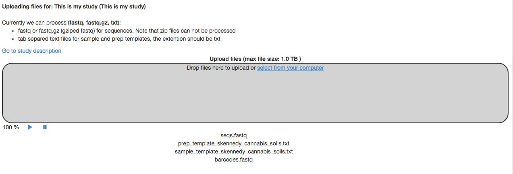
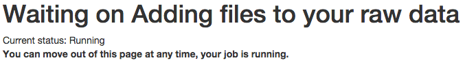
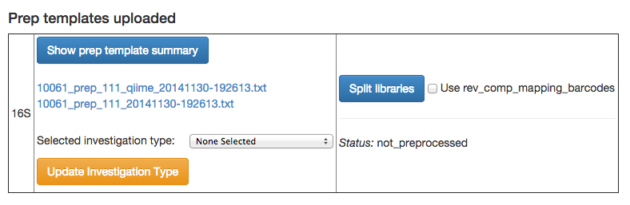
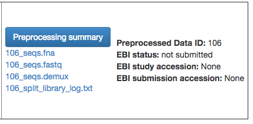

.. _getting-started:

.. index:: getting-started

Getting started
===============

Note that this is a work in progress. Please let us know of any additions or
changes you will like to see by emailing us at `qiita.help@gmail.com
<qiita.help@gmail.com>`__. Thanks!

If you have not yet created an account, please see the document
:doc:`account-creation`.

Managing your studies
---------------------

Studies are the main source of data for Qiita. Studies can contain only one set
of samples but can contain multiple sets of raw data, each of which can have a
different preparation. Many experiments will contain only one data set, which
includes data for all samples. Such experiments will include a single sample
template and a single prep template.  

However, Qiita can also support more complex study designs. For example
imagine a study with 100 samples in which:

1. All of the samples were prepped for 16S and sequenced in two separate
   MiSeq runs
2. 50 of the samples were prepped for 18S and ITS, and sequenced in
   a single MiSeq run
3. 50 of the samples were prepped for WGS and sequenced on a single
   HiSeq run
4. 30 of the samples have metabolomic profiles

To represent this project in Qiita, you will need to create a single
study with a single sample template that contains all 100 of the
samples. Separately, you will need to create four prep templates that
describe the preparations for the corresponding samples. All raw data
uploaded will need to correspond to a specific prep template. For
instance, the data sets described above would require the following data
and template information:

1. All of the samples prepped for 16S and sequenced in two separate
   MiSeq runs

   a) 1 preparation (prep) template describing the two MiSeq runs (use a
      run\_prefix column to differentiate between the two MiSeq runs, more
      on metadata below) where the 100 samples are represented
   b) the 4-6 fastq raw data files without demultiplexing (i.e., the
      forward, reverse (optional), and barcodes for each run)

2. 50 of the samples prepped for 18S and ITS, and sequenced in a single
   MiSeq run

   a) prep templates, one describing the 18S and the other describing the
      ITS preparations
   b) the 2-3 fastq raw data files (forward, reverse (optional), and
      barcodes)

3. 50 of the samples prepped for WGS and sequenced on a single HiSeq run

   a) 1 prep template describing how the samples were multiplexed
   b) the 2-3 fastq raw data files (forward, reverse (optional), and
      barcodes).
   c) NOTE: We currently do not have a processing pipeline for WGS but
      should soon.

4. 30 of the samples with metabolomic profiles

   a) 1 prep template. the raw data file(s) from the metabolomic
      characterization.
   b) NOTE: We currently do not have a processing pipeline for metabolomics but
      should soon.

Creating a study
----------------

|image8|

To create a study, click on the “Study” menu and then on “Create Study”.
This will take you to a new page that will gather some basic information
to create your study.

The “Study Title” has to be unique system-wide. Qiita will check this
when you try to create the study, and may ask you to alter the study
name if the one you provide is already in use..\ |Screen Shot 2015-02-23
at 9.08.35 AM.png|

A principal investigator is required, and a list of known PIs is
provided. If you cannot find the name you are looking for in this
list, you can choose to add a new one.

Select the environmental package appropriate to your study. Different
packages will request different specific information about your samples.
This information is optional; for more details, see the metadata
section.

Finally, select the kind of time series you have. The main options are:

-  No time series: the samples do not represent a time series.
-  Single intervention: the study has only one intervention, the classic
   before/after design. This can be also selected if you are only
   following individuals/environments over time without an actual
   intervention.
-  Multiple intervention: the study includes multiple interventions,
   such as 2-3 antibiotic (ABX) interventions.
-  Combo: the  samples are a combination of those having single and
   multiple interventions.

Additionally, there is a distinction between real, pseudo or mixed
interventions:

-  Real: the study follows the same individuals over time, so there
   are multiple samples from the same individuals.
-  Pseudo: the study has time information from diverse individuals; for
   example, it includes samples from individuals from 3 to 60 years of
   age but has only one sample per individual.
-  Mixed: the study is a combination of real and pseudo.

Once your study has been created, you will be informed by a green
message; click on the study name to begin inserting your sample
template, raw data and/or prep templates.\ |image10|

Inserting sample templates
--------------------------

The first point of entrance to a study is the study description
page. Here you will be able to edit the study info, upload files, and
manage all other aspects of your study.\ |image11|

The first step after study creation is uploading files. Click on the
“Upload” button: as shown in the figure below, you can now drag-and-drop
files into the grey area or simply click on “select from your computer”
to select the fastq, fastq.gz or txt files you want to upload.

Uploads can be paused at any time and restarted again, as long as you do
not refresh or navigate away from the page, or log out of the system
from another page.

|image12|

Once your file(s) have been uploaded, you can process them in Qiita.
From the upload tool, click on “Go to study description” and, once
there, click on the “Sample template” tab.  Select your sample template
from the dropdown menu and, lastly, click “Process sample template”. If
it is processed successfully,, a green message will appear; if
processing is unsuccessful, a red message describing the errors will
appear. In this case, please fix the described issues, re-upload your
file, and then re-attempt processing.
|image13|\ |image14|\ |image15|

You can download the processed sample template file from the “Sample
template” tab. If you are using a single-user install, you will see the
full path on your computer for downloads; alternately, if you have a multi-user
install, you will be able to download the files (Figure 2).

|image16|

|image17|

Figure 2. An example of how downloads differ between the single- and
multi-user installs. In a single-user install, the file-path on your
system is provided. In a multi-user install, an actual download of the
file is available.

The following table describes the data type per column that will be
enforced in the sample and prep templates:

+-----------------------+--------------+
|      Column Name      |  Python Type |
+=======================+==============+
|           sample_name |          str |
+-----------------------+--------------+
|     physical_location |          str |
+-----------------------+--------------+
| has_physical_specimen |         bool |
+-----------------------+--------------+
|    has_extracted_data |         bool |
+-----------------------+--------------+
|           sample_type |          str |
+-----------------------+--------------+
|       host_subject_id |          str |
+-----------------------+--------------+
|           description |          str |
+-----------------------+--------------+
|              latitude |        float |
+-----------------------+--------------+
|             longitude |        float |
+-----------------------+--------------+

Adding raw data
---------------

Once the sample template is successfully processed, you will be able to
use the “Add raw data” tab. You can either (a) select a new raw data
file from the drop-down menu of uploaded files or (b) add raw data from
another study to which you have access. The latter ability exists as a
way to avoid duplication of uploads, since some studies share the same
raw data (for example, the same fastq files). Note that the prep
templates are not shared.

|image18|

Linking files and adding preparation (prep) templates
-----------------------------------------------------

|image19|

After adding raw data to your study, you can add a prep template and
link uploaded raw files through the raw file object (tab). On the left
side of the tab you will have a list of all the updated files. To link
them to this tab you need to select which files are the forward and the
barcodes reads. You can also add which are the reverse reads but these
are optional. Once the selections are made you can “Link raw files for:
name of your raw data”. This action will take you to a new page, where
the moving/adding job is created, but you can move out of there whenever
you want. Note that from that moment until the job is finish, you will
see a “Linking files” message and you will not be able to add any more
files or unlink them.  |image20|

Adding prep templates is similar to adding sample templates except that,
in addition to selecting the prep template file from the dropdown menu,
you will also need to select what kind of prep template (16S, 18S, etc)
and the corresponding investigation type. The investigation type is
optional for Qiita, but a requirement for submitting your data to
EBI.\ |image21|

Finally, when you add a new prep template, you will get two new links or
two full paths for those running Qiita on your local machine: one to
download the prep template you uploaded and another one that is a
QIIME-compatible mapping file. The QIIME mapping file is a combination
of the sample and the prep template.

Preprocessing data
------------------

Once you have linked files to your raw data and your prep template has
been processed, you can then proceed to preprocessing your data.
Currently we only support fastq files for target gene preprocessing
(including reverse complementing the prep template barcodes). We are
working on adding more options and preprocessing pipelines.

Once the preprocessing is finished you will have 4 new files:\ |image22|

-  \*\_seqs.fna: demultiplexed sequences in fasta format
-  \*\_seqs.fastq: demultiplexed sequences in fastq format
-  \*\_seqs.demux: demultiplexed sequences in an HDF5 format (more
   below)
-  \*\_split\_library\_log: the classic QIIME split libraries log that
   summarizes the demultiplexing process

The HDF5 demuliplexed file format allows (described in detail
`here <https://www.google.com/url?q=https%3A%2F%2Fgithub.com%2Fbiocore%2Fqiita%2Fblob%2Fmaster%2Fqiita_ware%2Fdemux.py&sa=D&sntz=1&usg=AFQjCNEzzqKW3-c5dtMDOpLxCS8mnrQn1A>`__)
for random access to sequences associated with samples, as well as
per-sample statistics. This format originated from the need to fetch
sequences associated with individual samples, which required substantial
overhead when working with ASCII formatted sequence files such as fasta
and fastq. The structure provided by HDF5 enables Qiita to rapidly
access the sequence data for any sample, and additionally, to
efficiently subset (potentially randomly) the corresponding sequences.

HDF5 can be thought of internally as a filesystem, where directories are
called “groups” and files are called “datasets.” In the HDF5 demux
format, a sample is a group and the sequence data are decomposed into
multiple datasets. Specifically, the following datasets are directly
part of the sample group:

-  sequence, which contains the actual sequence data stored as a vector
   of string.
-  qual, which contains the quality scores per sequence per nucleotide,
   stored as a matrix of integers. Sequences that do not have quality
   scores associated (e.g., sourced from a Sanger file) will have zeros
   for all positions.

Barcode details can be found under the “barcode” group of the sample.
Within there are three datasets:

-  original, which contains the original barcodes associated with the
   sequences stored as a vector of string.
-  corrected, which contains the corrected barcodes (e.g., the result of
   a corrected substitution error within the barcode) associated with
   the sequences stored as a vector of string.
-  error, which contain the number of observed barcode errors per
   sequence stored as a vector of integer.

All datasets within a sample are in index-order. In other words, the
sequence at index zero corresponds to the quality at row zero,
corresponds to the barcode at index zero, etc.

Last, the following summary statistics are tracked per-sample
(accessible via the group attributes) and per-file (accessible via the
file attributes):

-  n, the number of sequences stored as an integer.
-  max, the maximum sequence length stored as an integer.
-  min, the minimum sequence length stored as an integer.
-  mean, the mean sequence length stored as a floating point value.
-  std, the standard deviation of sequence length stored as a floating
   point value.
-  median, the median sequence length stored as a floating point value.
-  hist, a 10-bin histogram of sequence lengths stored as a vector of
   integer.
-  hist\_edge, the edges of each bin in the sequence length histogram
   stored as a vector of integer.

Once you are happy with these files and you are ready for publication,
you can contact one of the Qiita admins to submit to EBI, this process normally
takes a couple of days but can take more depending on availability and how busy
is the submitting queue.

Study status
------------

-  Sandbox. When a study is in this status, all the required metadata
   columns must be present in the metadata files (sample and prep), but
   the values don't have to be filled in or finalized yet. The purpose
   of this status is so that users can quickly upload their sequence
   files and some (possibly incomplete) metadata in order to have a
   preliminary look at their data.
-  Private.  Moving from sandbox to private status requires the user to
   correct and finalize their metadata. On the each study overview page,
   there is a button that the user can use to request approval. Approval
   must be provided by a Qiita admin, who will validate and finalize the
   metadata. After a study moves from sandbox to private status, very
   little can be changed about the study without reverting the study to
   sandbox.
-  Public. Once a study is made administrator-approved and becomes
   private, the user can choose when to make it public. Making a study
   public means that it will be available to anyone with a Qiita user
   account (e.g., for data downloads and meta-analyses).

Metadata
========

Analyses
========

TODO!

Frequent Asked Questions
========================

What kind of data can I upload to Qiita for processing?
-------------------------------------------------------

We need 3 things: raw data, sample template, and prep template. At this
moment, raw data is fastq files without demultiplexing with forward,
reverse (optional) and barcode reads. We should have before the end of
the week SFF processing so it's OK to upload. Note that we are accepting
any kind of target gene (16S, 18S, ITS, whatever) as long as they have
some kind of demultiplexing strategy and that you can also upload WGS.
However, WGS processing is not ready.

What's the difference between a sample and a prep template?
-----------------------------------------------------------

Sample template is the information about your samples, including
environmental and other important information about them. The prep
template is basically what kind of wet lab work all or a subset of the
samples had. If you collected 100 samples, you are going to need 100
rows in your sample template describing each of them, this includes
blanks, etc. Then you prepared 95 of them for 16S and 50 of them for
18S. Thus, you are going to need 2 prep templates: one with 95 rows
describing the preparation for 16S, and another one with 50 to
describing the 18S. For a more complex example go
`here <#h.eddzjlm5e6l6>`__ and for examples of these files you can go to
the "Upload instructions"
`here <https://www.google.com/url?q=https%3A%2F%2Fvamps.mbl.edu%2Fmobe_workshop%2Fwiki%2Findex.php%2FMain_Page&sa=D&sntz=1&usg=AFQjCNE4PTOKIvFNlWtHmJyLLy11mfzF8A>`__.

Example study processing workflow
---------------------------------

A few more instructions: for the example above the workflow should be:

#. Create a new study
#. Add a sample template, you can add 1, try to process it and the
   system will let you know if you have errors or missing columns. The
   most common errors are: the sample name column should be named
   sample\_name, duplicated sample names are not permitted, and the prep
   template should contain all the samples in the sample template or a
   subset. Finally, if you haven't processed your sample templates and
   can add a column to your template named sloan\_status with this info:
   SLOAN (funded by Sloan), SLOAN\_COMPATIBLE (not Sloan funded but with
   compatible metadata, usually public), NOT\_SLOAN (not included i.e.
   private study), that will be great!
#. Add a raw data. Depending on your barcoding/sequencing strategy you
   might need 1 or 2 raw datas for the example above. If you have two
   different fastq file sets (forward, reverse (optional) and barcodes)
   you will need two raw datas but if you only have one set, you only
   need one.
#. You can link your raw data to your files
#. You can add a prep template to your raw data. If you have the case
   with only one fastq set (forward, reverse (optional) and barcodes),
   you can add 2 different prep templates. Common missing fields here
   are: emp\_status, center\_name, run\_prefix, platform,
   library\_construction\_protocol, experiment\_design\_description,
   center\_project\_name. Note that if you get a 500 error at this stage
   is highly probable because emp\_status only accepts 3 values: 'EMP',
   'EMP\_Processed', 'NOT\_EMP', if errors persist please do not
   hesitate to contact us.
#. You can preprocess your files. For target gene, this means
   demultiplexing and QC.

.. |image8| image:: images/image18.png
.. |Screen Shot 2015-02-23 at 9.08.35 AM.png| image:: images/image02.png
.. |image10| image:: images/image04.png
.. |image11| image:: images/image09.png

.. |image13| image:: images/image01.png
.. |image14| image:: images/image22.png
.. |image15| image:: images/image12.png
.. |image16| image:: images/image00.png
.. |image17| image:: images/image15.png
.. |image18| image:: images/image06.png
.. |image19| image:: images/image21.png

