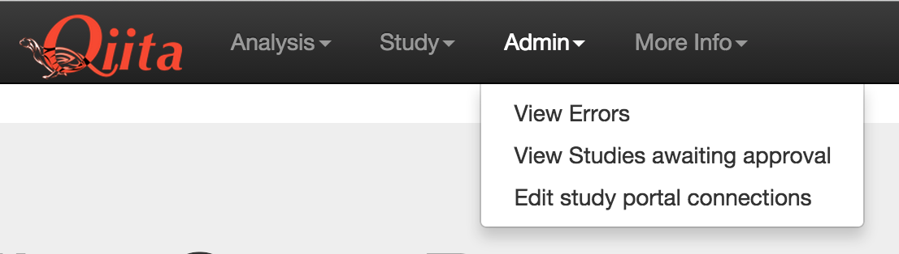
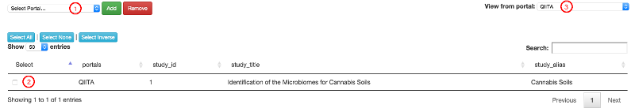
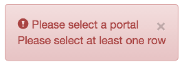
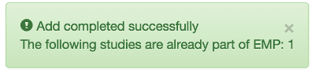

.. _portals:

.. index:: portals

User Portals
============
User portals allow a user to cordon off specific studies and analyses into their
 own user interface, which we call a portal, selectively slicing the data
 available through that portal.

The main ``QIITA`` portal gives access to all studies in the database, while
adding studies to a specific portal and changing the config file to point to the
portal will show the same interface, but with only the selected studies. To
change the portal being accessed, simply change the `PORTAL` setting in the
qiita config file. This must correspond to a portal name in the database.

Creating/Deleting a portal
--------------------------
Portals are created using the command line interface. A portal may be added
using the command ``qiita-env create-portal PORTAL_NAME PORTAL_DESC``.
Conversely, a portal may be deleted by the command
``qiita-env remove-portal PORTAL_NAME``.
Note, however, that you can not remove a portal that has one or more
studies/analyses attached to it. The portal must be completely connectionless
to be deleted. The ``QIITA`` portal is also a base system portal and therefore
can not be deleted.

Adding/Deleting studies on a portal
-----------------------------------
Studies will automatically be added to the main ``QIITA`` portal, as well as
the portal set in the config file if different than ``QIITA``. To add or remove
a study from a portal, there are two methods: Command line and web interface.

Command line additions and deletions can be done using the
``qiita db portal [add/remove]-studies PORTAL_NAME STUDY_LIST``.
The ``PORTAL_NAME`` is the name of the portal to add or remove from, and the
``STUDY_LIST`` is a space separated list of study IDs to act on. For example,
to add studies 5, 6, and 7 to the portal "EMP", you would use the following
command:

``qiita db portal add-studies EMP 5 6 7``

To add from the web interface, you must have admin privileges and be on the
``QIITA`` portal. You can then access the portals editing page through the
admin menu dropdown and selecting "Edit study portal connections".

On this page, you can select all studies required, followed by the portal, and
then add or remove as needed.

1. Portal selection: This changes what portal the studies will be added/removed
   from. A portal must be selected.
2. Study selection: Select the studies you want to add/delete from the portal.
   at least one study must be selected.
3. Portal view selection: Changing this dropdown changes the studies viewed in
   the table. Current studies in the table belong to the portal selected here.

   If you have not selected a study and/or portal, an error message will display
   and the selection will not be processed.

   If selections are made correctly, a success message will appear. This may
   may include a list of study IDs that were not acted upon, along with the reason
   for not acting upon them. For example, if a study is already part of a portal
   and added again, it will show up in this message.

Adding/Deleting analyses on a portal
------------------------------------
Analyses will automatically be added to the main ``QIITA`` portal, as well as
the portal set in the config file if different than ``QIITA``. Because the
analyses are heavily dependent on what studies and data are available, **WE
STRONGLY ADVISE NOT CHANGING THE PORTAL ASSIGNMENTS FOR ANALYSES.**

If absolutely required, command line additions and deletions can be done using
the ``qiita db portal [add/remove]-analyses PORTAL_NAME ANALYSIS_LIST``. The
``PORTAL_NAME`` is the name of the portal to add or remove from, and the
``ANALYSIS_LIST`` is a space separated list of analysis IDs to act on. For
example, to remove analyses 5, 6, and 7 to the portal "EMP", you would use the
following command:

``qiita db portal remove-analyses EMP 5 6 7``

Customizing portal text and style
---------------------------------
Portals can have their own custom welcome text and CSS styling. Portals have
their own configuration file, an example of which is in
qiita_pet/support_files/portal_config.cfg

In this file, you can enter the site title and logo for the portal, along with
header and welcome text displayed on the index page. Logos must be 40px by
100px.

You may also add a filepath to a custom CSS file for further style
customizations as required. This must be a standard format CSS file, based off
the jQuery 2.1.0 and bootstrap 3.1.1 CSS libraries. The custom CSS will then be
injected into each page automatically. Changes to the custom CSS will be applied
on next server restart.
