Analyzing Samples
=================

Creating A New Analysis
-----------------------

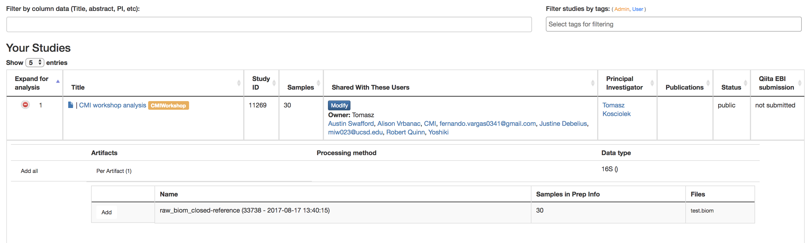

* **Create New Analysis Page**

  * **Filter results by column data (Title, Abstract, PI, etc.)**: Searches for studies with the title/abstract/PI/etc. that you inputted
  * **Filter study by Study Tags**: Searches for studies with the tag you searched for
  * **Title**: Brings you to Study Information Page of that experiment
  * **Green Expand for Analysis Button**: Reveals the studies done on this data that can be used for further analysis
  * **Per Artifact Button**: Reveals the names of the artifacts, the number of samples in the prep info, and the files

    * **Add**: Adds data to be analyzed

      * More than 1 can be done at once to do large meta-data analysis

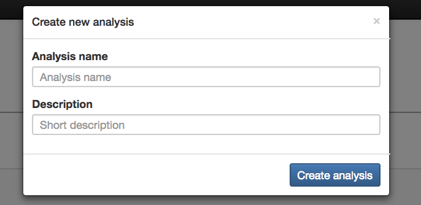

* **Create New Analysis**: Creates the analysis using the data that has been added

  * **Analysis Name** (required): Name for the analysis that will be done
  * **Description** (optional): Description for the analysis that will be done

Single vs. Meta Analysis
------------------------------
* **Single analysis**: One study chosen to analyze
* **Meta-analysis**: Multiple studies chosen to analyze

  * *You can only merge like data*

Processing Network Page: Commands
---------------------------------

Commands for Deblurred or Closed-Reference Data
~~~~~~~~~~~~~~~~~~~~~~~~~~~~~~~~~~~~~~~~~~~~~~~~

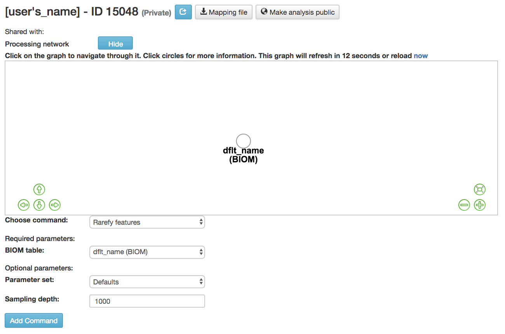

* **Rarefy features** :ref:`[35]<reference35>` : Subsample frequencies from all samples without replacement so that the sum of frequencies in each sample is equal to the sampling-depth

  *  **BIOM table** (required): Feature table containing the samples for which features should be rarefied
  *  **Parameter set**: Parameters at which the rarefication is run
  *  **Sampling depth** (required): Total frequency that each sample should be rarefied to, samples where sum of frequencies is less than sampling depth will not be included in resulting table

Commands from Rarefied Data
~~~~~~~~~~~~~~~~~~~~~~~~~~~

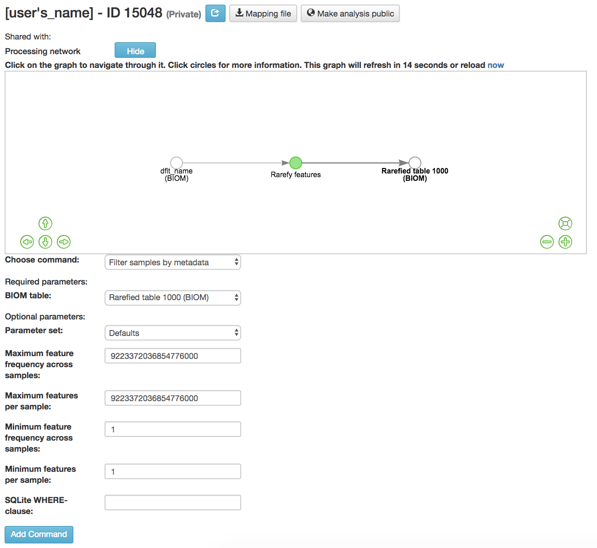

* **Filter samples by metadata**: Filters samples from an OTU table on the basis of the number of observations in that sample, or on the basis of sample metadata

  * **BIOM table** (required): Feature table containing the samples for which features should be filtered
  * **Maximum feature frequency across samples** (optional): Maximum total frequency that a feature can have to be retained
  * **Maximum features per sample** (optional): Maximum number of features that a sample can have to be retained
  * **Minimum feature frequency across samples** (optional): Minimum total frequency that a feature must have to be retained
  * **Minimum features per sample** (optional): Minimum number of features that a sample can have to be retained
  * **SQLite WHERE-clause** (optional): Metadata group that is being filtered out

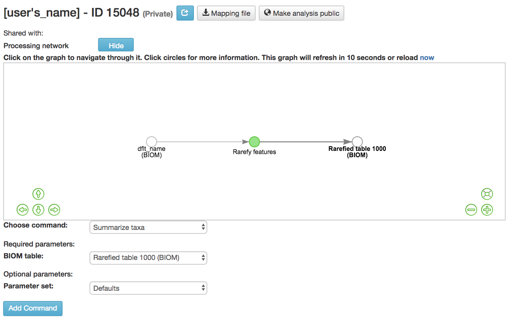

* **Summarize Taxa**: Creates a bar plot of the taxa within the analysis

  * *Can only be performed with closed-reference data*
  * **BIOM table** (required): Feature table containing the samples to visualize at various taxonomic levels

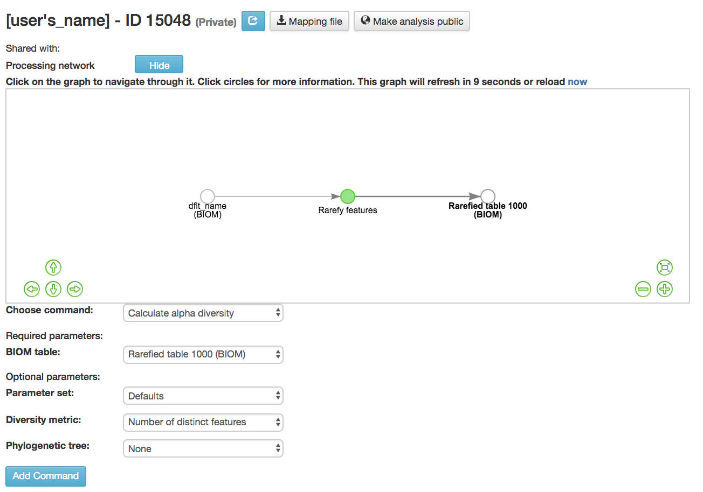

* **Calculate alpha diversity** :ref:`[99]<reference99>`: Measures the diversity within a sample

  * **BIOM table** (required): Feature table containing the samples for which alpha diversity should be computed

    * **Diversity metric** (required): Alpha diversity metric to be run

      * **Abundance-based Coverage Estimator (ACE) metric** :ref:`[15]<reference15>` : Calculates the ACE metric

        * Estimates species richness using a correction factor

      * **Berger-Parker Dominance Index** :ref:`[8]<reference8>` : Calculates Berger-Parker dominance index

        * Relative richness of the abundant species

      * **Brillouin’s index** :ref:`[73]<reference73>`: Calculates Brillouin’s index

        * Measures the diversity of the species present

        * Use when randomness can’t be guaranteed

      * **Chao1 confidence interval** :ref:`[21]<reference21>`: Calculates chao1 confidence interval

        * Confidence interval for richness estimator, Chao1

      * **Chao1 index** :ref:`[15]<reference15>`: Calculates Chao1 index

        * Estimates diversity from abundant data
        * Estimates number of rare taxa missed from undersampling

      * **Dominance measure**: Calculates dominance measure

        * How equally the taxa are presented

      * **Effective Number of Species (ENS)/Probability of intra-or interspecific encounter (PIE) metric** :ref:`[17]<reference17>` : Calculates Effective Number of Species (ENS)/Probability of intra-or interspecific encounter (PIE) metric

        * Shows how absolute amount of species, relative abundances of species, and their intraspecific clustering affect differences in biodiversity among communities

      * **Esty confidence interval** :ref:`[25]<reference25>` : Calculates Esty’s confidence interval

        * Confidence interval for how many singletons in total individuals

      * **Faith’s phylogenetic diversity** :ref:`[25]<reference25>` : Calculates faith’s phylogenetic diversity

        * Measures of biodiversity that incorporates phylogenetic difference between species
        * Sum of length of branches

      * **Fisher’s index** :ref:`[28]<reference28>` : Calculates Fisher’s index

        * Relationship between the number of species and the abundance of each species

      * **Gini index** :ref:`[30]<reference30>` : Calculates Gini index

        * Measures species abundance
        * Assumes that the sampling is accurate and that additional data would fall on linear gradients between the values of the given data

      * **Good’s coverage of counts** :ref:`[32]<reference32>` : Calculates Good’s coverage of counts.

        * Estimates the percent of an entire species that is represented in a sample

      * **Heip’s evenness measure** :ref:`[36]<reference36>` : Calculates Heip’s evenness measure.

        * Removes dependency on species number

      * **Kempton-Taylor Q index** :ref:`[43]<reference43>` : Calculates Kempton-Taylor Q index

        * Measured diversity based off the distributions of species
        * Makes abundance curve based off all species and IQR is used to measure diversity

      * **Lladser’s confidence interval** :ref:`[55]<reference55>` : Calculates Lladser’s confidence interval

        * Single confidence interval of the conditional uncovered probability

      * **Lladser’s point estimate** :ref:`[55]<reference55>` : Calculates Lladser’ point estimate

        * Estimates how much of the environment contains unsampled taxa
        * Best estimate on a complete sample

      * **Margalef’s richness index** :ref:`[59]<reference59>` : Calculates Margalef’s richness index

        * Measures species richness in a given area or community

      * **Mcintosh dominance index D** :ref:`[62]<reference62>`: Calculates McIntosh dominance index D

        * Affected by the variation in dominant taxa and less affected by the variation in less abundant or rare taxa

      * **Mcintosh evenness index E** :ref:`[36]<reference36>` : Calculates McIntosh’s evenness measure E

        * How evenly abundant taxa are

      * **Menhinick’s richness index** :ref:`[59]<reference59>` : Calculates Menhinick’s richness index

        * The ratio of the number of taxa to the square root of the sample size

      * **Michaelis-Menten fit to rarefaction curve of observed OTUs** :ref:`[77]<reference77>` : Calculates Michaelis-Menten fit to rarefaction curve of observed OTUs.

        * Estimated richness of species pools

      * **Number of distinct features** :ref:`[22]<reference22>` : Calculates number of distinct OTUs
      * **Number of double occurrences**: Calculates number of double occurrence OTUs (doubletons)

        * OTUs that only occur twice

      * **Number of observed features, including singles and doubles** :ref:`[22]<reference22>` : Calculates number of observed OTUs, singles, and doubles
      * **Number of single occurrences**: Calculates number of single occurrence OTUs (singletons)

        * OTUs that appear only once in a given sample

      * **Pielou’s evenness** :ref:`[72]<reference72>` : Calculates Pielou’s eveness

        * Measure of relative evenness of species richness

      * **Robbins’ estimator** :ref:`[79]<reference79>` : Calculates Robbins’ estimator

        * Probability of unobserved outcomes

      * **Shannon’s index** :ref:`[83]<reference83>` : Calculates Shannon’s index

        * Calculates richness and diversity using a natural logarithm
        * Accounts for both abundance and evenness of the taxa present

      * **Simpson evenness measure E** :ref:`[84]<reference84>` : Calculates Simpson’s evenness measure E.

        * Diversity that account for the number of organisms and number of species

      * **Simpson’s index** :ref:`[84]<reference84>` : Calculates Simpson’s index

        * Measures the relative abundance of the different species making up the sample richness

      * **Strong’s dominance index (Dw)** :ref:`[89]<reference89>`:  Calculates Strong’s dominance index

        * Measures species abundance unevenness

    * **Phylogenetic tree** (required for Faith PD): Phylogenetic tree to be used with alpha analyses (only include when necessary)

      * Currently the only tree that can be used is the GreenGenes 97% OTU based phylogenetic tree

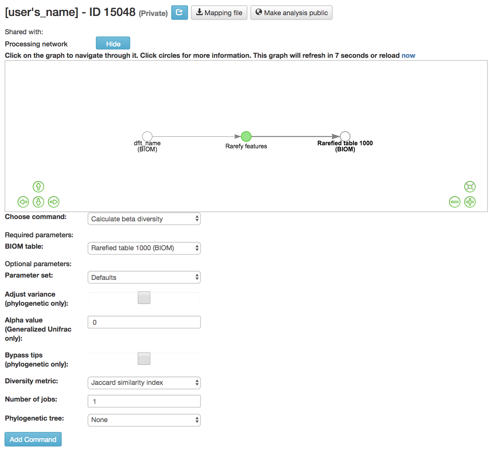

* **Calculate beta diversity** :ref:`[99]<reference99>`: Measured the diversity between samples

  * **BIOM table** (required): Feature table containing the samples for which beta diversity should be computed
  * **Adjust variance** :ref:`[14]<reference14>` (phylogenetic only): Performs variance adjustment

    * Weighs distances based on the proportion of the relative abundance represented between the samples at a given node under evaluation

  * **Alpha value** (Generalized UniFrac only): Controls importance of sample proportions

    * 1.0 is weighted normalized UniFrac. 0.0 is close to unweighted UniFrac, but only if the sample  are dichotomized.

  * **Bypass tips** (phylogenetic only): In a bifurcating tree, the tips make up about 50% of the nodes in a tree. By ignoring them, specificity can be traded for reduced compute time. This has the effect of collapsing the phylogeny, and is analogous (in concept) to moving from 99% to 97% OTUs
  * **Diversity metric** (required): Beta diversity metric to be run

    * **Bray-Curtis dissimilarity** :ref:`[87]<reference87>` : Calculates Bray–Curtis dissimilarity

      * Fraction of overabundant counts

    * **Canberra distance** :ref:`[52]<reference52>` : Calculates Canberra distance

      * Overabundance on a feature by feature basis

    * **Chebyshev distance** :ref:`[11]<reference11>` : Calculates Chebyshev distance

      * Maximum distance between two samples

    * **City-block distance** :ref:`[69]<reference69>` :  Calculates City-block distance

      * Similar to the Euclidean distance but the effect of a large difference in a single dimension is reduced

    * **Correlation coefficient** :ref:`[29]<reference29>`: Measures Correlation coefficient

      * Measure of strength and direction of linear relationship between samples

    * **Cosine Similarity** :ref:`[68]<reference68>` : Measures Cosine similarity

      * Ratio of the amount of common species in a sample to the mean of the two samples

    * **Dice measures** :ref:`[24]<reference24>` : Calculates Dice measure

      * Statistic used for comparing the similarity of two samples
      * Only counts true positives once

    * **Euclidean distance** :ref:`[53]<reference53>` : Measures Euclidean distance

      * Species-by-species distance matrix

    * **Generalized Unifrac** :ref:`[18]<reference18>` : Measures Generalized UniFrac

      * Detects a wider range of biological changes compared to unweighted and weighted UniFrac

    * **Hamming distance** :ref:`[34]<reference34>` : Measures Hamming distance

      * Minimum number of substitutions required to change one group to the other

    * **Jaccard similarity index** :ref:`[41]<reference41>` : Calculates Jaccard similarity index

      * Fraction of unique features, regardless of abundance

    * **Kulczynski dissimilarity index** :ref:`[50]<reference50>` : Measures Kulczynski dissimilarity index

      * Describes the dissimilarity between two samples

    * **Mahalanobis distance** :ref:`[60]<reference60>` : Calculates Mahalanobis distance

      * How many standard deviations one sample is away from the mean
      * Unitless and scale-invariant
      * Takes into account the correlations of the data set

    * **Matching components** :ref:`[42]<reference42>`: Measures Matching components

      * Compares indices under all possible situations

    * **Rogers-tanimoto distance** :ref:`[90]<reference90>` : Measures Rogers-Tanimoto distance

      * Allows the possibility of two samples, which are quite different from each other, to both be similar to a third

    * **Russel-Rao coefficient** :ref:`[81]<reference81>` : Calculates Russell-Rao coefficients

      * Equal weight is given to matches and non-matches

    * **Sokal-Michener coefficient** :ref:`[85]<reference85>`: Measures Sokal-Michener coefficient

      * Proportion of matches between samples

    * **Sokal-Sneath Index** :ref:`[86]<reference86>` : Calculates Sokal-Sneath index

      * Measure of species turnover

    * **Species-by-species Euclidean** :ref:`[53]<reference53>` : Measures Species-by-species Euclidean

      * Standardized Euclidean distance between two groups
      * Each coordinate difference between observations is scaled by dividing by the corresponding element of the standard deviation

    * **Squared Euclidean** :ref:`[53]<reference53>` : Measures squared Euclidean distance

      * Place progressively greater weight on samples that are farther apart

    * **Unweighted Unifrac** :ref:`[58]<reference58>` : Measures unweighted UniFrac

      * Measures the fraction of unique branch length

    * **Weighted Minkowski metric** :ref:`[13]<reference13>` : Measures Weighted Minkowski metric

      * Allows the use of the k-means-type paradigm to cluster large data sets

    * **Weighted normalized UniFrac** :ref:`[57]<reference57>` : Measures Weighted normalized UniFrac

      * Takes into account abundance
      * Normalization adjusts for varying root-to-tip distances.

    * **Weighted unnormalized UniFrac** :ref:`[57]<reference57>` : Measures Weighted unnormalized UniFrac

      * Takes into account abundance
      * *Doesn't correct for unequal sampling effort or different evolutionary rates between taxa*

    * **Yule index** :ref:`[28]<reference28>` : Measures Yule index

      * Measures biodiversity
      * Determined by the diversity of species and the proportions between the abundance of those species.

  * **Number of jobs**: Number of workers to use
  * **Phylogenetic tree** (required for Mahalanobis distance, Weighted Minkowski metric, and all UniFrac metrics): Phylogenetic tree to be used with beta analyses (only include when necessary)

    * Currently the only tree that can be used is the GreenGenes 97% OTU based phylogenetic tree

Commands from Alpha Diversity Data
~~~~~~~~~~~~~~~~~~~~~~~~~~~~~~~~~~

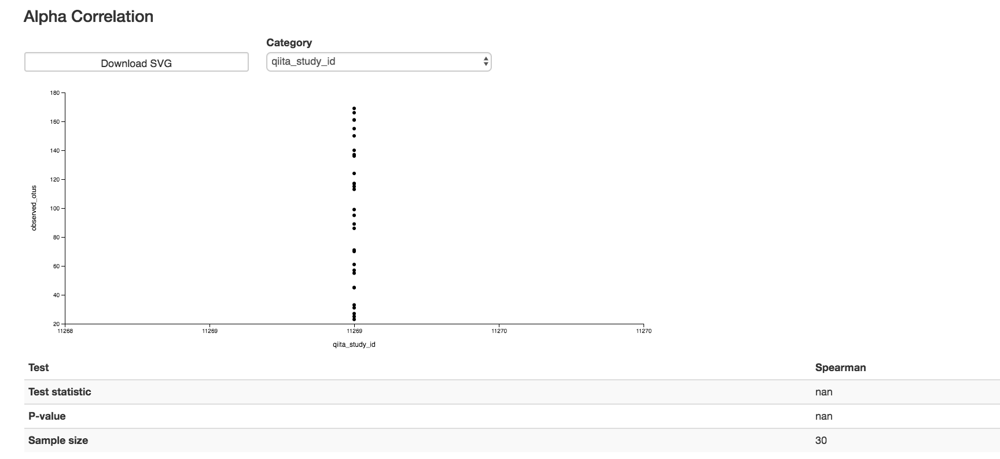

* **Calculate alpha correlation** :ref:`[80]<reference80>` : Determines if the numeric sample metadata category is correlated with alpha diversity

  * **Alpha Vectors** (required): Vector of alpha diversity values by sample
  * **Correlation Method** (required): Correction test being applied

    * **Spearman** :ref:`[88]<reference88>` : Measures if there is a linear relationship between 2 variables
    * **Pearson** :ref:`[70]<reference70>` : Measures how strong the linear relationship is between 2 variables

Commands from Beta Diversity Data
~~~~~~~~~~~~~~~~~~~~~~~~~~~~~~~~~

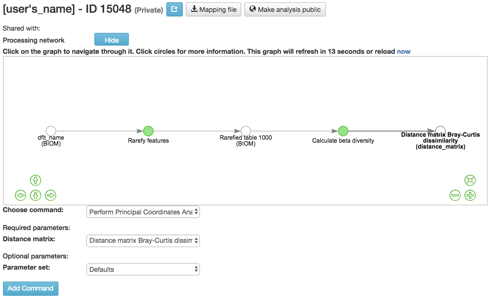

* **Perform Principal Coordinate Analysis (PCoA)** :ref:`[71]<reference71>` : Visualizes the similarities and differences between samples using Emperor Plots :ref:`[95]<reference95>`

  * **Distance matrix** (required): Distance matrix on which the PCoA should be computed

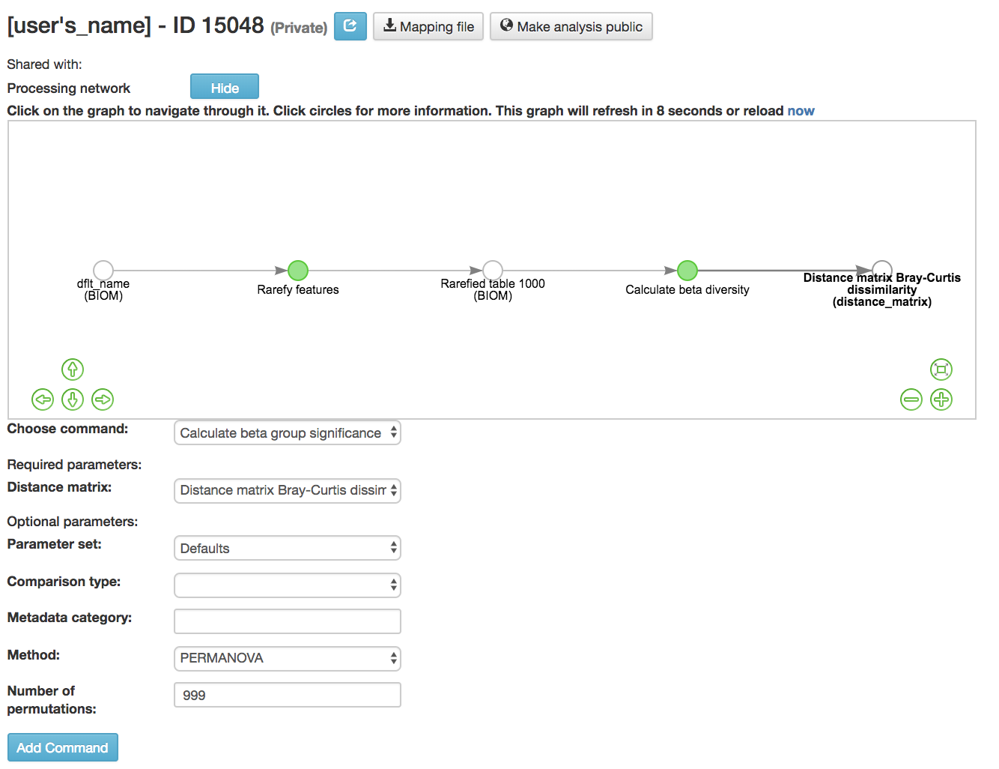

* **Calculate beta group significance**: Determines whether groups of samples are significantly different from one another using a permutation-based statistical test

  * **Distance matrix** (required): Matrix of distances between pairs of samples
  * **Comparison Type** (required): Perform or not perform pairwise tests between all pairs of groups in addition to the test across all groups
  * **Metadata category** (required): Category from metadata file or artifact viewable as metadata
  * **Method** (required): Correlation test being applied

    * **Anosim** :ref:`[20]<reference20>` :  Describes the strength and significance that a category has in determining the distances between points and can accept either categorical or continuous variables in the metadata mapping file
    * **Permanova** :ref:`[4]<reference4>`: Describes the strength and significance that a category has in determining the distances between points and can accept categorical variables

  * **Number of permutations** (required): Number of permutations to be run when computing p-values

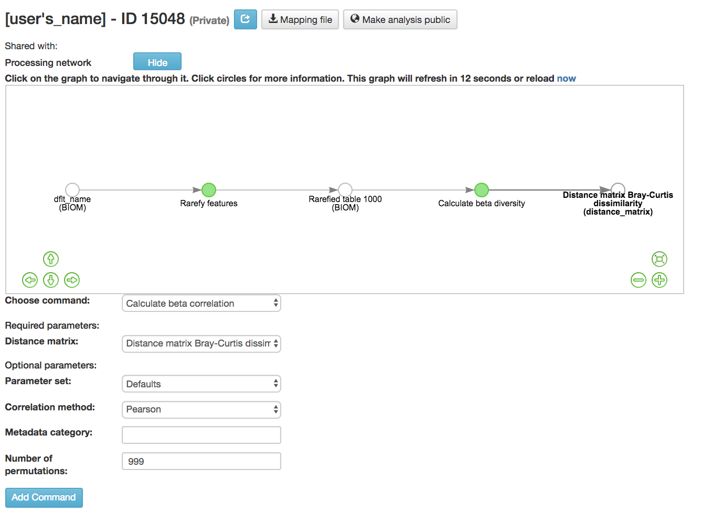

* **Calculate beta correlation**: Identifies a correlation between the distance matrix and a numeric sample metadata category

  * **Distance-matrix** (required): Matrix of distances between pairs of samples
  * **Correlation method** (required): Correlation test being applied

    * **Spearman** :ref:`[88]<reference88>`: Measures if there is a linear relationship between 2 variables
    * **Pearson** :ref:`[70]<reference70>`: Measures how strong the linear relationship is between 2 variables

  * **Metadata-category** (required): Category from metadata file or artifact viewable as metadata
  * **Number of permutations** (required): Number of permutations to be run when computing p-values

Processing Network Page: Results
--------------------------------

Taxa Bar Plot
~~~~~~~~~~~~~

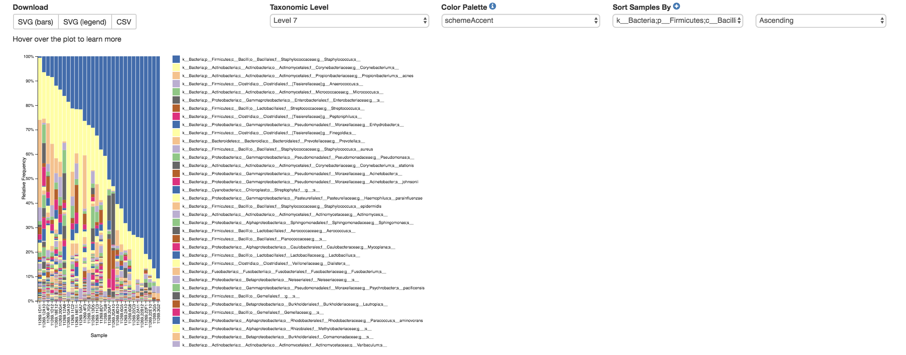

* **Taxonomic Level**: How specific the taxa will be displayed

  * 1- Kingdom, 2- Phylum, 3- Class, 4- Order, 5- Genus, 6- Species, 7- Subspecies

* **Color Palette**: Changes the coloring of your taxa bar plot

  * **Discrete**: Each taxon is a different color
  * **Continuous**: Each taxon is a different shade of one color

* **Sort Sample By**: Sorts data by sample metadata or taxonomic abundance and either by ascending or descending order

Alpha Diversity Results
~~~~~~~~~~~~~~~~~~~~~~~

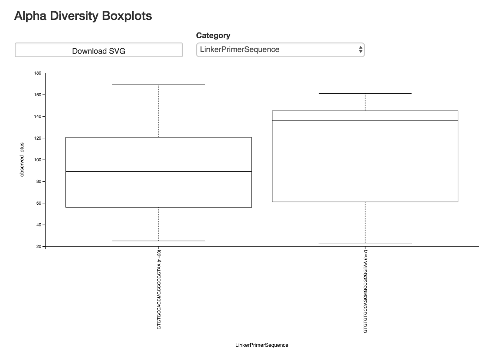

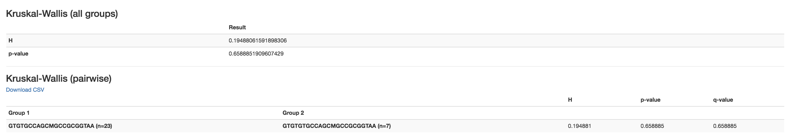

* **Boxplot**: Shows how different measures of alpha diversity correlate with different metadata categories
* **Category**: Choose the metadata category you would like to analyze
* **Kruskal-Wallis** :ref:`[49]<reference49>`: Result of Kruskal-Wallis tests

  * Says if the differences are statistically significant

Alpha Correlation Results
~~~~~~~~~~~~~~~~~~~~~~~~~

.. figure::  alpha_correlation_plot.png
   :align:   center

* **Boxplot**: Shows how different measures of alpha diversity correlate with different metadata categories

  * Gives the Spearman or Pearson result (rho and p-value)

Beta Diversity Result
~~~~~~~~~~~~~~~~~~~~~

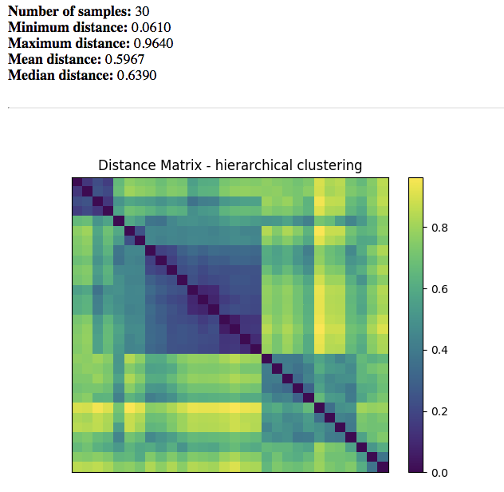

* **Distance Matrix**: Dissimilarity value for each pairwise comparison

PCoA Result
~~~~~~~~~~~

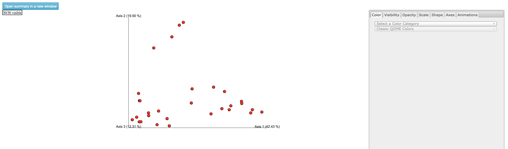

* **Emperor Plot**: Visualization of similarities/dissimilarities between samples

  * **Color**: Choose colors for each group

    * **Color Category**: Groups each sample by the given category chosen by a given color

  * **Visibility** Allows for making certain samples invisible

    * *Does not remove them from the analysis*

      * Must perform filtering to do that

  * **Opacity**: Change the transparency of a given category
  * **Scale**: Change the size of a given category
  * **Shape**: Groups each sample by the given category chosen by a given shape
  * **Axes**: Change the position of the axis as well as the color of the graph
  * **Animations**: Traces the samples sorted by a metadata category

    * *Requires a gradient (the order in which samples are connected together, must be numeric) column and a trajectory (the way in which samples are grouped together) column within the sample information file*
    * *Works best for time series*

Beta Group Significance
~~~~~~~~~~~~~~~~~~~~~~~

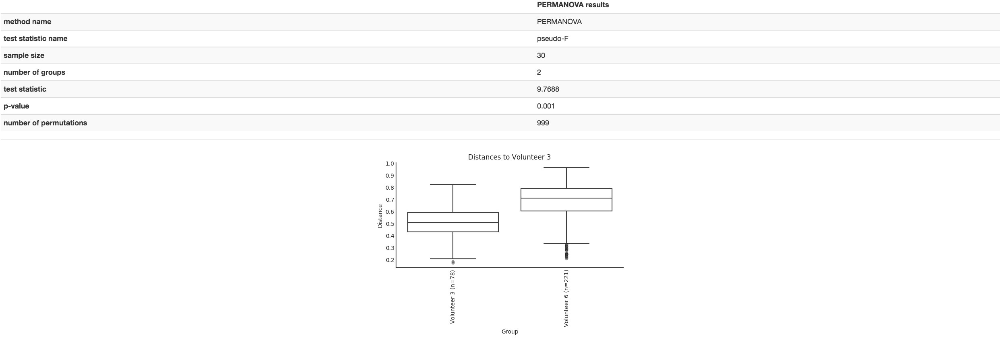

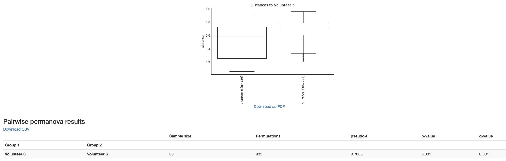

* **Boxplot**: Shows how different measures of beta diversity correlate with different metadata categories
* Gives the Permanova or Anosim result (psuedo-F and p-value)
