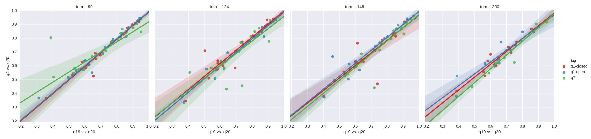
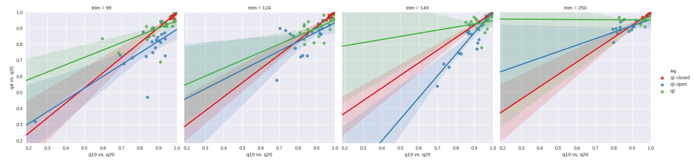
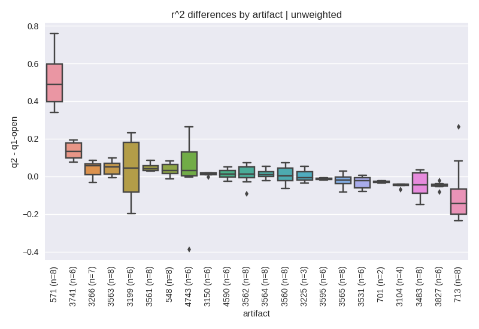
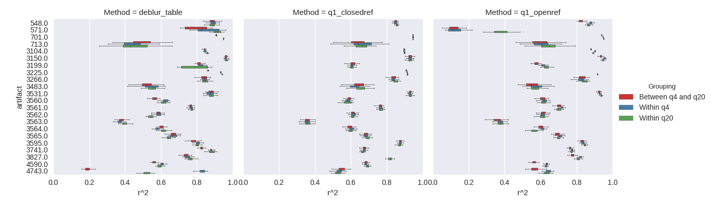

.. _deblur_quality:

.. index:: deblur-quality

Deblur quality filtering
========================

In the `Deblur Manuscript <http://msystems.asm.org/content/2/2/e00191-16>`__, many of the analyses performed quality filtered the sequence data based on the PHRED scores prior to the application of Deblur. The decision at the time was a motivation to reduce potential noise in the Deblur process, however an evaluation of whether the quality filtering actually mattered had not been performed. Herein, we explore the effect of quality filtering on Deblur as well as closed and open reference OTU picking using Mantel tests assessing the correlation between quality filtering levels. Based on our results, we do not see a practical reason to quality filter beyond the minimal recommendations made in `Bokulich et al. 2013 <https://www.ncbi.nlm.nih.gov/pubmed/23202435>`__.

Methods
=======

Preprocessed Illumina (MiSeq and HiSeq) artifacts targeting the 16S rRNA V4 region were selected from the public data in Qiita. The artifacts were choosen to span environments and with a bias toward longer read length to allow for the exploration of read trim lengths. The specific artifacts, studies and brief summaries of their environments used are summarized below:

.. table::

    +--------------+--------+--------------------------+------------------------------------------------+
    |Qiita Study ID|Artifact|      Environment         |                       URL                      |
    +==============+========+==========================+================================================+
    |         10407|    3150|Lemur gut                 |https://qiita.ucsd.edu/study/description/10407  |
    +--------------+--------+--------------------------+------------------------------------------------+
    |         10431|    3266|Soil                      |https://qiita.ucsd.edu/study/description/10431  |
    +--------------+--------+--------------------------+------------------------------------------------+
    |         10729|    4743|Butterfly gut             |https://qiita.ucsd.edu/study/description/10729  |
    +--------------+--------+--------------------------+------------------------------------------------+
    |         10483|    4590|Mouse gut                 |https://qiita.ucsd.edu/study/description/10483  |
    +--------------+--------+--------------------------+------------------------------------------------+
    |         10481|    3741|Microbial mat             |https://qiita.ucsd.edu/study/description/10481  |
    +--------------+--------+--------------------------+------------------------------------------------+
    |         10532|    3827|Human gut                 |https://qiita.ucsd.edu/study/description/10532  |
    +--------------+--------+--------------------------+------------------------------------------------+
    |         10485|    3562|Bovine milk               |https://qiita.ucsd.edu/study/description/10485  |
    +--------------+--------+--------------------------+------------------------------------------------+
    |         10394|    3104|Dog and human gut         |https://qiita.ucsd.edu/study/description/10394  |
    +--------------+--------+--------------------------+------------------------------------------------+
    |         10470|    3595|Estuarine bacterioplankton|https://qiita.ucsd.edu/study/description/10470  |
    +--------------+--------+--------------------------+------------------------------------------------+
    |         10346|     701|Porifera                  |https://qiita.ucsd.edu/study/description/10346  |
    +--------------+--------+--------------------------+------------------------------------------------+
    |         10343|    3199|peruvian_ants             |https://qiita.ucsd.edu/study/description/10343  |
    +--------------+--------+--------------------------+------------------------------------------------+
    |         10360|    3531|atacama_soils             |https://qiita.ucsd.edu/study/description/10360  |
    +--------------+--------+--------------------------+------------------------------------------------+
    |         10297|     571|gambian_infants           |https://qiita.ucsd.edu/study/description/10297  |
    +--------------+--------+--------------------------+------------------------------------------------+
    |         10291|     548|chick_microbiome          |https://qiita.ucsd.edu/study/description/10291  |
    +--------------+--------+--------------------------+------------------------------------------------+
    |         10281|     713|fed_reactor               |https://qiita.ucsd.edu/study/description/10281  |
    +--------------+--------+--------------------------+------------------------------------------------+
    |         10485|    3565|bovine_milk               |https://qiita.ucsd.edu/study/description/10485  |
    +--------------+--------+--------------------------+------------------------------------------------+
    |         10485|    3564|bovine_milk               |https://qiita.ucsd.edu/study/description/10485  |
    +--------------+--------+--------------------------+------------------------------------------------+
    |         10485|    3563|bovine_milk               |https://qiita.ucsd.edu/study/description/10485  |
    +--------------+--------+--------------------------+------------------------------------------------+
    |         10485|    3560|bovine_milk               |https://qiita.ucsd.edu/study/description/10485  |
    +--------------+--------+--------------------------+------------------------------------------------+
    |         10485|    3561|bovine_milk               |https://qiita.ucsd.edu/study/description/10485  |
    +--------------+--------+--------------------------+------------------------------------------------+
    |         10423|    3225|office                    |https://qiita.ucsd.edu/study/description/10423  |
    +--------------+--------+--------------------------+------------------------------------------------+
    |         10342|    3483|native_american_guts      |https://qiita.ucsd.edu/study/description/10342  |
    +--------------+--------+--------------------------+------------------------------------------------+

Each preprocessed artifact was filtered using the QIIME 1.9.1 standard parameters, as implemented in `q2-quality-filter <https://github.com/qiime2/q2-quality-filter>`__, with the exception that the minimum allowable quality score was varied from 4 (the default from Bokulich et al), 19 or 20. N.B. in QIIME 1.9.1, these minimum quality score values are equivalent to -q 3, -q 18 and -q 19 respectively. The quality filtered data were run through Deblur 1.0.1 via `q2-deblur <https://github.com/qiime2/q2-deblur>`__, QIIME 1.9.1’s default open reference OTU picking pipeline and QIIME 1.9.1’s default closed reference OTU picking pipeline. In the case of q2-deblur, the data were trimmed to different read lengths of 99, 124, 149, 250 (where feasible for the study) via exposed command line options; for QIIME 1.9.1, the data were trimmed using GNU cut 8.4. For the q2-deblur and open reference pipelines, trees were constructed using the respective defaults for QIIME2 and QIIME 1.9.1, where the former uses MAFFT with a dynamic entropy filter followed by FastTree and midpoint rooting, while the latter uses PyNAST with the Lane mask and FastTree. 

A high level characterization was performed by rarefying the tables to 1000 sequences per sample and computing unweighted and weighted UniFrac using the implementation in `q2-state-unifrac <https://github.com/wasade/q2-state-unifrac>`__. Mantel tests, as implemented in scikit-bio 0.5.1, were performed between q4 vs. q20, or q19 vs. q20 while controlling for OTU type, trim length, and distance metric.

For the rarefaction assessment, the picked data were rarefied to 1000 sequences per sample 10 times. Unweighted and weighted UniFrac were computed for each replicate using q2-state-unifrac. For a given artifact, OTU type, trim length and quality threshold, pairwise Mantel tests were performed between replicates. In addition, for a given artifact OTU type, and trim length, pairwise Mantel tests were performed between the quality replicates (e.g., all q4 vs all q20). 

Results
=======

We first set out to test whether higher quality filtering led to improved correlation between quality filtering levels. Our hypothesis being that a filtering level of N would have a higher correlation to a filtering level of N-1 then to the N-16 level. In order to assess this, we plotted the resulting Pearson r^2 values from Mantel tests between q4 vs. q20, against the Pearson r^2 values from Mantel tests between q19 vs. q20. As can be see with the unweighted UniFrac results in figure 1, the impact of quality filtering does not appear to improve correlation with more stringent filtering irrespective of the OTU methods tested. Paradoxically, there are a few examples where it appears that q4 has a higher correlation to q20 than q19. The effect is similar with weighted UniFrac (figure 2) in that studies which correlate poorly between q4 and q20 tend to correlate poorly between q19 and q20, however q2-Deblur tends to surprisingly have higher correlation between q4 and q20 in contrast to open reference. Closed reference OTU picking appears robust with weighted UniFrac. 

**Figure 1.** Mantel correlations of unweighted UniFrac distances between quality filtering thresholds. From left to right, the plots depict a sequence trim of 99nt, 124nt, 149nt and 250nt. Green corresponds to q2-deblur, blue to open reference and red to closed reference. The x-axes depict the r^2 for a q19 filtered table vs. a q20 filtered table, and the y-axes depict the r^2 for a q4 filtered table vs. a q20 filtered table.

**Figure 2.** Mantel correlations of weighted UniFrac distances between quality filtering thresholds. From left to right, the plots depict a sequence trim of 99nt, 124nt, 149nt and 250nt. Green corresponds to q2-deblur, blue to open reference and red to closed reference. The x-axes depict the r^2 for a q19 filtered table vs. a q20 filtered table, and the y-axes depict the r^2 for a q4 filtered table vs. a q20 filtered table. 

Next, we sought to explore how the methods performed relative to each other. For this analysis, for each pair of methods (e.g., q2-deblur vs. q1-openref), for a common artifact, for a common trim and quality filtering level, we computed the difference between r^2 values. The distribution of the resulting differences were then plotted per-artifact in figure 3 for unweighted UniFrac comparing q2-deblur to open reference. 

**Figure 3.** Correlation differences for unweighted UniFrac between q2-deblur and open-reference. For a given set of parameters (i.e., the artifact, trim length and quality filtering level pair), the observed r^2 values were subtracted and plotted. Values greater than 0 indicate whether q2-deblur yielded a higher correlation to q20 than open-reference. 

Finally, we examined the stability of the results by computing multiple rarefactions, and assessing Mantel correlations between the resulting tables. Specifically, we sought to understand the variability within a given quality threshold as it compares between quality thresholds (figure 4). 

**Figure 4.** Within and between rarefaction assessment of Mantel correlations at a trim of 99nt. For a given artifact, at a given quality filtering level, 10 rarefactions were computed. Within a quality filtering level, all pairwise Mantel tests were performed. Between quality levels, all pairwise Mantel tests of the rarefactions between levels were computed. The results suggest that more aggressive quality filtering does not have an appreciable impact on the overall relationships between samples.

Discussion
==========

The application of quality filtering on a sequencing run does not appear to share a monotonic relationship with Mantel test correlations. This result is surprising. Run quality should improve as more low quality sequences are removed. Instead, these data suggest that more aggressive quality filtering (in the case of 16S V4 data) only results in throwing away sequence data. This observation appears to hold across environments, sequencing instruments and OTU assessment methods. 
