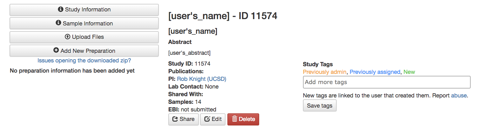
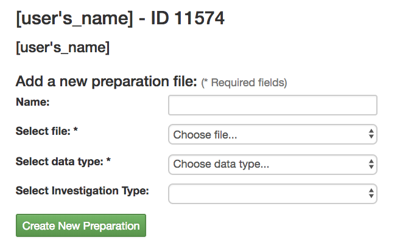
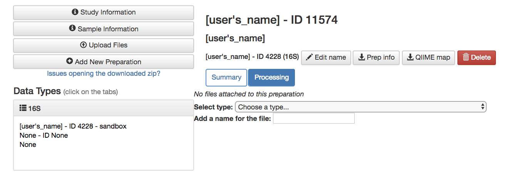
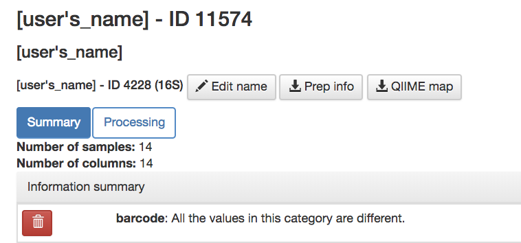
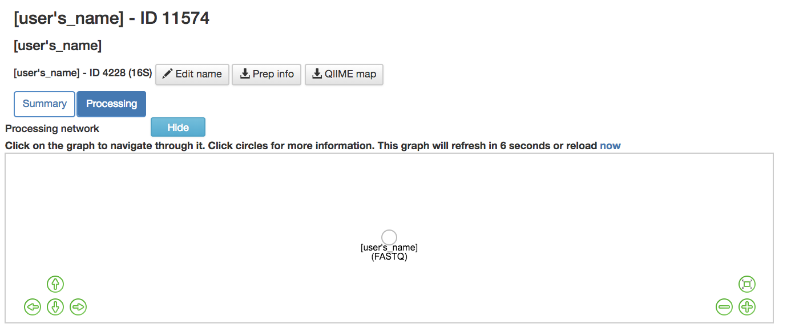

Getting Started Guide
======================

Creating an Account
-------------------

* **Sign up**: Brings you to window to create an account

Home Screen
~~~~~~~~~~~

.. figure::  home_screen.png
   :align:   center

* **Icons** (located on top right corner)

  * **Inbox** (3rd from the right): Your system messages
  * **Selected Samples** (2nd from the right): Your selected samples
  * **Jobs** (rightmost): Your active jobs and their statuses

Creating a Study
----------------

.. figure::  create_new_study.png
   :align:   center

* **Creating a New Study/Edit Study Page**

  * **Study Title** (required): Name of the experiment
  * **Study Alias** (required): A different name to put your experiment under
  * **DOI (optional)**: Not required but if your paper has already been published you will be given a DOI, or Digital Object Identifier, that scientists can use to find your paper
  * **PubMed ID** (optional): Not required but if your paper has been published in PubMed it will be given a designated PubMed ID that scientists can use to help find your paper
  * **Study Abstract** (required): Abstract for your experiment
  * **Study Description** (required): Quick description of your study, shorter than the abstract
  * **Principal Investigator** (required): Whose lab it is
  * **Lab Person** (optional): Who to contact if you have questions about the experiment
  * **Environmental Packages** (optional): Describing the environment from which a biological sample originates

    * To find out which type of sample you have read this paper found in `Nature <http://www.nature.com/nbt/journal/v29/n5/full/nbt.1823.html>`__.

  * **Event-Based Data** (optional): If your experiment contained interventions you can include that here

    * **single intervention, real**: a time series with a single intervention on one or more individuals over time
    * **multiple intervention, real**: a time series with multiple interventions on one or more individuals over time
    * **combo intervention, real**: a time series with some subjects having one intervention while other subjects have multiple interventions over time
    * **single intervention, pseudo**: a time series with a single intervention on groups with no subject being present in multiple time points
    * **multiple intervention, pseudo**: a time series with multiple interventions on groups with no subject being present in multiple time points
    * **combo intervention, pseudo**: a time series with some groups having one intervention while other groups have multiple interventions on another group with no subject being present in multiple time points
    * **single intervention, real**: a time series with a single intervention on groups with some subject being present in multiple time points while others are only present in a single time point
    * **multiple intervention, real**: a time series with multiple interventions on groups with some subject being present in multiple time points while others are only present in a single time point
    * **combo intervention, real**: a time series with some groups having single intervention while other groups having multiple interventions on groups with some subject being present in multiple time points while others are only present in a single time point

.. figure::  study_information_page.png
   :align:   center

* **Study Information Page**

  * **Share**: Shares the study with other users
  * **Edit**: Brings you to the Edit Study Page if you wanted to update your study
  * **Delete**: Deletes the study
  * **Study tags** (optional): Keywords that will help you, and others, find your study in Qiita

    * For example, if you’re studying soil you can add that as a tag
    * Must **Save tags** To keep them otherwise they disappear

  * **Sample Information**: A link to your metadata summary
  * **Upload Files**: A link to a screen to upload your files to

Editing a Study
~~~~~~~~~~~~~~~

*  Go to the “Study Information Page”
*  Select “Edit” from “Study Information Page” to bring you to “Edit Study Page”
*  Make the desired edits and select “Update Study”


.. _prepare-information-files:

Creating and Working With Sample information
--------------------------------------------

Example files
~~~~~~~~~~~~~

You can download an example sample information file from
`here <ftp://ftp.microbio.me/pub/qiita/sample_prep_information_files_examples.tgz>`__

EBI-ENA NULL values vocabulary
~~~~~~~~~~~~~~~~~~~~~~~~~~~~~~

For all public studies including those being submitted to EBI, no blanks are allowed in the sample information.
We support the following null values: *not applicable*, *missing: not collected*, *missing: not provided*,
*missing: restricted access*.

For the latest definitions and explanation visit the `EBI/ENA Missing value reporting <http://www.ebi.ac.uk/ena/about/missing-values-reporting>`__.

.. warning::
   Column names in your information files cannot be named as a Postgres reserved word. For example, a column cannot be named
   `CONDITION`, but could instead be named `DISEASE_CONDITION`. For a full list of these reserved words, see this
   `link <https://www.postgresql.org/docs/9.3/static/sql-keywords-appendix.html>`__.


Sample information file
~~~~~~~~~~~~~~~~~~~~~~~

The *sample information file* will define the biological context of each
sample, with categories like ``sample_type``, ``treatment``,
etc. The ``sample_name`` defined in this file is used to relate each
sample in the preparation file with the biological sample.

Required fields for Qiita
~~~~~~~~~~~~~~~~~~~~~~~~~

This is the minimum set of columns for a sample information file to be added to
the system:

+-------------------+-----------------------------+-------------------------------------------------------------------------------+
| Field name        | Format                      | Description                                                                   |
+===================+=============================+===============================================================================+
| ``sample_name``   | free text with restrictions | Identifies a sample. It is the primary key and must be unique. Allowed        |
|                   |                             | characters are alphabetic ``[A-Za-z]``, numeric ``[0-9]``, and periods ``.``. |
+-------------------+-----------------------------+-------------------------------------------------------------------------------+

Required fields for EBI submission
~~~~~~~~~~~~~~~~~~~~~~~~~~~~~~~~~~

In order to submit your data to EBI, certain fields are required in your sample information file. You can download a spread sheet containing these required fields on the `Knight Lab website <https://knightlab.ucsd.edu/wordpress/?page_id=478>`__ under "MetaData Template".

Checking for Errors In Sample information
~~~~~~~~~~~~~~~~~~~~~~~~~~~~~~~~~~~~~~~~~

* `Keemei <https://keemei.qiime2.org/>`__ is a Google Sheets add-on for validating sample metadata. Validation of sample metadata is important before beginning any analysis. Install Keemei and follow the instructions on its website to validate your sample information spread sheet.

**Remember that spelling and capitalization matters in Qiita**

Checking for Errors In Sample information
~~~~~~~~~~~~~~~~~~~~~~~~~~~~~~~~~~~~~~~~~

* `Keemei <https://keemei.qiime2.org/>`__ is a Google Sheets add-on for validating sample metadata. Validation of sample metadata is important before beginning any analysis. Install Keemei and follow the instructions on its website to validate your sample information spread sheet.


Attaching the Sample Information to the Study
---------------------------------------------

Upload Sample Information
~~~~~~~~~~~~~~~~~~~~~~~~~~

.. figure::  upload_page.png
   :align:   center

* **Upload Files Page**

  * Drag your sample info file into the box to upload your files
  * Your uploaded samples will appear under the "Files" section
  * **Delete selected files**: Delete a file with the selected boxes
  * **Go to study description**: Link to the study description page

Attach Sample Information
~~~~~~~~~~~~~~~~~~~~~~~~~

.. figure::  attach_sample_information.png
   :align:   center

* **Sample Information Page**

  * **Select sample information file**: Attaches the uploaded sample information to the study
  * **If uploading a QIIME mapping file, select the data type of the prep information**: Selects the data type
  * **Create**: Creates a new sample information page that includes the attached data

Viewing Sample Information
~~~~~~~~~~~~~~~~~~~~~~~~~~

.. figure:: sample_information_tab.png
   :align:   center

* **Sample Information Page**

  * **Sample Information** Tab

    * See different metadata values
    * **Sample Info**: Downloads the metadata onto your computer
    * **Update Sample Information**: Upload a new sample information file

.. figure::  sample_prep_summary_tab.png
   :align:   center

* **Sample Information Page**

  * **Sample-Prep Summary** Tab

    * **Add sample column information to table**: Allows you to add an additional metadata column to the sample summary for comparison on this page

Update Sample info
~~~~~~~~~~~~~~~~~~

* If your data has not been processed..

  * Upload your new metadata file using the Upload Files Page
  * Delete your old metadata file on the Sample Information Page
  * Update your metadata file on the Sample Information tab on the Sample Information page

* If your data has been processed...

  * Your past metadata file cannot be deleted but fields can be deleted

    * To remove data, go to the Sample Information tab on the Sample Information page and use the trash icon to delete the unwanted fields

  * You can update the fields that do exist (these fields can be found on the sample information tab on the sample information page)

    * Upload a new sample info file including only the updated field data and the sample_name field

  * You can add new fields

    * Upload a new sample info file including only the field data you want to add and the sample_name field

  * Sample names cannot be deleted

    * Any sample name change will be interpreted as a new sample

  * *Note that these changes will not update on your analysis but these changes will not affect your processing data since the metadata isn’t applied until analysis*

Creating and Working With Preparation information
-------------------------------------------------

.. _prepare_information_files:

Prepare information files
~~~~~~~~~~~~~~~~~~~~~~~~~

The set of required fields for the *sample information* and *preparation
information files* varies based on the functionality that you want to
use from the system.

As described in :doc:`../qiita-philosophy/index`, a Qiita study can have
many biological samples, each with many preparations for different kinds of
multi-omic analysis. Thus, the study will have a single *sample information
file* that will define the biological context of each sample. Each multi-omic
data type prepared will have a separate *preparation information file* that
will describe the sequencing technology or analytical chemistry used to
generate that data set.

Please note that while *sample information* and *preparation information files*
are similar to a `QIIME metadata file
<http://qiime.org/documentation/file_formats.html#metadata-mapping-files>`__,
they are conceptually different. A QIIME metadata file includes information
about the biological context, like ``sample_type``, and about the wet lab
processing, like ``BarcodeSequence``. Qiita intentionally separates this
information into two separate files; it would be conceptually incorrect
to include ``BarcodeSequence`` (barcode) with the *sample information*, as this
information pertains to the wet lab preparation and should be placed in the
*preparation information file*.

Ensure that your prep information column names are correct.

Example files
~~~~~~~~~~~~~

You can download an example prep information file from
`here <ftp://ftp.microbio.me/pub/qiita/sample_prep_information_files_examples.tgz>`__

Required fields for Qiita
~~~~~~~~~~~~~~~~~~~~~~~~~

This is the minimum set of columns for a prep information file to be added the
system:

+-------------------+-------------------------------+------------------------------------------------------------------------+
| Field name        | Format                        | Description                                                            |
+===================+===============================+========================================================================+
| ``sample_name``   | free text with restrictions   | Identifies a sample. It is the primary key, must be unique and should  |
|                   |                               | match the ones in the sample information file. Allowed characters are  |
|                   |                               | alphabetic ``[A-Za-z]``, numeric ``[0-9]``, and periods ``.``. Must    |
|                   |                               | match the sample_name in the sample template.                          |
+-------------------+-------------------------------+------------------------------------------------------------------------+

Required fields for EBI submission
~~~~~~~~~~~~~~~~~~~~~~~~~~~~~~~~~~


In order to submit your data to EBI, certain fields are required in your preparation information file. You can download a spread sheet containing these required fields on the `Knight Lab website <https://knightlab.ucsd.edu/wordpress/?page_id=478>`__ under "Prep Template".


For all valid values for instrument_model per platform, view the values in the table below:

+--------------+----------------------------------------------------------------------------------------------------------+
| Platform     | Valid instrument_model options                                                                           |
+==============+==========================================================================================================+
| ``LS454``    |  ``454 GS``, ``454 GS 20``, ``454 GS FLX``, ``454 GS FLX+``, ``454 GS FLX Titanium``, ``454 GS Junior``, |
|              |  ``454 GS Junior`` or ``unspecified``                                                                    |
+--------------+----------------------------------------------------------------------------------------------------------+
| ``Illumina`` |  ``Illumina Genome Analyzer``, ``Illumina Genome Analyzer II``, ``Illumina Genome Analyzer IIx``,        |
|              |  ``Illumina HiSeq 4000``, ``Illumina HiSeq 3000``, ``Illumina HiSeq 2500``, ``Illumina HiSeq 2000``,     |
|              |  ``Illumina HiSeq 1500``, ``Illumina HiSeq 1000``, ``Illumina MiSeq``, ``Illumina MiniSeq``,             |
|              |  ``Illumina NovaSeq 6000````Illumina HiScanSQ``,``HiSeq X Ten``, ``NextSeq 500``, ``NextSeq 550``,       |
|              |  or ``unspecified``                                                                                      |
+--------------+----------------------------------------------------------------------------------------------------------+

Required fields for pre-processing target gene data
~~~~~~~~~~~~~~~~~~~~~~~~~~~~~~~~~~~~~~~~~~~~~~~~~~~

If you are adding target gene data (e.g. 16S, 18S, ITS), there are
additional columns that are required for successfully preprocessing
them:

+---------------+--------------------+---------------------------------------------------------------------------------------+
| Field name    | Format             | Description                                                                           |
+===============+====================+=======================================================================================+
| ``primer``    | IUPAC characters   | The primer sequence (this is usually the forward primer for Illumina processed data,  |
|               |                    | or the barcoded primer for LS454 data;                                                |
|               |                    | `examples <http://www.nature.com/ismej/journal/v6/n8/extref/ismej20128x2.txt>`__).    |
+---------------+--------------------+---------------------------------------------------------------------------------------+
| ``barcode``   | IUPAC characters   | The barcode sequence                                                                  |
|               |                    | (`examples <http://www.nature.com/ismej/journal/v6/n8/extref/ismej20128x2.txt>`__).   |
+---------------+--------------------+---------------------------------------------------------------------------------------+

In case that your data has been sequenced using multiple sequencing lanes or you
have :ref:`per_sample_fastq_files_without_barcode_or_primer_information`, an
additional column is required.

+------------------+-------------+--------------------------------------------------------------------------------------------+
| Field name       | Format      | Description                                                                                |
+==================+=============+============================================================================================+
| ``run_prefix``   | free text   | Name of your sequence file without the suffix (for example, ``seqs.fna`` becomes ``seqs``, |
|                  |             | and ``my-data.fastq`` becomes ``my-data``).                                                |
+------------------+-------------+--------------------------------------------------------------------------------------------+

Checking for Errors In Preparation information
~~~~~~~~~~~~~~~~~~~~~~~~~~~~~~~~~~~~~~~~~~~~~~

* `Keemei <https://keemei.qiime2.org/>`__ is a Google Sheets add-on for validating sample metadata. Validation of sample metadata is important before beginning any analysis. Install Keemei and follow the instructions on its website to validate your sample information spread sheet.

**Remember that spelling and capitalization matters in Qiita**

Checking for Errors In Preparation information
~~~~~~~~~~~~~~~~~~~~~~~~~~~~~~~~~~~~~~~~~~~~~~

* `Keemei <https://keemei.qiime2.org/>`__ is a Google Sheets add-on for validating sample metadata. Validation of sample metadata is important before beginning any analysis. Install Keemei and follow the instructions on its website to validate your sample information spread sheet.

Attaching Preparation Information to the Study
----------------------------------------------

Upload Prep Information
~~~~~~~~~~~~~~~~~~~~~~~

.. figure::  upload_page.png
   :align:   center

* **Upload Files Page**

  * Drag your data files into the box to upload your files
  * If you want to delete the file, press the box that appears next to that file then click delete selected files
  * **Go to study description**: Link to the study description page

Attach Prep Information
~~~~~~~~~~~~~~~~~~~~~~~



* **Study Description Page**

  * Choose **Add New Preparation**



* **Add New Preparation Page**

  * **Select File** (required): Select the preparatory information file you uploaded
  * **Select Data Type** (required): Choose for what kind of data you studied
  * **Select Investigation Type** (optional): Not required, chooses the investigation you performed
  * **Create New Preparation**: Creates a new preparation based on the data inputted above

Associate Data with Prep Information
~~~~~~~~~~~~~~~~~~~~~~~~~~~~~~~~~~~~



* **Data Type**

  * **16S, or the data type you studied** dropdown: Shows the preparations created on this type of data on this study
  * **Prep Information Page**

    * To add files

      * **Select Type** (required): Select the file type you uploaded, causing Qiita to associate your files with this preparation
      * **Add a name for this file** (required): Give the file a name
      * **Add Files**: Shows up after Select Type has been chosen, adds files to the preparation



* **Prep Information Page**

  * **Summary** Tab

    * Includes preparation info files of that data type that’s associated with your study



* **Prep Information Page**

  * **Processing** Tab

    * **Processing Network**: Contains artifacts that represent your data and commands being run on your data
    * **Hide**: Hides the processing network

Update prep info
~~~~~~~~~~~~~~~~

* **Prep Information Page**

  * Under the "Summary" tab

    * Select “Update Information” and choose your updated file
    * *Barcodes and sample names cannot be updated*

      * Must create new preparation to update these
