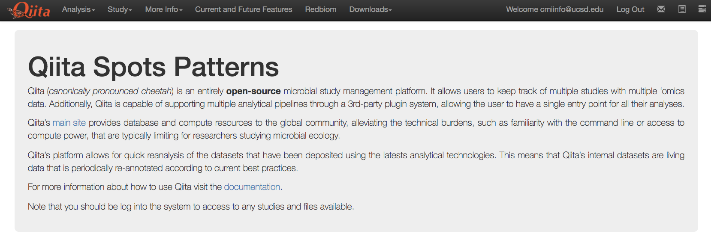
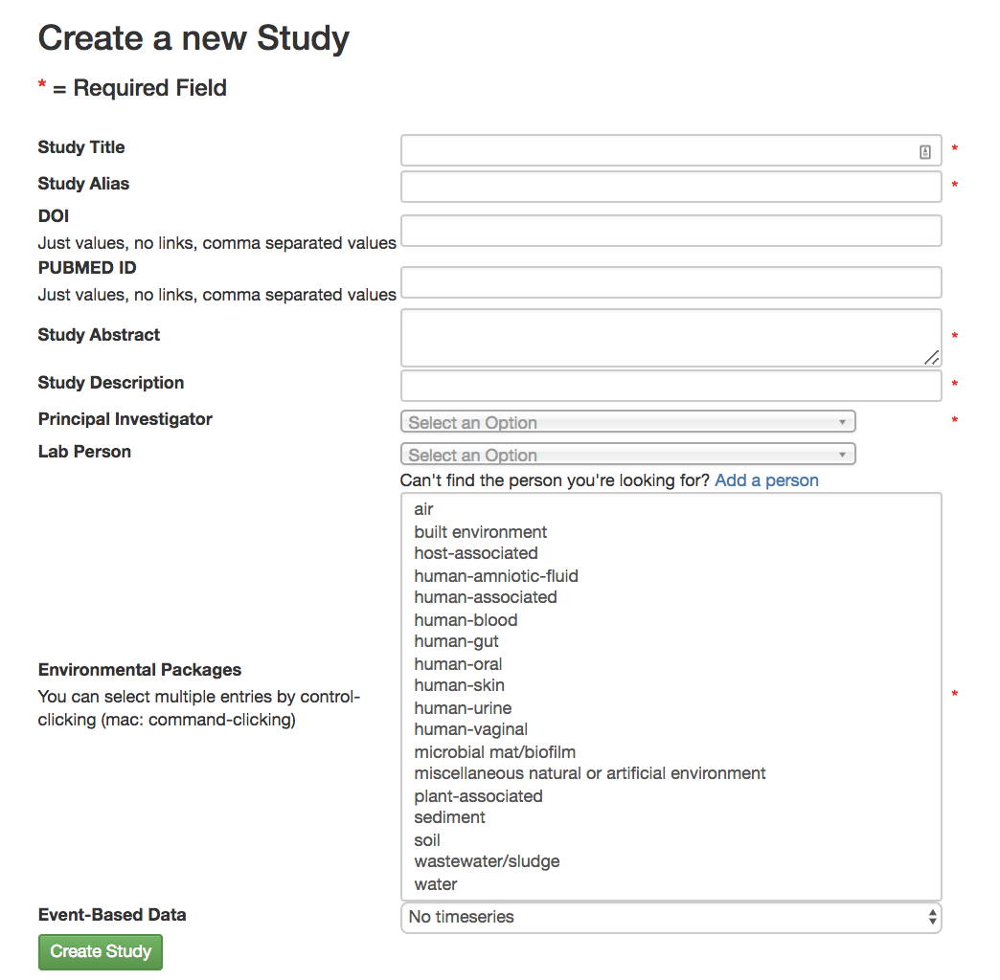
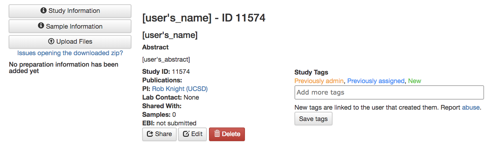
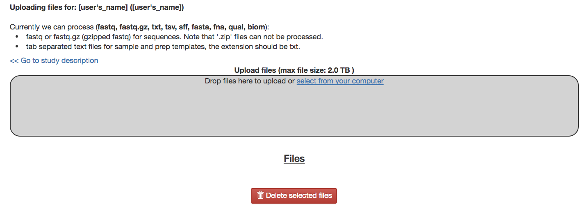
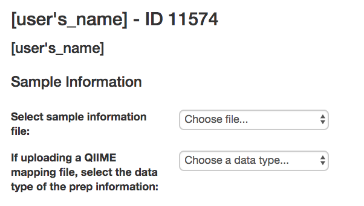
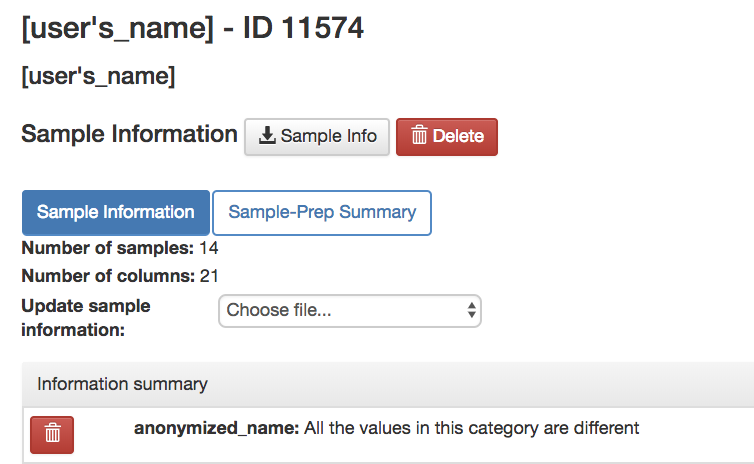
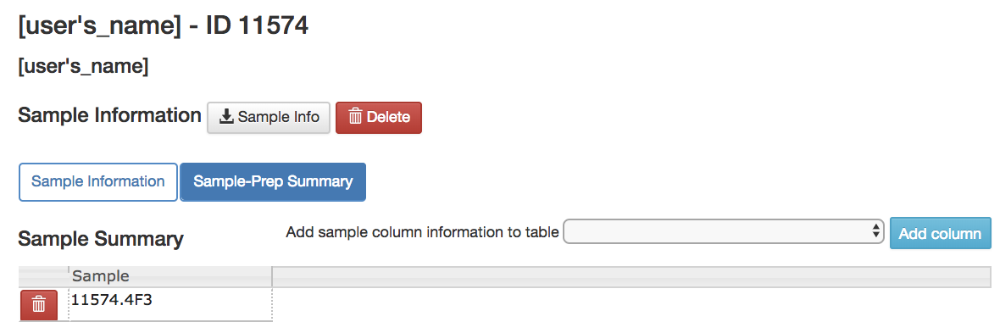

Getting Started Guide
======================

Creating an Account
-------------------

* **Sign up**: Brings you to window to create an account

Home Screen
~~~~~~~~~~~

* **Icons** (located on top right corner)
 * **Inbox** (3rd from the right): Your system messages
 * **Selected Samples** (2nd from the right): Your selected samples
 * **Jobs** (rightmost): Your active jobs and their statuses
 
Creating a Study
----------------

   
* **Creating a New Study/Edit Study Page**
 * **Study Title** (required): Name of the experiment
 * **Study Alias** (required): A different name to put your experiment under
 * **DOI (optional)**: Not required but if your paper has already been published you will be given a DOI, or Digital Object Identifier, that scientists can use to find your paper
 * **PubMed ID** (optional): Not required but if your paper has been published in PubMed it will be given a designated PubMed ID that scientists can use to help find your paper
 * **Study Abstract** (required): Abstract for your experiment
 * **Study Description** (required): Quick description of your study, shorter than the abstract
 * **Principal Investigator** (required): Whose lab it is
 * **Lab Person** (optional): Who to contact if you have questions about the experiment
 * **Environmental Packages** (optional): Describing the environment from which a biological sample originates
  * To find out which type of sample you have read this paper found in `Nature <http://www.nature.com/nbt/journal/v29/n5/full/nbt.1823.html>`__.
 * **Event-Based Data** (optional): If your experiment contained interventions you can include that here

   
* **Study Information Page**
 * **Share**: Shares the study with other users
 * **Edit**: Brings you to the Edit Study Page if you wanted to update your study
 * **Delete**: Deletes the study
 * **Study tags** (optional): Keywords that will help you, and others, find your study in Qiita
  * For example, if you’re studying soil you can add that as a tag
  * Must **Save tags** To keep them otherwise they dissapear
 * **Sample Information**: A link to your metadata summary 
 * **Upload Files**: A link to a screen to upload your files to
 
Editing a Study
~~~~~~~~~~~~~~~

*  Go to the “Study Information Page”
*  Select “Edit” from “Study Information Page” to bring you to “Edit Study Page”
*  Make the desired edits and select “Update Study”

Adding and Working With Sample information
------------------------------------------

Example files
~~~~~~~~~~~~~

You can download an example sample information file from
`here <ftp://ftp.microbio.me/pub/qiita/sample_prep_information_files_examples.tgz>`__

EBI-ENA NULL values vocabulary
~~~~~~~~~~~~~~~~~~~~~~~~~~~~~

For all public studies including those being submitted to EBI, no blanks are allowed in the smaple information. We support the following null values: *not applicable*, *missing: not collected*, *missing: not provided*, *missing: restricted access*.

For the latest definitions and explanation visit the `EBI/ENA Missing value reporting <http://www.ebi.ac.uk/ena/about/missing-values-reporting>`__.

.. warning::
   Column names in your information files cannot be named as a Postgres reserved word. For example, a column cannot be named `CONDITION`, but could instead be named `DISEASE_CONDITION`. For a full list of these reserved words, see this `link <https://www.postgresql.org/docs/9.3/static/sql-keywords-appendix.html>`__.
   
   
Sample information file
~~~~~~~~~~~~~~~~~~~~~~~

The *sample information file* will define the biological context of each
sample, with categories like ``sample_type``, ``treatment``,
etc. The ``sample_name`` defined in this file is used to relate each
sample in the preparation file with the biological sample.

Required fields for Qiita
~~~~~~~~~~~~~~~~~~~~~~~~~

This is the minimum set of columns for a sample information file to be added to
the system:

+-------------------+-------------------------------+--------------------------------------------------------------------------------------------------------------------------------------------------------+
| Field name        | Format                        | Description                                                                                                                                            |
+===================+===============================+========================================================================================================================================================+
| ``sample_name``   | free text with restrictions   | Identifies a sample. It is the primary key and must be unique. Allowed characters are alphabetic ``[A-Za-z]``, numeric ``[0-9]``, and periods ``.``.   |
+-------------------+-------------------------------+--------------------------------------------------------------------------------------------------------------------------------------------------------+

Required fields for EBI submission
~~~~~~~~~~~~~~~~~~~~~~~~~~~~~~~~~~

These are the columns required for successfully submit your data to EBI:

+----------------------------------+-------------------------+-----------------------------------------------------------------------------------------------------------------------------------------------------+
| Field name                       | Format                  | Description                                                                                                                                         |
+==================================+=========================+=====================================================================================================================================================+
| ``collection_timestamp``         | ``yyyy-mm-dd hh:mm:ss`` | The time stamp (preferred) of when the sample was collected. Several format are accepted, all ISO 8601.                                             |
|                                  | or ``yyyy-mm-dd hh:mm`` |                                                                                                                                                     |
|                                  | or ``yyyy-mm-dd hh``    |                                                                                                                                                     |
|                                  | or ``yyyy-mm-dd ``      |                                                                                                                                                     |
|                                  | or ``yyyy-mm``          |                                                                                                                                                     |
|                                  | or ``yyyy``.            |                                                                                                                                                     |
|                                  | Years are only          |                                                                                                                                                     |
|                                  | supported as 4 ``yyyy`` |                                                                                                                                                     |
|                                  | digits                  |                                                                                                                                                     |
+----------------------------------+-------------------------+-----------------------------------------------------------------------------------------------------------------------------------------------------+
| ``physical_specimen_location``   | free text               | Where you would go to find physical sample or DNA, regardless of whether it is still available or not.                                              |
+----------------------------------+-------------------------+-----------------------------------------------------------------------------------------------------------------------------------------------------+
| ``taxon_id``                     | integer                 | NCBI taxon ID for the sample. Should indicate metagenome being investigated. Examples: 410658 for soil metagenome, 749906 for gut metagenome,       |
|                                  |                         | 256318 for metagenome (used for unspecified or blanks). To find others visit `NCBI Taxonomy Database <http://www.ncbi.nlm.nih.gov/taxonomy>`__.     |
+----------------------------------+-------------------------+-----------------------------------------------------------------------------------------------------------------------------------------------------+
| ``scientific_name``              | free text               | NCBI's scientific name for the provided taxon ID. This is the name of the metagenome, not the host scientific name. Examples: soil metagenome,      |
|                                  |                         | gut metagenome, marine sediment metagenome, marine metagenome.                                                                                      |
+----------------------------------+-------------------------+-----------------------------------------------------------------------------------------------------------------------------------------------------+
| ``description``                  | free text               | Description of the sample.                                                                                                                          |
+----------------------------------+-------------------------+-----------------------------------------------------------------------------------------------------------------------------------------------------+

Required fields for centralized Qiita
~~~~~~~~~~~~~~~~~~~~~~~~~~~~~~~~~~~~~

These are the columns required if you want to make your date public at
the centralized `Qiita server <http://qiita.microbio.me>`__:

+-----------------------------------+----------------------------------------------------------------------+---------------------------------------------------------------------------------------------------------------------------------------------------------------------------------------------------------------------------------------------------------------------------------------------------------------------------------------------------+
| Field name                        | Format                                                               | Description                                                                                                                                                                                                                                                                                                                                       |
+===================================+======================================================================+===================================================================================================================================================================================================================================================================================================================================================+
| ``host_subject_id``               | free text                                                            | An identifier for the “host”. Should be specific to a host, and can be a one-to-many relationship with samples. All samples from the same source (host, sample) should have the same identifier to facilitate analysis. If this is not a host-associated study, this can be an identifier for a replicate, or can be the same as ``sample_name``. |
+-----------------------------------+----------------------------------------------------------------------+---------------------------------------------------------------------------------------------------------------------------------------------------------------------------------------------------------------------------------------------------------------------------------------------------------------------------------------------------+
| ``sample_type``                   | free text                                                            | Description of the type of sample.                                                                                                                                                                                                                                                                                                                |
+-----------------------------------+----------------------------------------------------------------------+---------------------------------------------------------------------------------------------------------------------------------------------------------------------------------------------------------------------------------------------------------------------------------------------------------------------------------------------------+
| ``physical_specimen_remaining``   | ``TRUE`` or ``FALSE``                                                | Is there still physical sample (e.g., soil, not DNA) available?                                                                                                                                                                                                                                                                                   |
+-----------------------------------+----------------------------------------------------------------------+---------------------------------------------------------------------------------------------------------------------------------------------------------------------------------------------------------------------------------------------------------------------------------------------------------------------------------------------------+
| ``dna_extracted``                 | ``TRUE`` or ``FALSE``                                                | Has DNA already been extracted for this sample?                                                                                                                                                                                                                                                                                                   |
+-----------------------------------+----------------------------------------------------------------------+---------------------------------------------------------------------------------------------------------------------------------------------------------------------------------------------------------------------------------------------------------------------------------------------------------------------------------------------------+
| ``latitude``                      | `decimal degrees <http://en.wikipedia.org/wiki/Decimal_degrees>`__   | Latitude where sample was collected.                                                                                                                                                                                                                                                                                                              |
+-----------------------------------+----------------------------------------------------------------------+---------------------------------------------------------------------------------------------------------------------------------------------------------------------------------------------------------------------------------------------------------------------------------------------------------------------------------------------------+
| ``longitude``                     | `decimal degrees <http://en.wikipedia.org/wiki/Decimal_degrees>`__   | Longitude where sample was collected.                                                                                                                                                                                                                                                                                                             |
+-----------------------------------+----------------------------------------------------------------------+---------------------------------------------------------------------------------------------------------------------------------------------------------------------------------------------------------------------------------------------------------------------------------------------------------------------------------------------------+

Optional fields for centralized Qiita by portal
~~~~~~~~~~~~~~~~~~~~~~~~~~~~~~~~~~~~~~~~~~~~~~~

* Sloan, Microbiology of the Built Environment

  +------------+------------+-------------------------------------------------------------------------------------------------------------------------------------------------------------------------------+
  | Field name | Format     | Description                                                                                                                                                                   |
  +============+============+===============================================================================================================================================================================+
  | ``sloan``  | free text  | Sloan sample status. SLOAN (funded by Sloan), SLOAN_COMPATIBLE (not Sloan funded but with compatible metadata, usually public), NOT_SLOAN (not included i.e. private study).  |
  +------------+------------+-------------------------------------------------------------------------------------------------------------------------------------------------------------------------------+

* Earth Microbiome Project

  +-------------------+------------+---------------------------------------------------------------------------------------------------------------------------------------------+
  | Field name        | Format     | Description                                                                                                                                 |
  +===================+============+=============================================================================================================================================+
  | ``emp_status``    | free text  | EMP sample status. ‘EMP’ (part of the EMP), ‘EMP_Processed’ (processed in the weblab using EMP parameters), ‘NOT_EMP’ (not EMP compatible). |
  +-------------------+------------+---------------------------------------------------------------------------------------------------------------------------------------------+

Attaching the Sample Information to the Study
---------------------------------------------
   
Upload Sample Information
~~~~~~~~~~~~~~~~~~~~~~~~~~

   
* **Upload Files Page**
 * Drag your sample info file into the box to upload your files
 * Your uploaded samples will appear under the "Files" section
 * **Delete selected files**: Delete a file with the selected boxes
 * **Go to study description**: Link to the study description page

Attach Sample Information
~~~~~~~~~~~~~~~~~~~~~~~~~

   
* **Sample Information Page**
 * **Select sample information file**: Attaches the uploaded sample information to the study
 * **If uploading a QIIME mapping file, select the data type of the prep information**: Selects the data type
 * **Create**: Creates a new sample information page that includes the attached data

Viewing Sample Information
~~~~~~~~~~~~~~~~~~~~~~~~~~

* **Sample Information Page**

   
* **Sample Information** Tab
 * See different metadata values
 * **Sample Info**: Downloads the metadata onto your computer
 * **Update Sample Information**: Upload a new sample information file
 

   
* **Sample-Prep Summary** Tab
 * **Add sample column information to table**: Allows you to add an additional metadata column to the sample summary for comparison on this page

Update Sample info
~~~~~~~~~~~~~~~~~~

* If your data has not been processed..
 * Upload your new metadata file using the Upload Files Page
 * Delete your old metadata file on the Sample Information Page
 * Update your metadata file on the Sample Information tab on the Sample Information page
* If your data has been processed...
 * Your past metadata file cannot be deleted but fields can be deleted 
  * To remove data, go to the Sample Information tab on the Sample Information page and use the trash icon to delete the unwanted fields
 * You can update the fields that do exist (these fields can be found on the sample information tab on the sample information page)
  * Upload a new sample info file including only the updated field data and the sample_name field
 * You can add new fields
  * Upload a new sample info file including only the field data you want to add and the sample_name field
 * Sample names cannot be deleted
  * Any sample name change will be interpreted as a new sample
 * *Note that these changes will not update on your analysis but these changes will not affect your processing data since the metadata isn’t applied until analysis*
