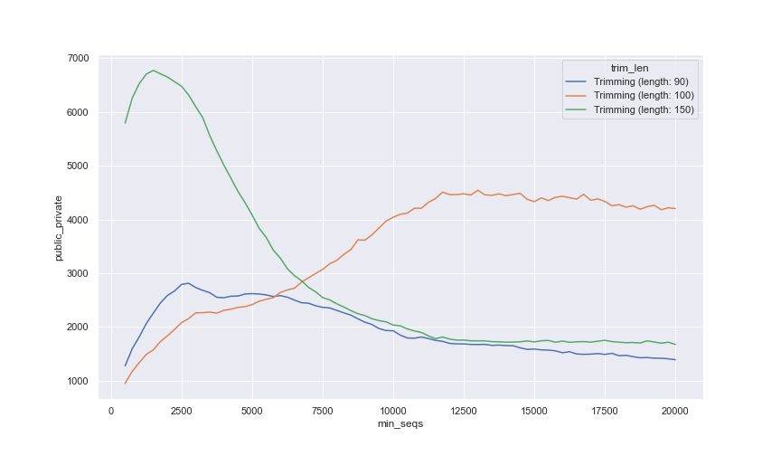

deblur version 2021.09
======================

The deblur version 2021.09 addresses a bug with the fragment insertion parsing and
cache that ignored some fragments for getting an accurate placement in the tree. In
summary, in some occasions SEPP will return multiple fragments in a single entry; which
was unexpected by the qp-deblur plugin parser, which assumed only one entry - the
extra features will be seen as missing by the plugin and recorded in the cache as such. As these fragments were reported as missing in the cache, the effect was propagated to future studies and
meta-analyses.

This bug was resolved in this `pull request <https://github.com/qiita-spots/qp-deblur/pull/60>`__.

It is important to note that this bug only applies to the fragments inserted into the tree, which is
only part of the `deblur reference hit table`.

How do I know if my study processing had this bug?
----------------------------------------------------

The easiest is to check the table summary reported `Number rejected fragments`. If the number is
different between the qp-deblur v1.1.0 and qp-deblur v2021.09 then your study had this bug. To
see the table summary, you need to navigate to the processing graph, click on the
`deblur reference hit table` artifact and see the table summary.

Sample counts implications
--------------------------

At the time of writing of this documentation Qiita had 978,052 16S deblured private or pubic samples.
In the figure below, we have at different trimming lengths how samples we will recover
based on the minimum number of sequences per sample - this is an important consideration
as we normally need to remove samples below a given threshold for beta diversity
calculations (via rarefaction) or differential abundance testing.

A few conclusions from this plot:

- The maximum number of samples that we will recover are 6,771 at `Trimming (length: 150)`
  and min_seqs of 1,500; which represents a 0.7% increment in private and public samples.
- At all Trimming lengths the curve tends to go up and then down based on min_seq,
  which is a common trend seen in rarefacion plots

How perversive is this bug?
---------------------------

For a better assessment we are going to focus on only on the 150 bps trimming length. At
the time of writing of this documentation Qiita had 1,484 16S preparations that have a
150 bps deblur table. Of those:

- 96.6% of preparations had 0-10% of features lost
- 12.6% had 10-20% of the features lost
-  9.7% 20-30%
-  6.9% 30-40%
-  4.9% 40-50%
-  3.3% 50-60%
-  2.0% 60-70%
-  1.3% 70-80%
-  0.6% 80-90%
-  0.2% 90-100%

Remember that the percentage reported above is inclusive at the next level, for example
the studies with 40-50% lost are also accounted for at lower levels.

Additionally, after a Qiita wide review, we did not find a strong patterns among the
studies that were most greatly affected, whether they were from a specific sample type
(according to EMPO 3 category) or target 16S variable region (according to the reported
target_subfragment).

Reaching out to affected study owners
-------------------------------------

As you saw in the previous section the effect of the missing fragments depends on the
study, the trimming length and the minimum per sample sequence count. As a
general rule of thumb, as a first analytical pass for meta-analysis for 16S data, we use
5,000 sequences per sample and we prefer 150 base pair trimming. Thus, we directly
contacted all study owners that would recover more than 5% of the samples in their study
(total 24).
