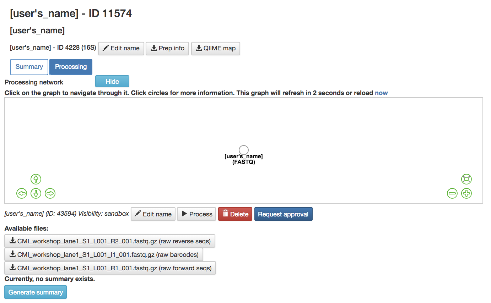
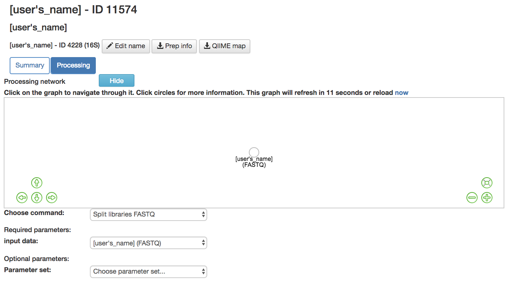
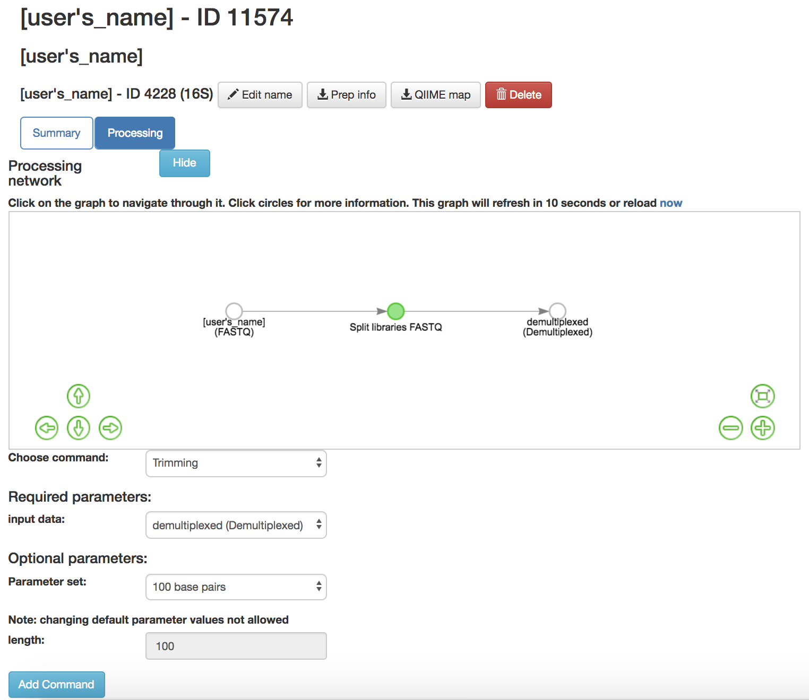
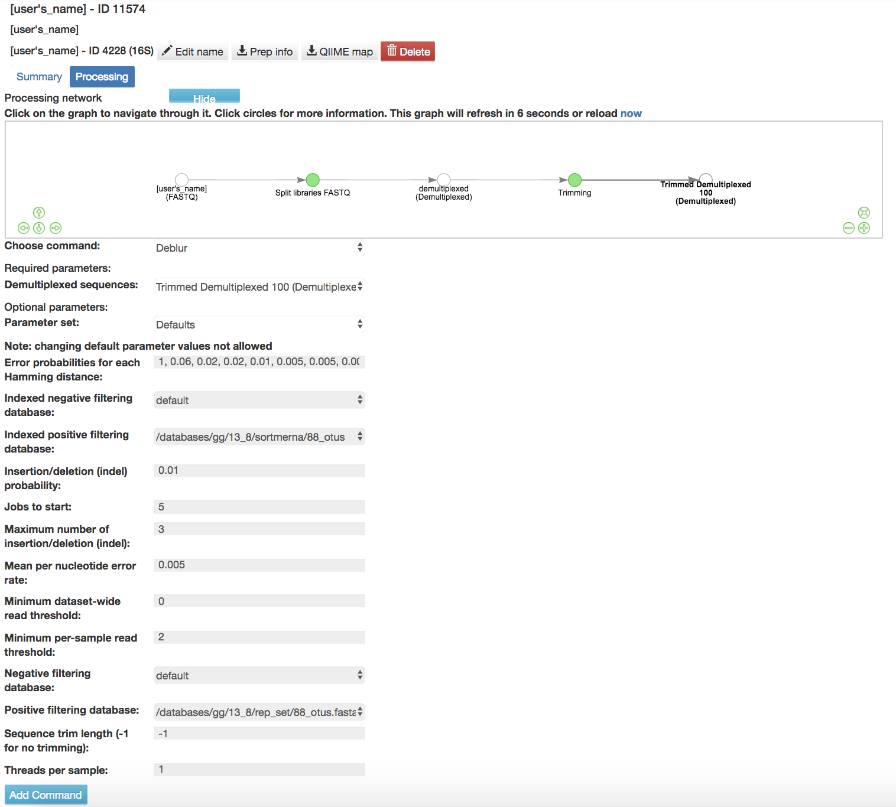
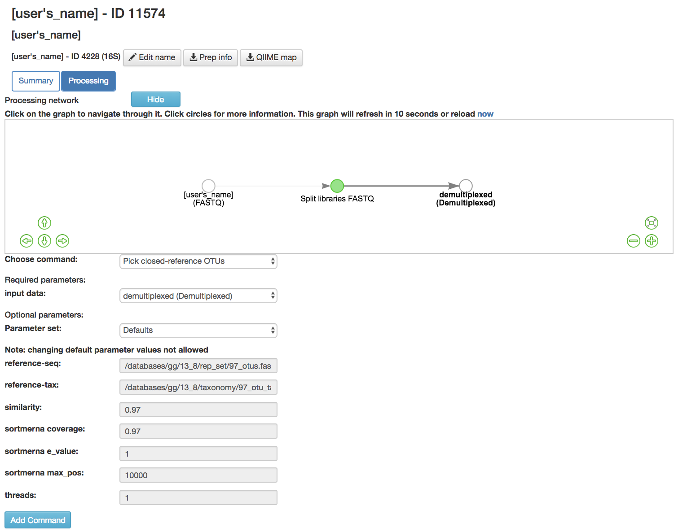

Processing Data
===============

Processing Network Page
-----------------------

Files Network Within Data Type
~~~~~~~~~~~~~~~~~~~~~~~~~~~~~~

   
* **(FASTQ) or other data type artifact**: Represents the data from the study
* **Hide**: Hides the processing network 
* **Show**: Shows the processing network
* **Run**: Runs the command that is in the processing workflow window
* **Click on artifact circle**: Brings up more options 
 * **Edit**: Rename the artifact
 * **Process**: Brings you to processing network page so you can process the data
  * **Choose Command dropdown menu**: Will show you the commands that can be given to the chosen artifact
 * **Delete**: Delete the artifact/data from the files network
 * **Available Files**: FASTQ files that have been uploaded to this study can be downloaded here
 * **Generate Summary**: Creates a summary for the data attached to the artifact chosen
 * **Show processing information**: Shows the processing information of the artifact chosen
 * **Request Approval**: Sends the artifact to a Qiita admin to be reviewed for approval to become a public study
  * *Note that a study must be successfully processed to be approved my a Qiita admin*
  * *Note that a study must be approved by a Qiita admin prior to being sent to EBI for submission* 
* The commands run on this page use the QIIME2 [64](..//references.rst) bioinformatics platform.

Converting Data to BIOM Tables
------------------------------

BIOM
~~~~

* No manipulation is necessary

FASTQ, SFF, FNA/QUAL, or FASTA/QUAL Files
~~~~~~~~~~~~~~~~~~~~~~~~~~~~~~~~~~~~~~~~~

   
* **Per-sample vs Multiplexed FASTQ Demultiplexing**
 * **Split libraries FASTQ**: Converts the raw FASTQ data into the file format used by Qiita for further analysis
  * **Input data** (required): Data being split
  * **Parameter Set** (required): Chooses the parameters for how to split the libraries
   * **Multiplexed FASTQ; generic 5 base pair barcodes**: Uses first 5 base pairs to identifies samples from FASTQ from multiple samples
   * **Multiplexed FASTQ; generic 5 base pair barcodes with Phred quality threshold: 0** [26](..//references.rst): Uses first 5 base pairs to identifies samples from FASTQ from multiple samples, only use samples with Phred quality score above 0
   * **Multiplexed FASTQ; generic 5 base pair reverse complement mapping file barcodes**: Uses the complementary base pairs to the last 5 base pairs in reverse order to identify samples from FASTQ from multiple samples
   * **Multiplexed FASTQ; generic 6 base pair barcodes**: Uses first 6 base pairs to identify samples from FASTQ from multiple samples
   * **Multiplexed FASTQ; generic 6 base pair reverse complement mapping file barcodes**: Uses the complementary base pairs to the last 6 base pairs in reverse order to identify samples from FASTQ from multiple samples
   * **Multiplexed FASTQ; generic 8 base pair barcodes**: Uses first 8 base pairs to identify samples from FASTQ from multiple samples
   * **Multiplexed FASTQ; generic 8 base pair barcodes with Phred offset: 33**: Uses first 8 base pairs to identify samples from FASTQ from multiple samples, uses Phred offset: 33 for measuring quality
   * **Multiplexed FASTQ; generic 8 base pair reverse complement mapping file barcodes**: Uses the complementary base pairs to the last 8 base pairs in reverse order to identify samples from FASTQ from multiple samples
   * **Multiplexed FASTQ; generic 11 base pair barcodes**: Uses first 11 base pairs to identify samples from FASTQ from multiple samples
   * **Multiplexed FASTQ; generic 11 base pair reverse complement barcodes**: Uses the complementary base pairs to the last 11 base pairs in reverse order to identify samples from FASTQ from multiple samples
   * **Multiplexed FASTQ; generic 12 base pair barcodes**: Uses first 12 base pairs to identify samples from FASTQ from multiple samples
   * **Multiplexed FASTQ; generic 12 base pair reverse complement barcodes**: Uses the complementary base pairs to the last 12 base pairs in reverse order to identify samples from FASTQ from multiple samples
   * **Multiplexed FASTQ; Golay 12 base pair barcodes** [31](..//references.rst),[12](..//references.rst): Error correcting for the first 12 base pairs from FASTQ from multiple samples
   * **Multiplexed FASTQ; Golay 12 base pair barcodes with Phred offset: 33** [12](..//references.rst), [26](..//references.rst), [31](..//references.rst): Error correcting for the first 12 base pairs from FASTQ from multiple samples, uses Phred offset: 33 for measuring quality
   * **Multiplexed FASTQ; Golay 12 base pair barcodes with Phred offset: 64** [12](..//references.rst), [26](..//references.rst), [31](..//references.rst): Error correcting for the first 12 base pairs from FASTQ from multiple samples, uses Phred offset: 64 for measuring quality
   * **Multiplexed FASTQ; Golay 12 base pair reverse complement barcodes** [12](..//references.rst),[31](..//references.rst): Error correcting for the complementary base pairs to the last 12 base pairs in reverse order to identify samples from FASTQ from multiple samples
   * **Multiplexed FASTQ; Golay 12 base pair reverse complement barcodes with Phred offset: 33** [12](..//references.rst), [26](..//references.rst), [31](..//references.rst): Error correcting for the complementary base pairs to the last 12 base pairs in reverse order to identify samples from FASTQ from multiple samples, uses Phred offset: 33 for measuring quality
   * **Multiplexed FASTQ; Golay 12 base pair reverse complement barcodes with Phred offset: 64** [12](..//references.rst), [26](..//references.rst), [31](..//references.rst): Error correcting for the complementary base pairs to the last 12 base pairs in reverse order to identify samples from FASTQ from multiple samples, uses Phred offset: 64 for measuring quality
   * **Multiplexed FASTQ; Golay 12 base pair reverse complement mapping file barcodes with reverse complement barcodes (UCSD CMI standard)** [12](..//references.rst),[31](..//references.rst): Error correcting for the complementary base pairs to the last 12 base pairs in reverse order to identify samples from FASTQ from multiple samples
   * **Per-sample FASTQ defaults** (auto detect): Error detection for the FASTQ from 1 sample
   * **Per-sample FASTQs; Phred offset: 33** [26](..//references.rst): Error detection for the FASTQ from 1 sample, uses Phred offset: 33 for measuring quality
   * **Per-sample FASTQs; Phred offset: 64** [26](..//references.rst): Error detection for the FASTQ from 1 sample, uses Phred offset: 64 for measuring quality
    * For informtion regarding FASTQ formats please go to the `FASTQ wikipedia page  <https://en.wikipedia.org/wiki/FASTQ_format>`__.
   * For more information regarding Demultiplexing please go to the `Multiplexed wikipedia page  <https://en.wikipedia.org/wiki/Multiplexing>`__. 
  * **Default Parameters Set**
   * **barcode type** (required): Type of barcode used
   * **max bad_run_length** (required): Max number of consecutive low quality base calls allowed before truncating a read
   * **max barcode_errors** (required): Maximum number of errors in barcode
   * **min per_read_length_fraction** (required): Minimum number of consecutive high quality base calls to include a read
   * **phred offset** (required): Ascii (character that corresponds to a Phred score) offset to use when decoding phred scores
   * **phred quality threshold** (required): Minimum acceptable Phred quality score
   * **rev comp** (required): Reverse complement sequence before writing to output file
   * **rev comp_barcode** (required): Reverse complement barcode reads before lookup
   * **rev comp_mapping_barcodes** (required): Reverse complement barcode in mapping before lookup
   * **sequence max_n** (required): Maximum number of N characters allowed in a sequence to retain it

Deblurring
----------
*Note that sff data cannot be deblurred*

   
* **Trimming**: Removes base pairs from the sequences
 * **Input Data** (required): Data being trimmed
 * **Parameter Set** (required): How many bases to trim off
  * **90 base pairs**- Removes first 90 base pairs from the sequences
  * **100 base pairs**- Removes first 100 base pairs from the sequences
  * **125 base pairs**- Removes first 125 base pairs from the sequences
  * **150 base pairs**- Removes first 150 base pairs from the sequences
  * **200 base pairs**- Removes first 200 base pairs from the sequences
  * **250 base pairs**- Removes first 250 base pairs from the sequences
  * **300 base pairs**- Removes first 300 base pairs from the sequences
**Command from Trimmed Artifact**:

   
* **Deblur Workflow**: Removes sequences due to error and does not take into account if sequences are found in a database
 * **Default Parameters** 
  * **Error probabilities for each Hamming distance** (required): List of error probabilities for each hamming distance
   * Length of list determines number of hamming distances taken into account
  * **Indexed negative filtering database** (required): Indexed version of the negative filtering database
  * **Indexed positive filtering database** (required): Indexed version of the positive filtering database
  * **Insertion/deletion (indel) probability** (required): Insertion/deletion probability
  * **Jobs to start** (required): Number of workers to start (if to run in parallel)
  * **Maximum number of insertion/deletion (indel)** (required): Maximum number of allowed insertions/deletions
  * **Mean per nucleotide error rate** (required): Mean per nucleotide error rate
   * Used for original sequence estimate if the the typical Illumina error wasn’t passed for the original
  * **Minimum dataset-wide read threshold** (required): Keep only the sequences which appear at this many times study wide (as opposed to per-sample)
  * **Minimum per-sample read threshold** (required): Keep only the sequences which appear at this many times per sample (as opposed to study wide)
  * **Negative filtering database** (required): Negative (artifacts) filtering database
   * Drops all sequences which align to any record in this
  * **Positive filtering database** (required): Positive reference filtering database
   * Keeps all sequences permissively aligning to any sequence
  * **Sequence trim length (-1 for no trimming)** (required): Sequence trim length
  * **Threads per sample** (required): Number of threads to use per sample
* **Deblur 16S Only Table** [2](..//references.rst): Only contains 16S deblurred sequences 
* **Deblur Final Table** [2](..//references.rst): Contains all the sequences.

Deblur Quality Filtering
~~~~~~~~~~~~~~~~~~~~~~~~

Looking for information about debluring? Please see the document here:

.. toctree::
   :maxdepth: 1

   deblur_quality.rst
   
Closed-Reference OTU Picking
----------------------------

   
* **Pick Closed-Reference OTUs** [19](..//references.rst): Removes sequences that do not match those found in a database
 * **Input data** (required): Data being close referenced 
 * **Parameter Set** (required): Chooses the database to be compared to
  * **16S OTU Picking**:
   * **Defaults**: Compares to Greengenes 16S Database [61](..//references.rst)
   * **Defaults-parallel**: Compares to GreenGenes 16S database [61](..//references.rst) but performs it with multi-threading
  * **18S OTU Picking**:
   * **Silva 119**: Compares to Silva 119 Database [76](..//references.rst)
  * **ITS OTU Picking**:
   * **UNITE 7**: Compares to UNITE Database [1](..//references.rst)
 * **Default Parameters** (required)
  * **Reference-seq** (required): Path to blast database (Greengenes [61](..//references.rst), Silva 119 [76](..//references.rst), UNITE 7) [1](..//references.rst) as a fasta file
  * **Reference-tax** (required): Path to corresponding taxonomy file (Greengenes [61](..//references.rst), Silva 119 [76](..//references.rst), UNITE 7 [1](..//references.rst))
  * **Similarity** (required): Sequence similarity threshold
  * **Sortmerna coverage** [48](..//references.rst)(required): Minimum percent query coverage (of an alignment) to consider a hit, expressed as a fraction between 0 and 1 
  * **Sortmerna e_value** [48](..//references.rst)(required): Maximum e-value when clustering (local sequence alignment tool for filtering, mapping, and OTU picking) can expect to see by chance when searching a database
  * **Sortmerna max-pos** [48](..//references.rst)(required): Maximum number of positions per seed to store in the indexed database
  * **Threads** (required): Number of threads to use per job

Processing Recommendations
~~~~~~~~~~~~~~~~~~~~~~~~~~

Looking for information about processing data? Please see the document here:

.. toctree::
   :maxdepth: 1

   processing-recommendations.rst
