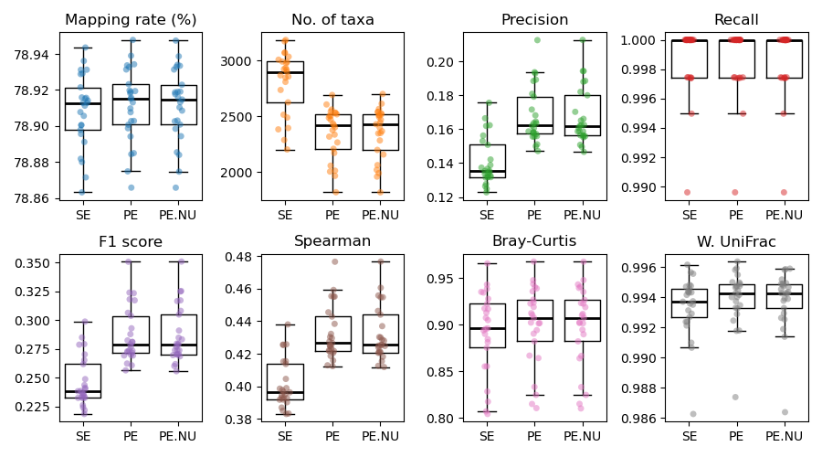

Wolka and Bowtie2 using Read Pairing Schemes
============================================

Benchmarks created by Qiyun Zhu (@qiyunzhu) on Aug 1, 2024.

Summary
-------

I tested alternative read pairing schemes in the analysis of shotgun metagenomic sequencing data. Sequencing reads were aligned against a reference microbial genome database as unpaired or paired. A series of synthetic datasets were used in the analysis.

The results reveal that treating reads as paired is always advantageous over unpaired. Regardless of accuracy, the downstream community ecology analyses are not obviously impacted by the choice of parameters.

Therefore, I recommend the general adoption of paired alignments as a standard procedure.

Alignment parameters
--------------------

Sequencing data were aligned using Bowtie2 v2.5.1 in the "very sensitive" mode against the WoL2 database. They were treated as either unpaired or paired-end:

- SE: Reads are treated as unpaired (Bowtie2 input: -U merged.fq)
- PE: Reads are treated as paired (Bowtie2 input: -1 fwd.fq, -2 rev.fq)
- PE.NU: flags `--no-exact-upfront --no-1mm-upfront`.

Resulting alignment files (SAM format) were processed by Woltka v0.1.6 using default parameters to generate OGU tables.

Synthetic data
--------------

Five synthetic datasets were generated with 25 samples each consisting of randomly selected WoL2 genomes. CAMISIM was executed to simulate 500 Mbp of 150 bp paired-end Illumina sequencing reads (appr. 3.3 million reads) per sample. The five datasets have different taxon count and distribution patterns. The result of one of the five datasets is displayed below. It consists of 400 taxa (more than others) and therefore is presumably the most realistic. However, all five results largely shared the same pattern.

The results of the five Bowtie2 parameter sets were compared using nine metrics:

Two metrics that only rely on each result.

- Mapping rate (%)
- Number of taxa

Six metrics that rely on comparing each result against the ground truth (higher is better):

- Presence/absence-based:
- Precision (fraction of discovered taxa that are true)
- Recall (sensitivity) (fraction of true taxa that are discovered)
- F1 score (combination of precision and recall)
- Abundance-based:

   - Spearman correlation coefficient
   - Bray-Curtis similarity *
   - Weighted UniFrac similarity *

* Note: Bray-Curtis and weighted UniFrac similarities were calculated after subsampling to a constant sum of taxon frequencies per sample.

The results revealed:

#. PE outperforms SE in all metrics. Most importantly, it reduces false positive rate (higher precision) while retaining mapping rate. Meanwhile, the sensitivity (recall) of identifying true taxa is not obviously compromised (note the y-axis scale).
#. PE.NU the two additional parameters had minimum effect on the result and make the alignment step faster. This may suggest that the additional parameters are safe to use.

Therefore, I would recommend adopting paired alignment in preference to unpaired alignment.
