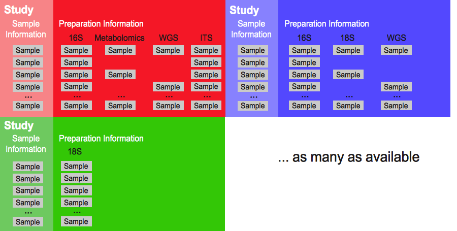

Qiita Philosophy
================

Plugin ideology
---------------

Qiita can be seen as an analytical pipeline broker that can apply any specific
pipeline, tool, or script to any of its stored data. All the analytical
pipelines are autonomous, independently developed, and tested, which
facilitates the support of current tools and the development of new ones. This
principle is supported via virtual environments and artifacts. Virtual
environments for each pipeline gives the freedom of adding any pipeline with
any software dependencies to Qiita. Artifacts, basically any file in the
system, from raw sequence to contingency tables or even data visualizations,
permits the system to store any kind of data but also define within each
pipelines which commands and parameters can applied to them.

The current plugins available are:

* Target gene processing via `QIIME <http://qiime.org>`__: sequence
  demultiplexing, and QC of SFF, fasta/qual, fastq and per sample fastq.
  Closed reference OTU picking.

A Study
-------

Qiita’s main entity is the idea of a study. A study can have many samples, with
many preparations, that have been sequenced several times, Figure 1.
Additionally, study artifacts have 3 different states: sandboxed, private and
public. A sandboxed artifact has all operational capabilities in the system
but is not publicly available, allowing for quick integration with other
studies but at the same time keeping it private so the user can improve the
analysis. Once a user decides that is time to make their artifact public they
can request an administrator to validate their study information and make it
private and possibly submit to a permanent repository, where it can also be
kept private until the user wants to make it public. At this stage in Qiita
the whole study (including all processed data) is private. This process is
completely automatic via the Graphical User Interface (GUI). Currently sequence
data is being deposited for permanent storage to the European Nucleotide
Archive (ENA), part of the European Bioinformatics Institute (EBI). Finally,
when the user is ready, usually when the main manuscript of the study is ready
for publication, the user can request for the artifact to be made public
public, both in Qiita and the permanent repository, Figure 2.

   **Figure 1. Qiita’s main structure: from single to multiple studies.**
   Increasingly, a simple study is composed of multiple samples which have
   been prepared using different protocols to identify different microbial
   features. For example, 16S rRNA amplification to identify the bacteria in
   or on the sample, metabolomics to identify chemical components formed by
   the microbial community or within the sample, and/or ITS amplification for
   identification of fungal organisms that may also be present. Additionally,
   Qiita allows users to compare their studies with other public ones already
   available in the system.

   **Figure 2. Possible Qiita artifact states.** Artifacts are any file,
   either uploaded by users or generated by the system. There are 3 possible
   states: sandboxed, private and public. In the sandboxed and private states
   no other user has access to the artifacts, unless the owner grants access
   by sharing the study. In the public state, the artifact is open to all
   users in the system, and the study can be found by searching from the
   study listing page.

Portals
-------

Qiita allows the hosting of multiple portals within the same infrastructure.
This allows each portal to have a subset of studies (often with a similar
theme) in a different URL but sharing the same resources. Sharing the same
backend resources avoids having multiple sites and data getting out of sync.

The current available portals are:

* Main site (all studies from all portals): qiita.microbio.me
* Sloan portal (build environment): sloan_microbe.microbio.me
* Earth Microbiome Project portal (studies generated under the
  `EMP <http://www.earthmicrobiome.org>`__): emp.microbio.me
