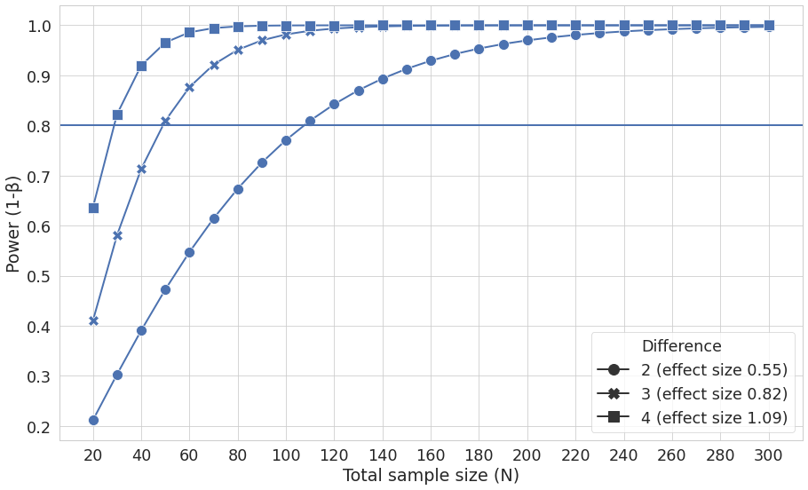
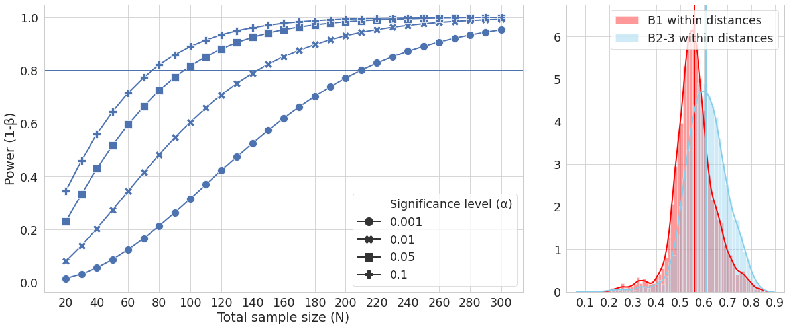
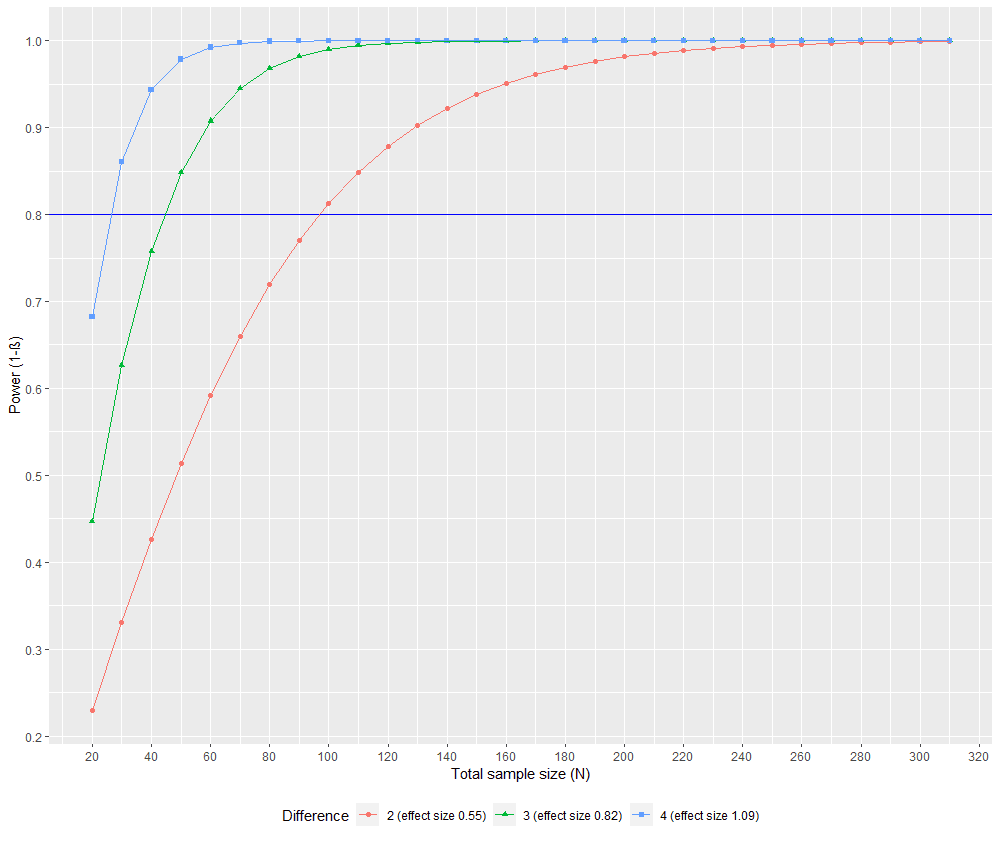
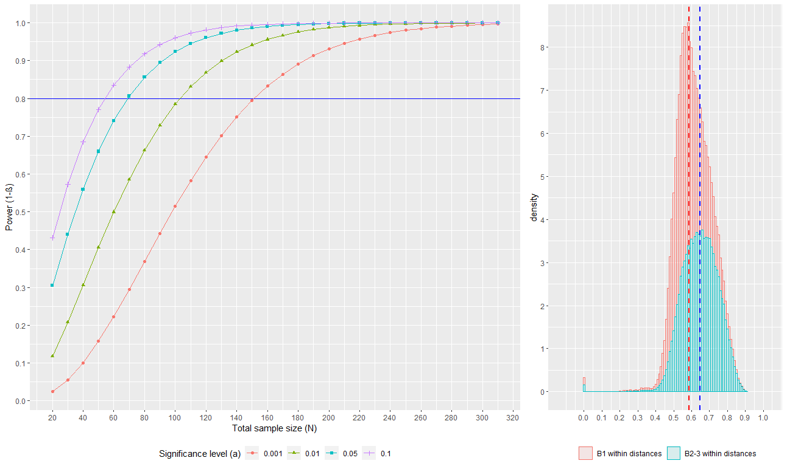

Introduction to the download and (re)analysis of public data from Qiita
===========================================================================

This documentation provides an introduction to accessing and processing public data within the Qiita database for re-analysis. redbiom can be used to identify public data within Qiita for a meta-analysis focused on some particular factor (or factors). The utility of using redbiom to search the database in this way is that it allows the discovery and subsequent use of a potentially wide variety of samples. This may include data from studies with completely different research goals, which one would otherwise have been unlikely to realize could be used.

To illustrate this utility, the following tutorials provide guidance on how to search for and download data using redbiom (:ref:`Retrieving Public Data`) and how to process data retrieved with redbiom using QIIME 2 to allow (re-)analysis of said data (:ref:`Processing Public Data`).
Furthermore, the third section (the :ref:`Statistical Analysis`) provides guidance on a specific example of how public data may be repurposed, in this case to justify clinical trial or experimental sample size.

Two datasets are used in this documentation:

* the American Gut Project (AGP),
* the data used in Casals-Pascual et al 2020 (originally from Halfvarson et al 2017).

See :ref:`Intro-to-data` for more detail. Both datasets are used in the first section (:ref:`Retrieving Public Data`) while :ref:`Processing Public Data` uses the AGP data and the :ref:`Statistical Analysis` uses the data used in Casals-Pascual et al 2020.

.. _Retrieving Public Data:

Retrieving Public Data for Own Analysis
----------------------------------------

Introduction
^^^^^^^^^^^^^^^^

This tutorial aims to introduce Qiita [1A]_ and redbiom [2A]_ to new users as utilities for downloading public datasets for subsequent analyses of their own. This will be illustrated with two examples.

Set up
^^^^^^^^

This tutorial will start online using `Qiita <https://qiita.ucsd.edu/>`__ , for which one requires an account. If you do not, as yet, have a Qiita account you will need to create one (this is very simple, requiring only an email address); navigate to the `Qiita website <https://qiita.ucsd.edu/>`__ and use the sign up action box in the top right corner to do so.
Redbiom can be used as a plugin within Qiita, however, the command line version of redbiom has increased functionality. We will therefore be installing redbiom in the command line to use with the second tutorial example, which demonstrates this functionality. Windows requires some additional set-up, please refer to the *Setting up Windows to use QIIME 2* section in the `QIIME2 docs <https://docs.qiime2.org/>`__. The following set-up is relevant for linux, Mac and the Windows Subsystem for Linux (setup explained in the `QIIME2 docs <https://docs.qiime2.org>`__):

If you have installed anaconda/miniconda then (in the command line) type:

.. code-block:: bash

    conda install -c conda-forge redbiom

If  you do not have miniconda or anaconda installed you could choose to install miniconda as follows:

.. code-block:: bash

    wget https://repo.anaconda.com/miniconda/Miniconda3-latest-Linux-x86_64.sh
    bash Miniconda3-latest-Linux-x86_64.sh

Restart the terminal to have changes take effect, then create an environment to work in

.. code-block:: bash

    conda create --name <name of new environment>

Packages for this tutorial can now be installed in the new environment, keeping them separate from any other projects you may have, and ensuring that different dependencies do not clash.

Alternatively, if you prefer not to install miniconda, redbiom can be installed as follows:

.. code-block:: bash

    pip install numpy
    pip install redbiom

.. _Intro-to-data:

Introduction to the example data
^^^^^^^^^^^^^^^^^^^^^^^^^^^^^^^^^^^^^^^^

This tutorial will use two different datasets to highlight both the different questions that can be asked with existing, open source data, and the different methods that can be used to do so.

The analysis of clinical microbiome data, selected for its similarity to the type of samples one plans to collect for one's own study, allows one to produce example data before starting such a study. This data can then be used for informing and justifying clinical trial format or experimental set-up [3A]_. As this requires only a relatively small data set, and the question is of a less exploratory nature (than the second example), it will be possible to carry out the entire process for this first example within Qiita.

The second example poses a meta-analysis type question about the microbiome which has not yet been fully addressed in the literature: does a person's frequency of exercise affect their microbiome? To answer this type of exploratory meta-analysis type question does not necessarily require a new study, it may be possible to re-purpose publicly available data for the analysis. This exploratory analysis will require a search through the database for any samples with information about a specific meta-data feature - in this case frequency of exercise - this existing data can then be used to answer the novel question. This is a larger study and will require the use of the command line version of redbiom, and coding tools beyond Qiita.

The following section will explain how to retrieve the data for these examples, beginning with the simpler clinical data example.

Retrieving Data
^^^^^^^^^^^^^^^^

Contexts
"""""""""

Processing and bioinformatic techniques can cause inherent biases in datasets. Therefore, within Qiita and redbiom processed samples are partitioned into contexts representing these different methods. The protocol used to obtain samples and extract data may cause biases but, within any one context, data is expected to have the same biases and so be comparable. When retrieving data found in a redbiom search a context must be specified so ensuring the retrieved data is comparable.

Ultimately a context represents a processing pipeline, so if you are unfamiliar with the methods and processes used in such pipelines it may be worth reading this section:

.. toctree::
    :maxdepth: 1

    understanding-contexts.rst

If you already have a decent understanding of sequencing and processing microbial genomics data then please proceed to the next section.

Commands to retrieve data
""""""""""""""""""""""""""

As previously discussed this tutorial will explore two methods by which one can retrieve data from publicly available studies. The simpler method, that is, completing everything within Qiita, will be outlined first, and this will be illustrated with our first example data set.

Retrieving data using the redbiom plug-in within Qiita
'''''''''''''''''''''''''''''''''''''''''''''''''''''''''

It is possible to search for data and studies directly on Qiita using the redbiom plug-in. This will be demonstrated by finding the data used in Casals-Pascual et al 2020, which cites that the data used was retrieved from a study in Qiita with ID 1629 [3A]_. On the Qiita website select the *Study -> View Study option*, specify metadata in the tab down menu next to the search box and search for 1629 to find the data for this first example. However, in most scenarios, one would not know of a specific study to search for beforehand. In this case, the Redbiom plugin can be used to search by metadata attributes e.g. a search for IBD brings up 7 studies, including Study 1629. Note that next to the search box you can specify metadata, feature or taxon. Selecting the green plus for the study of interest reveals the study data, in the form of Qiita artifacts. All artifacts of one type can then be selected by using *add all*, or specific artifacts can be selected using *per artifact -> add*. These selected artifacts can then be used to create an analysis as will be outlined subsequently.

When browsing public studies to find appropriate data, more information on any study can be accessed by selecting it; this will open a new page which includes the study abstract and details as well as options to download the study data. All QIIME 2 maps and BIOMs, as well as EBI accession numbers and sample information can be downloaded directly from this main page. Selecting *data types*, and then the type of interest shows a diagram of the processing pipeline, further information, and list of samples within the dataset of that type. The sample information tab includes a list of all the metadata features (e.g. BMI) associated with the samples, and the option to download this metadata. Perusing these features may give a better indication of whether a study can be repurposed for one's own analysis.

A search using the redbiom plugin within Qiita therefore allows one to either download data for study on another platform or to select artifacts for processing and analysis within Qiita. Once the artifacts have been added select *analysis* from the top bar and, from the drop down menu, select *create from selected samples*. This opens a window where one can view all selected artifacts and exclude blocks of samples or individual samples that are not required/relevant (first select a particular artifact to view these). Note if one chooses multiple studies that only like data can be merged.
Selecting *create analysis* and entering an analysis name (and optional description) will take one to Qiita's graphical interface processing platform. Note that you should should select "*Merge samples with the same name - useful when merging multiple preparation artifacts*" if you want to use the metadata from the studies the samples originated from.

Other tutorials (e.g. the :ref:`Statistical Analysis`) explain how to process the raw data that you have just selected within Qiita for analysis. After processing raw data with Qiita the artifacts can be downloaded by selecting an artifact and clicking ‘*generate a download link*'. This is also possible for another's analysis as long as it is public. More generally, using wget or curl in the command line, one can use the general notation: *https://qiita.ucsd.edu/public_artifact_download/?artifact_id=artifact-id*, provided the analysis is public. This is also useful in the situation where one wants to use the processed artifacts from a public study (simply click on an artifact in any public study's processing network to view its artifact ID). To fetch specific types of data one can also use specific calls. The following notation can be used to fetch:

* All raw data: ``https://qiita.ucsd.edu/public_download/?data=raw&study_id=<study-id>``
* All BIOMs + mapping files: ``https://qiita.ucsd.edu/public_download/?data=biom&study_id=<study-id>``
* Only 16S raw data: ``https://qiita.ucsd.edu/public_download/?data=raw&study_id=<study-id>&data_type=16S``
* Only Metagenomic BIOMs + mapping files: ``https://qiita.ucsd.edu/public_download/?data=biom&study_id=<study-id>&data_type=Metagenomic``
* Only the sample information file: ``https://qiita.ucsd.edu/public_download/?data=sample_information&study_id=<study-id>``
* Only the preparation information file: ``https://qiita.ucsd.edu/public_download/?data=prep_information&prep_id=<prep-id>``

Where ``<study-id>/<prep-id>`` should be replaced with the appropriate study-id/prep-id.

Retrieving data with redbiom in the command line
''''''''''''''''''''''''''''''''''''''''''''''''''

While the redbiom plugin for Qiita is useful for simple searches, and when finding data for processing and analysis within Qiita, the command line version of redbiom has increased functionality, and is particularly useful when data will be processed outside of Qiita. While artifacts, or raw study data, found within Qiita can then be downloaded after accessing the study and finding their ID, the command line version of redbiom  allows searching and direct download all within the command line. The exercise frequency example will demonstrate how to use the command line version of redbiom.

**Background information:** [4A]_

redbiom commands follow a specific syntax: ``redbiom [options] command [arguments]``; for example to search for a metadata feature: ``redbiom search metadata <the feature>``. The general structure of the search arguments is ``<set operations> where <value or restrictions>``. Typing ``redbiom`` in the terminal will return its syntax and commands if ever in doubt. Similarly typing ``redbiom <command>`` will return the syntax and options of that redbiom command.

redbiom search has four commands, ``features``, ``metadata``, ``samples`` and ``taxon``. ``samples`` and ``features`` are complementary, ``features`` retrieves samples containing that feature while ``samples`` fetches the features present in the specified sample/s. In redbiom features are either closed reference OTU ids or exact sequences from deblur. In the future features will be expanded to include other unique attributes produced by processing pipelines. Both of these commands require a specified file and so are not as relevant to initial exploratory searches. ``taxon`` will return features associated with a taxon. ``metadata`` is particularly useful for our purposes. It accepts both ‘natural language' (but uses stemming) and python-like grammar (separately or in combination). Some useful symbols include: ``&`` for intersection, ``|`` for union, ``-`` for difference and ``==`` for equal to. ``<``, ``>``, ``=>``, ``=<``, etc. can also be used. Using the option ``--categories`` one can search for metadata categories rather than values using the same syntax. For example, one could type ``redbiom search metadata --categories <keyword>`` to see the categories which include that keyword, one can then learn more about a specific category with ``summarize metadata-category --category <category-name> --counter``.

Querying and fetching sample data using Redbiom requires a specified context (``-context <your context>``). As contexts are relatively long it is useful to specify them beforehand: ``export CTX=<your context>`` and then use ``--context $CTX``. Contexts can be viewed by typing ``redbiom summarize contexts``. To view contexts with a particular keyword use ``redbiom summarize contexts | grep <your keyword>``. The context used will depend on the data one is looking for, if in doubt, one could choose the context with the most samples. In our case we will initially specify CTX as ``Deblur-NA-Illumina-16S-v4-90nt-99d1d8``, as this is appropriate for study 1629. See the section on understanding contexts for a reminder of their function and utility.

Making a directory to work in at this point (e.g. ``mkdir querying_redbiom; cd querying_redbiom``), will keep all the data retrieved and generated together and tidy.

**Retrieving data**

For the first example, as we know the specific study we are interested in using, we could use the syntax ``redbiom search metadata "where qiita_study_id == <study ID>"`` . To retrieve the data from this study we could pipe the previous command as follows:

.. code-block:: bash

    redbiom search metadata "where qiita_study_id == 1629" | redbiom fetch samples --context $CTX --output IBD.data.biom

Note here the use of our context. Alternatively, it is possible to write the contents of ``redbiom search metadata "where qiita_study_id == <study ID>"`` to a `sample.lst` file, in which case there will be a record of the samples found.

.. code-block:: bash

    redbiom search metadata "where qiita_study_id == 1629" > IBD.samples.lst
    redbiom fetch samples --from IBD.samples.lst --context $CTX --output IBD.data.biom

To illustrate the full functionality of redbiom we will now proceed to the exercise frequency example. The first step will be to search for studies that log exercise frequency, ``redbiom search metadata "exercise"`` yields 24 results.
Or, using `NCBI <https://www.ncbi.nlm.nih.gov/Taxonomy/TaxIdentifier/tax_identifier.cgi>`__ to find the human taxa ID we could use ``redbiom search metadata "exercise where host_taxid==9606"`` which also gives 24 results. These results are studies, rather than individual samples (which is what is returned when searching for a specific study).

When searching with a key word one cannot be sure how it is being used within the metadata, therefore, it is worth examining the categories which are returned by an exercise search: ``redbiom search metadata --categories exercise``. This searches for metadata categories containing exercise, of which there are eight at the time of writing.
``redbiom summarize metadata-category --category <your category> --dump`` gives all samples (not studies) in the category, pipe (``|``) this to ``wc -l`` to get the number of samples. For example, there are 161 samples in the category ``total_hours_exercise``. The ``--dump`` option returns all samples while the other option when searching for metadata categories is ``--counter``. THis gives the responses/variables within a category (e.g. for exercise frequency, one such value is *rarely*, another *frequently*) and also counts the number of samples matching to each of these responses.

We are interested in exercise frequency, and two categories contain this: ``exercise_frequency_unit`` with 1510 samples and ``exercise_frequency`` with 28017 samples (at the time of writing). One can use ``redbiom summarize metadata-category --category exercise_frequency --dump > exercise.list.txt`` to get a list of all the samples and confirm this worked with ``cat exercise.list.txt | wc -l`` which gives 28017 lines. The output is a file with not only contains the sample IDs but also the variable associated with each response; i.e. there are two columns. To use the file to fetch samples the second column must be removed: ``awk ‘{print $1}' exercise.list.txt > exercise.samples.lst``. It is worth noting that these samples start with their study ID, e.g. 10317 (the American Gut Project (AGP) study ID). ``cat exercise.list.txt | grep 10317 | wc -l`` shows that 26027 of the samples are in fact from the AGP. Using the same code with the ``-v`` option for ``grep`` gives the samples from the other studies that logged exercise frequency.

As AGP has the most samples, we could consider using data only from this study. All the samples from a single study will have been collected and processed with the same protocol, and the measures of exercise frequency standardised, thus comparison will be less affected by biases than if multiple studies were used. First retrieve a list of the samples present in the AGP study:

.. code-block:: bash

  redbiom search metadata "where qiita_study_id == 10317" | grep -vi “blank” > AGP-samples.

``grep`` is a selection tool, the option ``-v`` means to exclude any lines containing the specified keyword and the option ``-i`` causes the function to ignore case, in this way we only retrieve correctly ID'd (non blank) samples. This list (AGP-samples) can be used  to retrieve sample data. ``redbiom select`` would allow us to further refine the search if required. ``cat AGP-samples | redbiom summarize samples --category sample_type`` gives information on where the samples originate from e.g. one of the sample type categories is stool.
To fetch the sample metadata and data use ``redbiom fetch``:

.. code-block:: bash

    redbiom fetch sample-metadata --from AGP-samples --context $CTX --output AGP-metadata.tsv --all-columns
    redbiom fetch samples --from AGP-samples --context $CTX --output AGP.data.biom

Note that here the previous context for sample 1629 returns no results. Instead we need a context appropriate to the American Gut Project. AGP used the V4 region of the 16S rDNA gene sequenced by illumina, trimming to 150nt and deblur for binning. ``export CTX=Deblur-Illumina-16S-V4-150nt-780653`` allows the data for the AGP samples in that context to be fetched (repeat the  commands above once the new context has been set).

For a small study ``redbiom summarize AGP-metadata.tsv``, and ``less AGP-metadata.tsv`` could be used to explore the data retrieved, however, for this large data set they give more details than are currently necessary. ``biom summarize-table -i AGP.data.biom | head`` gives some more condensed information about the sample (rather than meta) data, including a summary of counts.

Note that the AGP data-set is large. If the previous steps were slow, or if later steps are slow, then you could consider using a subset of the data. Replace:

.. code-block:: bash

    redbiom search metadata "where qiita_study_id == 10317" | grep -vi “blank” > AGP-samples

with

.. code-block:: bash

    redbiom search metadata "where qiita_study_id == 10317" | grep -vi “blank” | shuf -n <number of samples you want to use> > AGP-samples

Where shuf shuffles the lines piped to it and randomly selects the number of lines specified. All other commands remain the same but less samples will be analyzed.

Conclusion
^^^^^^^^^^^^^^^^

This tutorial has demonstrated how to retrieve publicly available data with redbiom either through the Qiita plugin or the command line programme. If you are interested in learning how to process the raw data retrieved through the redbiom programme into a form appropriate for analysis please proceed to the :ref:`Processing Public Data` section (below). Alternatively, if you would like to learn how to use the data retrieved through the Qiita redbiom plugin to perform statistical analysis to justify clinical trial size please see the :ref:`Statistical Analysis` for guidance on how to do so.

Bibliography
^^^^^^^^^^^^^^^^

.. [1A] Gonzalez A et al. 2018 Qiita: rapid, web-enabled microbiome meta-analysis. Nat. Methods 15, 796798. (doi:10.1038/s41592-018-0141-9)

.. [2A] McDonald D, Kaehler B, Gonzalez A, DeReus J, Ackermann G, Marotz C, Huttley G, Knight R. 2019 redbiom: a Rapid Sample Discovery and Feature Characterization System. mSystems 4. (doi:10.1128/mSystems.00215-19)

.. [3A] Casals-Pascual C, González A, Vázquez-Baeza Y, Song SJ, Jiang L, Knight R. 2020 Microbial Diversity in Clinical Microbiome Studies: Sample Size and Statistical Power Considerations. Gastroenterology 158, 15241528. (doi:10.1053/j.gastro.2019.11.305)

.. [4A] https://github.com/biocore/redbiom

------------------------------------------------------

.. _Processing Public Data:

Processing Public Data Retrieved with redbiom
----------------------------------------------

Introduction
^^^^^^^^^^^^^^^^

This tutorial proceeds from the :ref:`Retrieving Public Data` section above, and demonstrates how to process the raw AGP data retrieved through the command line version of redbiom so that it can be used for analysis. The general work flow is transferable to any raw data retrieved through the command line version of redbiom.

We will be using the AGP-samples, AGP-metadata.tsv and AGP.data.biom files retrieved using redbiom in the :ref:`Retrieving Public Data` section (above). As a reminder, AGP-samples contains a list of the samples retrieved by a search with specification "where qiita_study_id == 10317", this was then used to retrieve the biom table for those samples, and their associated metadata. A quick check to ensure that these are correct:

.. code-block:: bash

    biom summarize-table -i AGP.data.biom | head

Should give an output something like as follows:

.. code-block:: bash

    Num samples: 25,180
    Num observations: 1,028,814
    Total count: 524,626,716
    Table density (fraction of non-zero values): 0.000

    Counts/sample summary:
    Min: 2.000
    Max: 499,002.000
    Median: 14,772.500
    Mean: 20,835.056

Note this will be different if you are using a smaller subset of the data (which will speed up this tutorial). In the tutorial this retrieved data will be processed into an appropriate format for analysis using QIIME 2. QIIME 2 can be used in the command line or as an API for python. The command line is simpler to use, while the API allows more customization for complex processing. Note that while QIIME 2 artifacts cannot easily be viewed from either interface, one can use ``qiime tools peek <artifact name>`` to obtain some information on them in the command line or use the QIIME 2 `artifact viewer <https://view.qiime2.org/>`__ to view visualization type QIIME 2 artifacts (.qzv files).

Set up
^^^^^^^^

QIIME 2 is the latest version (at the time of writing) of a package necessary for handling the raw data retrieved through redbiom. It is a command line programme, therefore, if you have Windows OS you will need to use WSL2 for this tutorial. For instructions to set up WSL2 please see this the *Setting up Windows* section in the `QIIME 2 docs <https://docs.qiime2.org/>`__. Instructions for QIIME 2 installation on Linux, Mac and Windows and the latest release of the software can also be found in these `docs <https://docs.qiime2.org/>`__ . If you have anaconda/miniconda then use the following commands:

Visit the `QIIME 2 documentation <https://docs.qiime2.org/>`__ and navigate to *Natively installing QIIME 2* to find the link for the latest version of QIIME 2.
Then install as follows:

* Installation in a new environment:

.. code-block:: bash

    wget <link from QIIME2 docs>
    conda env create -n qiime2 --file <RELEASENAME>.yml
    conda activate qiime2

*or*

* Installation in an existing environment:

.. code-block:: bash

    wget <link from QIIME2 docs>
    conda env update --file <RELEASE-NAME>.yml

If you do not have miniconda/anaconda then you can install miniconda as follows:

.. code-block:: bash

    wget https://repo.anaconda.com/miniconda/Miniconda3-latest-Linux-x86_64.sh
    bash Miniconda3-latest-Linux-x86_64.sh

Restart the terminal to have changes take effect, then create an environment to work in

.. code-block:: bash

    conda create --name <name for environment>

Packages for this project can now be installed in the new environment, keeping them separate from any other projects you may have, and ensuring that different dependencies do not clash.

Command line workflow
^^^^^^^^^^^^^^^^^^^^^^^^

For the command line version of the processing workflow, make sure you have activated the appropriate conda environment (i.e. the one in which you installed QIIME 2). The first step is to convert the files retrieved with redbiom into QIIME 2 format files. Note that we don't need to convert the metadata into a QIIME 2 format, as its .tsv format is an accepted metadata format for QIIME 2.

.. code-block:: bash

    #Importing biom data, and converting into a QIIME 2 artifact and QIIME 2 visualization:

    qiime tools import --input-path ../AGP.data.biom --type 'FeatureTable[Frequency]' --input-format BIOMV210Format --output-path feature-table-AGP.qza

    qiime feature-table summarize --i-table feature-table-AGP.qza --o-visualization feature-table-AGP.qzv --m-sample-metadata-file ../AGP-metadata.tsv

Once the data has been imported into a QIIME 2 format, it needs to undergo quality control. Quality control will depend on the study but in this case we will first filter and discard samples which have a total feature count under a threshold of 1000, so ensuring that samples with a low number of reads (little data) are removed. Then further filtering to remove rare features, i.e. ASVs that only appear a few times in the whole dataset, will remove possible outliers. Furthermore, it is also important to only include samples from the same body site (we will use feces as this is where most of the samples originate) and exclude samples that do not have exercise frequency logged (some AGP participants may not have answered this particular question when filling in the questionnaire). Finally, it may also be worth filtering out unhealthy individuals, who may bias the results (if health conditions limit exercise frequency then we may get a spurious result due to the correlation between ill health and low exercise frequency).

.. code-block:: bash

    #Filter frequency table using metadata and frequency criteria

    #filter out samples with a low number of reads
    qiime feature-table filter-samples --i-table feature-table-AGP.qza --p-min-frequency 1000 --o-filtered-table sample-frequency-filtered-table-AGP.qza

    #filter out features (ASVs) with a low frequency of occurrence
    qiime feature-table filter-features --i-table sample-frequency-filtered-table-AGP.qza --p-min-frequency 3 --o-filtered-table feature-filtered-table-AGP.qza

    #filter out samples which fall in unwanted metadata categories, or lack the metadata we require
    qiime feature-table filter-samples --i-table feature-filtered-table-AGP.qza --m-metadata-file ../AGP-metadata.tsv --p-where "([body_site]='UBERON:feces') AND ([subset_healthy] IN ('true', 'True', 'TRUE')) AND ([exercise_frequency] IN ('Never', 'Rarely (a few times/month)', 'Occasionally (1-2 times/week)', 'Regularly (3-5 times/week)', 'Daily'))" --o-filtered-table filtered-table-AGP.qza

    #visualise the filtered table
    qiime feature-table summarize --i-table filtered-table-AGP.qza --o-visualization filtered-table.qzv --m-sample-metadata-file ../AGP-metadata.tsv

We now have a filtered dataset, but will need to classify our features if we want to use analyses that take into account phylogenetic distance, and for more general taxonomic analysis. Therefore we need to extract sequences from the dataset and ‘insert' them into a reference phylogenetic tree (this placement identifies their taxonomic position). The first step is to extract representative sequences from the data, and these can then be aligned with and inserted in a reference database.
Obtain this reference data, as follows:
In the command terminal in your working directory (e.g. ``~/microbiome/exercise/``) create a directory for references (``mkdir reference``) and then use wget to download the data:

.. code-block:: bash

    mkdir reference
    cd reference
    # get the reference we need now
    wget https://data.qiime2.org/2020.2/common/sepp-refs-gg-13-8.qza
    # other reference files we will need later and may as well get now too
    wget https://github.com/BenKaehler/readytowear/raw/master/data/gg_13_8/515f-806r/human-stool.qza
    wget https://github.com/BenKaehler/readytowear/raw/master/data/gg_13_8/515f-806r/ref-seqs-v4.qza
    wget https://github.com/BenKaehler/readytowear/raw/master/data/gg_13_8/515f-806r/ref-tax.qza
    # return to the previous working directory
    cd ..

Once these have downloaded one can proceed with the fragment insertion workflow.

.. code-block:: bash

    #generate representative sequences
    biom summarize-table --observations -i ../AGP.data.biom | tail -n +16 | awk -F ':' '{print ">"$1"\n"$1}' > rep_seqs.fna

Note that here we have made a fasta file, this is a very common file type for sequence storage where every sequence is preceded by a header line beginning with ``>``. Generally this header line contains information about the sequence such as it's origin (species, gene etc) but as these are as yet unknown we use the sequence itself as an id for the sequence.

.. code-block:: bash

    #import these sequences into an artifact form
    qiime tools import --input-path rep_seqs.fna --output-path rep_seqs.qza --type 'FeatureData[Sequence]'

    #use the representative sequences artifact to create a fragment insertion placement tree
    qiime fragment-insertion sepp --i-representative-sequences ./rep_seqs.qza --i-reference-database ./sepp-refs-gg-13-8.qza --o-tree ./insertion-tree.qza --o-placements ./insertion-placements.qza

Aligning the fragments and creating an insertion tree is computationally costly, and will require at least 12GB ram and possibly several hours. If you are struggling to complete this step consider decreasing the sample size you are using (go back to the data retrieval section, and use the ``shuf -n`` option, then repeat the steps from there).

One can also train a taxonomic classifier to classify the sequences. The fragment insertion generated a phylogeny, with the sequences inserted appropriately. The taxonomic classifier classifies the ASVs, assigning them to a particular clade (e.g. with good data to specific species) [1B]_. While it is possible to use pre-trained classifiers these tend to give poorer results than those trained on data similar to that of the sample, therefore we will train  a classifier using human-stool samples.

.. code-block:: bash

    #create and train a taxonomic classifier
    qiime feature-classifier fit-classifier-naive-bayes --i-reference-reads ../reference/ref-seqs-v4.qza --i-reference-taxonomy ../reference/ref-tax.qza --i-class-weight ../reference/human-stool.qza --o-classifier classifier.qza

    qiime feature-classifier classify-sklearn --i-classifier classifier.qza --i-reads rep_seqs.qza --o-classification taxonomy.qza

You have now produced all the artifacts necessary for a basic exploratory analyses and could continue from here to analyse e.g. beta diversity and alpha diversity, as well as producing PCA plots. The next section details how to achieve the same result in python, rather than within the command line.

Python Workflow
^^^^^^^^^^^^^^^^^^^^^^^^

This section will demonstrate how to, using python, process data retrieved via redbiom into a form that can be used for further analysis.

Set up
""""""""

As well as QIIME 2 processing the data in python will require pandas (a data analysis and manipulation tool) and some QIIME 2 plugins:

* ``Feature_table`` allows feature tables to be filtered, merged, transformed, etc [2B]_.
* ``Fragment_insertion`` improves phylogeny creation from sequence fragments by inserting the sequences into an existing high quality reference phylogeny rather than making a de novo phylogeny [3B]_.
* ``Feature_classifier`` for taxonomic classification of QIIME 2 features [4B]_.
* ``Metadata`` provides functionality for working with and visualizing metadata [5B]_.

These are loaded into your IDE as follows:

.. code-block:: python

    #Set up
    import biom
    import qiime as q
    import pandas as pd
    import sklearn
    from qiime2.plugins import feature_table, fragment_insertion, feature_classifier, metadata

If any of these are not present, install them through conda (search *conda install <name of package>* in your preferred internet browser for instructions on how to do so for said package - usually such instructions are found on the Anaconda Cloud web-pages).

Load and process data
"""""""""""""""""""""""

The first step is to load the files retrieved using redbiom into QIIME 2 artifact type variables, these can then be recognized by QIIME 2 processing commands.

.. code-block:: python

    #load metadata
    meta = q.Metadata.load('<path to file>/<metadata file name>')

    #load sample data (biom table)
    sample_data = q.Artifact.import_data(type='FeatureTable[Frequency]',view='<path to file>/<biom table file name>', view_type='BIOMV210Format')

    #visualize the data
    vis_data = feature_table.visualizers.summarize(table=sample_data, sample_metadata=meta)

If you have trouble loading the metadata file then try use the keemie (google sheets) add-on to validate the metadata tsv file. It might also be worth re-fetching the sample, in case it has been corrupted by an incomplete download. The last command creates a feature table plot, like those in Qiita, which can help you decide how to filter the raw data. A feature in QIIME 2 is a unit of observation such as an OTU or ASV, or gene, or taxon.

You can (and should) save this visualization, and the generated QIIME 2 artifact feature table to your working directory using the following code:

.. code-block:: python

    sample_data.save("table.qza")
    vis_data.visualization.save("feature_table.qzv")

(It might be tidier to create a results directory, and then save the files to this by specifying the path to this directory in the command above.)

The next step is to perform quality control on the data: first filtering and discarding samples which have a total feature count under a threshold of 1000, so ensuring that samples with a low number of reads are removed. Further filtering to remove rare features i.e. ASVs that only appear a few times in the whole dataset should also be performed. Furthermore, it is also important to only include samples from the same body site (we will use feces as this is where most of the samples originate) and exclude samples that do not have exercise frequency logged (some participants may not have answered this particular question in the questionnaire). Finally, it may also be worth filtering out unhealthy individuals, who may bias the results (if health conditions limit exercise frequency then we may get a spurious result due to the correlation between ill health and low exercise frequency).

.. code-block:: python

    # Inclusion criterion
    criterion = "[body_site]='UBERON:feces'"\
    " AND [subset_healthy] IN ('true', 'True', 'TRUE')"\
    " AND [exercise_frequency] IN ('Never', 'Rarely (a few times/month)', 'Occasionally (1-2 times/week)', 'Regularly (3-5 times/week)', 'Daily')"

    # Keep only one sample if there are multiple samples from same subject
    ids_to_keep = meta.get_column('host_subject_id').to_series().drop_duplicates().index
    filtered_meta = meta.filter_ids(ids_to_keep)

    # Thresholds for filtering samples and features
    min_feature_per_sample= 1000
    min_per_feature = 3

    # Filter FeatureTable[Frequency] with feature-table filter-samples method to remove samples with a small library size
    sample_filtered_data = feature_table.methods.filter_samples(table=sample_data, min_frequency=min_feature_per_sample, metadata=filtered_meta, where=criterion)

    # Filter FeatureTable[Frequency] with feature-table filter-features method to remove very rare features
    feature_filtered_data = feature_table.methods.filter_features(table=filtered_data.filtered_table, min_frequency=min_per_feature)

    # Visualize the filtered table
    vis_filtered_data = feature_table.visualizers.summarize(table=filtered_data.filtered_table, sample_metadata=filtered_meta)

To save these to the results directory made in your working directory use the code below. By viewing the feature filtered with the QIIME 2 metadata plugin we can also extract the ids of those samples which have met all filtering criteria for future reference. The metadata format is converted to a dataframe, from which the indexes are extracted and each pasted on a new line to give a variable with the sample ids. These are then written to a file saved in the results directory - you can check this file in the command line with ``cat ./results/filtered.ids | head`` (from your working directory).

.. code-block:: python

    # save the filtered feature table and visualisations
    sample_filtered_data.filtered_table.save('./results/sample-filtered-table.qza')
    vis_sample_filtered.visualization.save('./results/sample-filtered-table.qzv')
    feature_filtered_data.filtered_table.save('./results/feature-filtered-table.qza')
    vis_feature_filtered.visualization.save('./results/feature-filtered-table.qzv')

    # for future reference save the ids of the samples that met filtering criteria
    filtered_table = feature_filtered_data.filtered_table.view(q.Metadata)
    filtered_ids = "\n".join(filtered_table.to_dataframe().index) + "\n"
    with open('./results/filtered.ids', 'w') as f:
        f.write(filtered_ids)

You have now obtained a filtered dataset, but will need to classify the features if you want to use analyses that take into account phylogenetic distance. Therefore we need to extract sequences from the dataset and ‘insert' them into a reference phylogenetic tree (this placement identifies their taxonomic position). To extract representative sequences from the features we will use the ``feature_filtered_data`` (a frequency feature table) to make a fasta file (a universal DNA/protein sequence file format) of sequence feature data. You can view this file with ``less <file>`` or ``cat <file> | head``, as it is a plain text file. Often such files have information about the origin of the sequences (on the > line before the sequence), but we will use the sequence itself as an ID as the taxonomic data is currently unknown. Fragment insertion, mapping representative sequences from the samples to a reference database will allow taxonomic classification of the ASVs. First extract representative sequences from the data:

.. code-block:: python

    with open('./results/sequences.fna', 'w') as f:
        for seq in feature_filtered_data.filtered_table.view(pd.DataFrame).columns:
            f.write('>%s\n%s\n' % (seq, seq))

    # import the fasta file as a FeatureData[Sequence] artifact
    sequences = q.Artifact.import_data(type='FeatureData[Sequence]', view='./results/sequences.fna')

The first line here creates a writeable output file and assigns it to a variable. ``seqs = ‘'`` creates an empty string that is then filled in the following for loop. The for loop uses two variables ``i`` and ``seq`` representing the index and a column from the ``feature_filtered_data`` represented as a panda DataFrame. Each loop therefore writes a line with > and then the contents of the next column to seqs. Seqs is then written to the output file.We don't necessarily know how many lines have been added to seqs but can specify to write out the slice from the first to the last index using [:-1] (or [0:-1]).

Again, we can visualize this data and save it:

.. code-block:: python

    # visualize artifact and save both visualization and artifact
    vis_sequences = feature_table.visualizers.tabulate_seqs(data=sequences)
    sequences.save('./results/sequences.qza')
    vis_sequences.visualization.save('./results/sequences.qzv')

We can now create a tree to insert the fragments into. For this we will need reference data, this can be downloaded in the command terminal. In your working directory create a directory for references (``mkdir reference``) and then use wget to download the data:

.. code-block:: bash

    mkdir reference
    cd reference
    # get the reference we need now
    wget https://data.qiime2.org/2020.2/common/sepp-refs-gg-13-8.qza
    # other reference files we will need later and may as well get now too
    wget https://github.com/BenKaehler/readytowear/raw/master/data/gg_13_8/515f-806r/human-stool.qza
    wget https://github.com/BenKaehler/readytowear/raw/master/data/gg_13_8/515f-806r/ref-seqs-v4.qza
    wget https://github.com/BenKaehler/readytowear/raw/master/data/gg_13_8/515f-806r/ref-tax.qza
    cd .. # return to the directory we have been working in

When the data is downloaded the sepp reference data can be loaded into your python IDE and the sample fragments inserted into the sepp tree.

.. code-block:: python

    ### Fragment insertion
    # Load the reference data and insert sequences into sepp tree
    sepp_ref = q.Artifact.load('./reference/sepp-refs-gg-13-8.qza')
    sepp_result = fragment_insertion.methods.sepp(representative_sequences=sequences,
                                              reference_database=sepp_ref,
                                              threads=8,
                                              debug=True)

Once the sequences have been placed save the tree and placements as with the same save function we have been using throughout this section:
This last command is computationally costly (requires at least 12GB ram), and will take a while. If you are having trouble consider using a subset of the entire AGP dataset - you do not need to change your script, simply copy it into a new directory, repeat the redbiom data retrieval steps with the same names for the output files but with the ``shuf -n <number of samples>`` command piped into the initial sample ID retrieval command, and then run your script again in this new directory. Another possible solution is to lower the number of threads, though the process will take longer.

We can also train a taxonomic classifier to classify the sequences. The fragment insertion generated a phylogeny, with the sequences inserted appropriately. The taxonomic classifier classifies the ASVs, assigning them to a particular clade (e.g., with good data, to specific species) [1B]_. While it is possible to use pre-trained classifiers these tend to give poorer results than those trained on data similar to that of the sample, therefore we will train  a classifier using human-stool samples. First we load the other references and the representative sequence:

.. code-block:: python

    # Load the representative sequences
    rep_seqs = qiime2.Artifact.import_data(type='FeatureData[Sequence]', view='./sequences.fna`)

    # Load the Greengenes sequences and taxonomy and Clawback human stool weights
    human_stool_weights = q.Artifact.load('./reference/human-stool.qza')
    ref_seqs_v4 = q.Artifact.load('./reference/ref-seqs-v4.qza')
    ref_tax = q.Artifact.load('./reference/ref-tax.qza')

We can then generate a classifier and classify the sequences:

.. code-block:: python

    # Generate a classifier with the loaded reference data
    human_stool_v4_result = feature_classifier.methods.fit_classifier_naive_bayes(reference_reads=ref_seqs_v4, reference_taxonomy=ref_tax, class_weight=human_stool_weights)

    # Use classifier to classify sequences
    bespoke_taxonomy = feature_classifier.methods.classify_sklearn(reads=rep_seqs, classifier=human_stool_v4_result.classifier, n_jobs=-1)

The classifier training will give a warning
"`The TaxonomicClassifier artifact that results from this method was trained using scikit-learn version 0.23.1. It cannot be used with other versions of scikit-learn.`"
You can check your version of scikit-learn by typing the following in your python console:

.. code-block:: python

    import sklearn
    print('The scikit-learn version is {}.'.format(sklearn.__version__))

If you have the correct version, ignore the warning. If not, update to the correct version using conda.

The classifier and the classifications should be saved.

.. code-block:: python

    human_stool_v4_result.classifier.save('./results/gg138-v4-human-stool_classifier.qza')
    bespoke_taxonomy.classification.save('./results/bespoke-taxonomy.qza')

We can also visualize this classification as a table:

.. code-block:: python

    taxonomy_vis = metadata.visualizers.tabulate(bespoke_taxonomy.classification.view(q.Metadata))
    taxonomy_vis.visualization.save('./results/bespoke-taxonomy.qzv')

With the data processed it is now possible to begin analysis. We have generated a feature table, representative sequences, an insertion tree and taxonomic classification and these will be sufficient for most simple exploratory analyses.

Conclusion
^^^^^^^^^^^^^^^^

This tutorial has demonstrated how to process raw data retrieved through redbiom, using QIIME 2, either directly in the command line or through the python API. The processed data can now be analysed e.g. by calculating alpha and beta diversity metrics. To learn how to analyse the data visit the `QIIME 2 docs <https://docs.qiime2.org/>`__ and select an appropriate tutorial e.g. the Moving Pictures tutorial (skip to the Alpha and Beta Diversity Analysis section).

Bibliography
^^^^^^^^^^^^^^^^

.. [1B] Bokulich NA, Kaehler BD, Rideout JR, Dillon M, Bolyen E, Knight R, Huttley GA, Gregory Caporaso J. 2018 Optimizing taxonomic classification of marker-gene amplicon sequences with QIIME 2's q2-feature-classifier plugin. Microbiome 6, 90. (doi:10.1186/s40168-018-0470-z)

.. [2B] QIIME 2 2020.6.0 documentation. See https://docs.qiime2.org/2020.6/plugins/available/feature-table/

.. [3B] Janssen S et al. 2018 Phylogenetic Placement of Exact Amplicon Sequences Improves Associations with Clinical Information. mSystems 3, e00021-18

.. [4B] Bokulich NA, Kaehler BD, Rideout JR, Dillon M, Bolyen E, Knight R, Huttley GA, Gregory Caporaso J. 2018 Optimizing taxonomic classification of marker-gene amplicon sequences with QIIME 2's q2-feature-classifier plugin. Microbiome 6, 90. (doi:10.1186/s40168-018-0470-z)

.. [5B] QIIME 2 2020.6.0 documentation. See https://docs.qiime2.org/2020.6/plugins/available/metadata/

------------------------------------------------------------------------------

.. _Statistical Analysis:

Statistical Analysis to Justify Clinical Trial Sample Size Tutorial
-------------------------------------------------------------------

The goal of this tutorial is to demonstrate how to analyse public data similar to that one may obtain from one's own proposed study; and use this to find the minimum sample size needed for appropriate/sufficient statistical power. This will allow relevant conclusions to be drawn for the minimum clinical trial size in one's actual (own) study. The information obtained using this public data will therefore allow justification of the clinical trial format, and strengthen e.g. grant applications.

This tutorial is based on Casals-Pascual et al 2020 and will be analysing the same data, to reproduce the figures and statistics found in the paper [1]_ . The tutorial continues on from the :ref:`Retrieving Public Data` section and expects that you can find the example data from study 1629, using the Qiita redbiom plugin.

To reproduce the figures and results in Casals-Pascual et al 2020 we first need to process the raw data from study 1629 to obtain an Alpha_diversity artifact and a Beta_diverstiy artifact for the data. This stage of the tutorial will be completed within the Qiita processing interface, though note that it could be completed in QIIME 2 instead. We will also need the Metadata artifact from the original study. The second half of the process, producing the figures can then be completed using either python or R.

Set up
^^^^^^^^^^^^^^^^

Please follow the instructions in the :ref:`Retrieving Public Data` section for the first example to find the data required for this tutorial.

For later analysis you will require either a python script editor or R studio.
Python scripts can be written directly in the command line editor vi but if you are a beginner this is not very user friendly, and I would recommend installing spyder (``conda install spyder``, presuming you have `miniconda <https://docs.conda.io/en/latest/miniconda.html>`__ ) which can then be launched from the command line by typing ``spyder``.
R-studio can be downloaded via the command line using conda if you have miniconda/anaconda. It can also be downloaded and function independently of the command line (note you need to install both R and R-studio in this case). There are many tutorials for this online e.g. `here <https://www.datacamp.com/community/tutorials/installing-R-windows-mac-ubuntu>`__ or `here <https://techvidvan.com/tutorials/install-r/>`__ .

Find and process data in Qiita
^^^^^^^^^^^^^^^^^^^^^^^^^^^^^^^^

Once you have selected the study 1629 (see :ref:`Retrieving Public Data` above) there are four artifacts, these are:

#. *Pick closed-reference OTUs (reference-seq: /databases/gg/13_8/rep_set/97_otus.fasta) | Split libraries FASTQ*.
    * This tells us that the data is picked OTUs clustered by closed reference against /databases/gg/13_8/rep_set/97_otus.fasta and is now in a split library FASTQ format.
    * FASTQ stores both sequence and corresponding quality score see `here <https://emea.support.illumina.com/bulletins/2016/04/fastq-files-explained.html>`__ for more information (though note the data in FASTQ format does not have to be illumina sequencing data).
    * Split refers to demultiplexing where sequences from the same lane are split into samples based on barcodes. N.B. illumina can sequence multiple different samples at the same time, therefore sequence data has to be demultiplexed into the separate samples present in the same lane.
#. *Pick closed-reference OTUs (reference-seq: /databases/gg/13_8/rep_set/97_otus.fasta) | Trimming (length: 90)*
    * This is essentially the same as the previous artifact but the reads have been trimmed to 90nt (see the explanation of contexts for an explanation of why this is done).
#. *Deblur (Reference phylogeny for SEPP: Greengenes_13.8, BIOM: /projects/qiita_data/BIOM/60941/reference-hit.biom) | Trimming (length: 90)*
    * Deblur processed sequence data trimmed to 90nt and classified by taxonomy using the greengenes reference database. This artifact contains only those sequences which have been classified thus reference-**hit**.biom
    * SEPP is a phylogenetic placement program that can be used to place query sequences (reads e.g. of the V4 region of 16S) into the phylogeny of the full length gene's tree (in this case using the Greengenes database).
#. *Deblur (Reference phylogeny for SEPP: Greengenes_13.8, BIOM: /projects/qiita_data/BIOM/60942/all.biom) | Trimming (length: 90)*
    * This artifact been processed in the same manner as the previous artifact, but all ASVs are present, including those that did not get placed (therefore **all**.biom).

For the Deblur data we will use the reference-hit.biom data as this represents those ASVs which were placed within the Greengenes database. Using the all.biom data would give all ASVs, but the unplaced sequences would have to be removed to allow later analysis with Unifrac (so that they may as well not be present) and therefore we select the reference-hit data from the start. N.B. unifrac uses phylogenetic distance (measures of relatedness), thus the need for placed sequences.
For the OTUs, the trimmed sequences are appropriate, as they represent a later step in the processing pipeline of the raw data.

With these two artifacts selected proceed to *create analysis*. Both samples will need to be rarefied and then have alpha and beta diversity artifacts created. For a general overview of processing data in the Qiita processing interface see the appropriate section of these `Qiita docs <https://qiita.ucsd.edu/static/doc/html/index.html>`__ . To rarefy the data select the artifact -> *process* -> *rarefy*, modify the options of rarefy so that total frequency is a 10000 for both -> *add command* -> *run*.
The cut off frequency is an individual choice, but the use of 10 000 strikes a compromise between losing data from samples with large library sizes and discarding samples with smaller library size. One can look at the frequency tables of the biom artifacts to get an idea of what would be an appropriate cut off. In this case 10 000 will allow most samples to be used, while maintaining quality. Once rarefaction has completed the `rarefied_table` artifact can be used for alpha and beta diversity calculations. Select the `rarefied_table` artifact, *process* -> *alpha diversity (phylogenetic) [alpha_phylogenetic]* and in options use the default option of Faith's index then *add command* -> *run*. Beta Diversity can be calculated with *Beta Diversity (phylogenetic)* (this uses Unifrac). For the OTU artifact one can specify the phylogenetic tree from the database (as closed OTUs inherently have taxonomy data). For the Deblur artifact use the ‘artifact tree, if exists' option. The artifact we are using has been aligned to a reference database, but not all deblur data will necessarily have associated taxonomy data.
The distance matrix produced by the Beta Diversity process will allow us to run a principal coordinate analysis, while this is not necessary for reproducing the plots, it allows one to visualise the data and so get an intuitive idea of what it represents.

Retrieve artifacts/data from Qiita and create figures
^^^^^^^^^^^^^^^^^^^^^^^^^^^^^^^^^^^^^^^^^^^^^^^^^^^^^^^^^^^^^^^^

To reproduce the plots in the paper we need to produce two figures (three plots). The first shows sample size against power (1 - P(type II error)) which is used to find statistically significant differences in alpha diversity. This allows one to calculate the standard sample size required to detect an effect between a group and the control population. This sample size will be affected by the effect size, so we need to plot power for at least three different effect sizes. Casals-Pascual et al 2020. use 0.55, 0.82, 1.00 because these represent a difference in Faith's PD (a measure of phylogenetic distance) of 2, 3, and 4. The group being used to calculate alpha diversity is B1.
The second figure includes two plots: the first plots sample size against power (1 - P(type II error)) to find statistically significant differences in Beta diversity (in this case pairwise distances between the two groups). Again, multiple scenarios are used, in this case significance levels of 0.001, 0.01, 0.05 and 0.1. The second is a histogram showing the distribution of pairwise distances within and between the two sample groups. The groups are B1 and B2/3 (i.e. B1 samples are compared to all other samples).

Download data from Qiita
""""""""""""""""""""""""""

This can be done in the command line using wget and the links from your Qiita study. Select an artifact followed by ‘generate download link' if your study is private. If your study is public one can simply use the artifact ID as described in the Retrieving Public Data for Own Analysis Tutorial (under redbiom). Use the -O option to specify the output (downloaded) file's name. We also need the study metadata, this can be retrieved from the study page, under sample information, copy the link address of the sample info download button, or use the study ID as below.

.. code-block:: bash

    wget -O alpha_div_artifact.zip “<link for alpha diversity artifact>”
    wget -O beta_div_artifact.zip "<link for beta diversity artifact>"
    wget -O metadata.zip “<https://qiita.ucsd.edu/public_download/?data=sample_information&study_id=<study-id>”

To have this run ‘quietly' (without showing any output) add the -q option. However, note that running in quiet mode might lead to missed error messages. Certain errors, suggesting that the zipfile is corrupt, can be `ignored <https://qiita.ucsd.edu/static/doc/html/faq.html#how-to-solve-download-or-unzip-errors>`__ .
When the files have been downloaded unzip them with ``unzip <file name>``.

If you did not merge samples when creating your analysis the sample IDs in the beta and alpha diversity artifacts may not match those of the metadata, as they will have your rarefied artifact ID appended to the sample ID. To make the sample IDs match, the simplest fix is to change the metadata file as it is an easily manipulatable .txt file. The code below will append your rarified table ID to the metadata IDs

.. code-block:: bash

    cat ./templates/<name of your metdata file> | sed “s/^1629/<rarified table in Qiita ID>.1629/g” > ./templates/metadata.txt

Check this has worked with ``cat templates/metadata.txt | less``.

Python workflow
^^^^^^^^^^^^^^^^

This section works through the `code <https://github.com/knightlab-analyses/sample-size-stat-power-clinical-microbiome>`__ accompanying the aforementioned paper. Alternatively, you can skip this section and use R studio for the same end result figures.

Set up environment
"""""""""""""""""""

There are various modules required to complete this analysis in python.

* ``qiime2``: a bioinformatics platform for next generation microbiome data.
* ``pandas``: a data analysis and manipulation tool.
* ``Seaborn``: a data visualization library based on matplotlib which facilitates drawing statistical graphics.
* ``Matplotlib.pyplot``: a matplotlib interface (allows plotting in a manner similar to that in MATLAB which is a programming language).
* ``skbio/scikit-bio``: a python package which is used by QIIME 2 (i.e. a dependency), from which the DistanceMatrix function is required.
* ``statistics``: a python package for functions such as mean and stdev
* From ``statsmodels.stats.power`` the ``tt_ind_solve_power`` function is required - this is a function that allows calculation of the power of a two sample t-test given relevant data.

It is likely that these packages will already be present if you are using conda and have installed QIIME 2. If any are missing do an internet search for the package name + conda; one of the top hits will be from the anaconda cloud, and give instructions for installing the package. Alternatively, you can use ``conda search <package name>`` within the command line.

Open your preferred python IDE or script editor, and make a new script. To set-up the environment use:

.. code-block:: python

    import pandas as pd
    import qiime2 as q2
    import seaborn as sns
    import matplotlib.pyplot as plt

    from statsmodels.stats.power import tt_ind_solve_power
    from statistics import mean, stdev
    from skbio import DistanceMatrix

Process the artifact data
""""""""""""""""""""""""""""""""""""

**Metadata**

The metadata file unpacks to a folder template, with one file 1629_20180101-113841.txt. If you have used the earlier command to append an artifact ID to the sample ID this name may be different. To assign the metadata to a variable use:

.. code-block:: python

    metadata = pd.read_csv('./templates/<metadata file name>', sep='\\t', dtype=str, index_col=0, engine='python')

This code assigns the metadata information to the variable metadata, using the pandas ``read_csv function``, the ``sep =`` sets the separator of the data columns, ``index_col`` specifies the column to use as the index, ``dtype`` specifies the data type for the columns, and ``engine`` specifies the parser. The variable metadata now consists of 38 columns specifying the metadata details of the 683 patients.

Next, using QIIME 2, the alpha_diversity artifact can be be added to the metadata variable in a new column (deblur alpha diversity):

.. code-block:: python

    metadata['deblur alpha diversity'] = q2.Artifact.load('./alpha_vector/<appropriate ID>/alpha_diversity.qza').view(pd.Series)
    metadata.dropna(subset=['deblur alpha diversity'], inplace=True)

The ``view(pd.Series)`` is used to view the artifact (loaded by QIIME 2) in panda series format - in this format the data can be appended to the metadata variable. A panda series is an array that can be made from data input such as csv files and existing storage. The last line of code drops those rows with NA (not applicable) values (i.e. missing values) in the deblur alpha diversity column from the data frame. Inplace specifies editing of the object in place rather than returning the output as a new dataframe.

When working through someone else's code it is often a good aid to understanding to print various variables along the way, this gives a better idea of what is happening, and will flag any possible errors. E.g. at this stage try

.. code-block:: python

    print(metadata[metadata ['deblur alpha diversity']])

Next we can divide the data into groups:

.. code-block:: python

    b1 = metadata[metadata.cd_behavior == 'Non-stricturing, non-penetrating (B1)']
    bother = metadata[(metadata.cd_behavior != 'Non-stricturing, non-penetrating (B1)') & (metadata.cd_behavior != 'not applicable')]

    dtx = q2.Artifact.load('<path to distance matrix artifact/distance artifact .qza>').view(DistanceMatrix)

    b1_dtx = dtx.filter(ids=b1.index).to_series().values
    bother_dtx = dtx.filter(ids=bother.index).to_series().values

This code makes a variable representing the b1 group. This variable (``b1``) contains all rows in the metadata object which have cd_behaviour equal to the B1 phenotype (Non-structuring, non-penetrating (B1). ``b1_dtx`` contains all the values in the distance matrix after filtering for b1. To do this required loading the distance matrix data into a variable using q2.Artifact.load. We also create variables containing all other non-B1 and present (not NA) data from the metadata and dtx variables.

**Alpha diversity data**

Now we have processed the data into a python readable format we can calculate variables such as the standard deviation and the mean:

.. code-block:: python

    sd1 = b1['deblur alpha diversity'].std()
    sd2 = bother['deblur alpha diversity'].std()
    sd12 = mean([sd1, sd2])

Again, print these to see if they look as expected, or, if you are using an appropriate IDE (such as spyder), you can look at their values and type in the inbuilt variable explorer. Next we will make a data frame containing the data for the first plot

.. code-block:: python

    # significance level
    alpha = 0.05

    #create empty list
    data_alpha = []

    #in steps of 5 from 10 to 55
    for observations in range(10, 155, 5):
    #for differences in Faiths PD representative of effect sizes 0.55, 0.82, 1.00
        for difference in [2, 3, 4]:
            #effect size calculation
       		effect_size = difference/sd12
       		x = tt_ind_solve_power(effect_size=effect_size,
                #number of observations, iterated by the loop
                nobs1=observations,
                #significance level
                alpha=alpha,
                #number of observations for second group presumed to be equal to first group's observations
                ratio=1.0,
                alternative='two-sided')
            data_alpha.append({
                #append parameters and output to list
                'alpha': alpha, 'Power (1-β)': x,
                'Total sample size (N)': observations * 2,
                'Difference': '%d (effect size %0.2f)' % (difference, effect_size)})

    #turn the list created in the loop into dataframe
    data_alpha = pd.DataFrame(data_alpha)

``tt_ind_solve_power`` solves for any one parameter of a two sample t-test. In this case we are using it to find power given all data. It requires effect_size, nobs1, alpha, power and ratio; where exactly one needs to be None (and is calculated), while all others need numeric values.

* ``Effect_size`` is the standardized effect size, the difference between the two means divided by the standard deviation.
* ``Nobs1`` is the number of observations of sample 1 (which we generate with a loop, in steps of 5 from 10 to 55).
* ``Ratio`` is used to specify the ratio between the number of observations of group one and two; so that ``nobs2 = nobs1 * ratio``.
* ``Alpha`` is the significance level - that is the probability of a type I error; that is the probability of finding a significant effect when the null hypothesis is actually true.
* ``Power`` - is what we want to calculate, it is (1 - the probability of a type II error). A type II error is falsely finding a non-significant effect and accepting the null hypothesis (when there is in fact a significant effect).

Our extra parameter, alternative, ensures that the power is calculated for a two-tailed t-test (this is default in anycase).
The outcome of this code is therefore to calculate the power for a given alpha and difference over a range of sample sizes (represented by observation), and then append all parameters appropriately to a list which is then processed to form a data-frame which we can use as input for plotting.

**Beta diversity data**

The process for obtaining the points to plot for beta diversity is similar to that for alpha diversity but now we are considering two groups, and therefore the difference between them. The absolute difference in the two groups' means divided by their mean standard deviation gives the effect size:

.. code-block:: python

    u2u1 = abs(mean(b1_dtx) - mean(bother_dtx))
    effect_size = u2u1/mean([stdev(b1_dtx), stdev(bother_dtx)])

Note here that ``stdev()`` is used rather than ``std()``. ``std()`` calculates population standard deviation, while ``stdev()`` calculates sample standard deviation. For alpha diversity we consider only the contents of the particular sample (i.e. we are not comparing to any other group but rather attempting to find whether the sample is significantly different from the entire population) and therefore, for the null hypothesis can treat it as the population. However, for beta-diversity comparison between groups means that no one group cannot be considered as necessarily representative of the whole population and so sample standard deviation is used.

Again, a list is created by appending iterated ``tt_ind_solve_power`` output and parameters, and this list is then converted to a dataframe. However, this time we iterate through different significance levels rather than effect levels.

.. code-block:: python

    data_beta = []
    for observations in range(10, 155, 5):
        for alpha in [.001, .01, .05, .1]:
            x = tt_ind_solve_power(effect_size=effect_size, nobs1=observations,
                    alpha=alpha, ratio=1.0,
                    alternative='two-sided')
            data_beta.append({
                    'Significance level (α)': alpha, 'Power (1-β)': x,
                    'Total sample size (N)': observations * 2,
                    'Difference': '%d (effect size %0.2f)' % (difference, effect_size)})
   data_beta = pd.DataFrame(data_beta)

We have now generated the necessary data to create the relevant plots.

Create Figures
"""""""""""""""""""""

**Figure 1**

We will use ``fig``, which allows the creation of a background (blank canvas) upon which further commands will take effect, the rest of the first line formats this background. ``sns.set`` can be used to set aesthetic parameters of the graph including plotting context such as grid line width, adjust the parameters of the plotting line axes and specify the axes titles.

.. code-block:: python

    fig, ax1 = plt.subplots(figsize=(15, 9))

    sns.set(style="whitegrid")
    sns.set_context("paper", font_scale=2,
    rc={'lines.linewidth': 2, 'lines.markersize': 12})

    f = sns.lineplot(x='Total sample size (N)', y='Power (1-β)', markers=True, dashes=False, style='Difference', ax=ax1, data=data_alpha)		#plot the data itself

    #x.axis ticks every 20 units
    ax1.xaxis.set_major_locator(plt.MultipleLocator(20))

    plt.axhline(0.8, 0, data_alpha['Total sample size (N)'].max())

    fig.savefig('figure1.pdf')

   Figure 1 as produced by python code.

**Figure 2**

Figure 2 has two graphs within it. This requires a grid to place them within, with three columns, two for the one graph, one for the other graph, on a single row. Then we can plot the two graphs, using similar syntax to the previous figure.

.. code-block:: python

    fig = plt.figure(figsize=(20, 8))
    grid = plt.GridSpec(ncols=3, nrows=1, hspace=0.2, wspace=0.2)

    # add two new plots to grid
    ax1 = fig.add_subplot(grid[0, :2])
    ax2 = fig.add_subplot(grid[0, 2:])

    #for plot 1 set the style, axes etc + specify the data
    sns.lineplot(x='Total sample size (N)', y='Power (1-β)',
        style='Significance level (α)',
        markers=True, dashes=False,
        ax=ax1, data=data_beta)

    # plot the data for plot 1, and set it's x axis ticks to be every 20 units
    ax1.axhline(0.8, 0, data_beta['Total sample size (N)'].max())
    ax1.xaxis.set_major_locator(plt.MultipleLocator(20))

    # specify plot 2 parameters and plot
    sns.distplot(b1_dtx, label="B1 within distances", color="red", ax=ax2)
    ax2.axvline(mean(b1_dtx), 0, 6, color="red")
    sns.distplot(bother_dtx, label="B2-3 within distances", color="skyblue", ax=ax2)
    ax2.axvline(mean(bother_dtx), 0, 6, color="skyblue")
    ax2.xaxis.set_major_locator(plt.MultipleLocator(.1))
    plt.legend()

    fig.savefig('figure2.pdf')

You have now replicated the two figures in the Casals-Pascual et al 2020 paper, and should be able to repurpose this code to use for other data relevant to your own study.

   Figure 2 as produced by python code.

R studio workflow
^^^^^^^^^^^^^^^^^^^^^^^^^^^^^^^^

Set up environment
"""""""""""""""""""

In R-studio create a new project and copy the (equivalent) following files to it:

* metadata.txt
* alpha-diversity.tsv
* alpha_diversity.qza
* distance_matrix.qza
* distance-matrix.tsv

If you are using windows, and have the windows R-studio, the files can be copied from the linux subshell using ``cp <file.name> /mnt/c/Users/<your username>/<rest\ of\ path\ with\ back-slashes\ to\ escape\ spaces>/`` (this assumes you are in the directory containing the files, if not add the path to the file before the file name). Create a new script and set up your R environment:

.. code-block:: r

    # IBD example

    ##get packages
    if (!requireNamespace("installr", quietly = TRUE)){install.packages("installr")}
    library("installr")
    if (!requireNamespace("devtools", quietly = TRUE)){install.packages("devtools")}
    library(devtools)
    if (!requireNamespace("qiime2R", quietly = TRUE )) {devtools::install_github("jbisanz/qiime2R")}
    library(qiime2R)
    if(!requireNamespace("stats", quietly = TRUE)){install.packages("stats")}
    library("stats")
    if(!requireNamespace("ggplot2", quietly = TRUE)){install.packages("ggplot2")}
    library("ggplot2")
    if(requireNamespace("gridExtra", quietly = TRUE)){install.packages("gridExtra")}
    library("gridExtra")

Not all the above steps may be necessary, but do remember to load the libraries, even if they are already installed. After this is completed we can import the data and process it. We will use Qiime2R [2]_ to import the data into formats R can handle, then filter it into appropriate groups.

Import and process data
""""""""""""""""""""""""

.. code-block:: r

    ## Import and prepare data
    ### metadata
    metadata <- read.table("metadata.txt", sep="\t", header = TRUE)

    ###Load alpha diversity artifact
    alpha <- read_qza("alpha_diversity.qza")
    metadata <- merge.data.frame(metadata, alpha$data, by.x = 'sample_name', by.y = 0 )
    metadata <- metadata[!is.na(metadata$faith_pd),]

    ####Make variables for each group
    b1 <- metadata[(metadata[ ,'cd_behavior'] == 'Non-stricturing, non-penetrating (B1)'), ]
    bother <- metadata[(metadata$cd_behavior != 'Non-stricturing, non-penetrating (B1)' & metadata$cd_behavior != 'not applicable'), ]

    ###Load beta diversity/distance matrix artifact
    beta <- read_qza("distance_matrix.qza")
    dtx <- as.matrix(beta$data)

    ####Make variables for each group
    b1_dtx <- as.vector(t(dtx[(metadata[(metadata$cd_behavior == 'Non-stricturing, non-penetrating (B1)'),"sample_name"]), ]))
    bother_dtx <- as.vector(t(dtx[(metadata[(metadata$cd_behavior != 'Non-stricturing, non-penetrating (B1)' & metadata$cd_behavior != 'not applicable'), "sample_name"]), ]))

The artifacts have now been loaded into R and the data separated by group. We can now perform the necessary processing to obtain data for plotting. Note that we do not use R's sd function directly because it calculates sample standard deviation and we require population standard deviation when working with alpha diversity statistics (which consider the sample as the population).

.. code-block:: r

    ## Process data
    ### alpha
    n <- length(b1$faith_pd)

    # R's standard sd function uses denominator n -1 i.e. calculates sample standard deviation, therefore we do not use sd directly.

    sd1 <- sqrt((n-1)/n) * sd(b1$faith_pd)
    sd2 <- sqrt((n-1)/n) * sd(bother$faith_pd)
    sd12 <- mean(sd1, sd2)

    #### power t-test has the parameters n, delta, sd, sig.level and power. Four must be specified and the final is then calculated

    #significance level
    sig <- 0.05

    #create and empty data frame
    data_alpha <- data.frame(NULL)

    #calculate the values for plotting and place them in a data frame
    #iterate through sample sizes
    for(obs in seq(from = 10, to = 155, by = 5)) {
    	#for each sample size iterate through different effect sizes
        for(diff in 2:4){
            x <- power.t.test(n=obs,
                                delta=diff,
                                sd=sd12,
                                sig.level=sig,
                                power=NULL,
                                alternative="two.sided")
    #place the calculated values into a dataframe
        xrow <- c(x$sig.level, x$power, (x$n * 2), x$delta, (x$delta / x$sd))
        data_alpha <- rbind(data_alpha, xrow)
        }
    }

    # Set column names of the created dataframe
    colnames(data_alpha) <- c('Significance level (α)', 'Power (1-β)', 'Total sample size (N)', 'Difference', 'Effect size')

    ###beta

    u2u1 <- abs(mean(b1_dtx) - mean(bother_dtx))

    # note here we do use sd() because now we do want to calculate the sample standard deviation
    sd_dtx <- mean(sd(b1_dtx), sd(bother_dtx))

    #create empty dataframe
    data_beta <- data.frame(NULL)

    #iterate through samples sizes
    for(obs in seq(from=10, to=155, by=5)){
    #for each sample size iterate through different significance levels
        for(sig in c(0.001, 0.01, 0.05, 0.1)){
            #calculate power for the set variable
            x <- power.t.test(n=obs,
                            delta=u2u1,
                            sd=sd_dtx,
                            sig.level=sig,
                            power=NULL,
                            type="two.sample",
                            alternative="two.sided")
            #place the calculated data into a data frame
            xrow <- c(x$sig.level, x$power, (x$n * 2), x$delta, (x$delta / x$sd))
            data_beta <- rbind(data_beta, xrow)
            }
    }

    #Name the columns of the data frame appropriately
    colnames(data_beta) <- c('Significance level (α)', 'Power (1-β)', 'Total sample size (N)', 'Difference', 'Effect size')

If you have also looked at the python version of this code you may notice that here we do not use effect size directly, rather the function accepts both the difference and the standard deviation and calculates the effect size itself.

Make Plots
"""""""""""""

R's default plotting function is perfectly adequate for exploratory analysis, but for publication level figures the package ggplot is more appropriate. ggplot uses 'layers', first the plot background is made, then points, lines, annotations etc can be added to it.

.. code-block:: r

    ## Make plots
    ### Figure 1
    p <- ggplot(data_alpha, aes(x =as.numeric(`Total sample size (N)`), y =as.numeric(`Power (1-ß)`), group = as.factor(`Difference`), color = as.factor(`Difference`), shape = as.factor(`Difference`))) +
        geom_hline(yintercept = 0.8, color = "blue", size = 0.5) +
        geom_point() +
        geom_line() +
        scale_x_continuous(breaks = seq(0, 320, by = 20)) +
        scale_y_continuous(breaks = seq(0, 1, by = 0.1)) +
        labs(x = "Total sample size (N)", y = "Power (1-ß)") +
        scale_shape_discrete(name = 'Difference', breaks = c("2", "3", "4"), labels = c("2 (effect size 0.55)", "3 (effect size 0.82)", "4 (effect size 1.09)")) +
        scale_colour_discrete(name = 'Difference', breaks = c("2", "3", "4"), labels = c("2 (effect size 0.55)", "3 (effect size 0.82)", "4 (effect size 1.09)")) +
        theme(legend.position = "bottom")

        #save the figure
        jpeg('Figure_1.jpg', width = 1306, height = 579)
        p
        dev.off()

   Figure 1 as produced by R code.

While this code contains the necessary command to save an image automatically, a better quality image can be saved by running the line ``p`` alone so that the plot is present in the Rstudio plot viewer, and then using *export* -> *export as png* -> optionally alter image size and or ratio -> *save*. The same is true for figure 2 below, but in this case run the line ``grid.arrange(p1, p2, layout_matrix = lay)`` alone.

.. code-block:: r

    ### Figure 2
    #### First create the two graphs
    p1 <- ggplot(data_beta, aes(x =as.numeric(`Total sample size (N)`), y =as.numeric(`Power (1-ß)`), group = as.factor(`Significance level (a)`), color = as.factor(`Significance level (a)`), shape = as.factor(`Significance level (a)`))) +
        geom_hline(yintercept = 0.8, color = "blue", size = 0.5) +
        geom_point() +
        geom_line() +
        scale_x_continuous(breaks = seq(0, 320, by = 20)) +
        scale_y_continuous(breaks = seq(0, 1, by = 0.1)) +
        labs(x = "Total sample size (N)", y = "Power (1-ß)") +
        scale_shape_discrete(name = 'Significance level (α)', breaks = c("0.001", "0.01", "0.05", "0.1"), labels = c("0.001", "0.01", "0.05", "0.1")) +
        scale_colour_discrete(name = 'Significance level (α)', breaks = c("0.001", "0.01", "0.05", "0.1"), labels = c("0.001", "0.01", "0.05", "0.1")) +
        theme(legend.position = "bottom")

    ####prepare data so ggplot can use it for a histogram
    mu_b1 <- mean(b1_dtx)
    label <- 'b1'
    b1_dtx <- cbind(b1_dtx, label)
    mu_bother <- mean(bother_dtx)
    label <- 'bother'
    bother_dtx <- cbind(bother_dtx, label)
    merged <- as.data.frame(rbind(b1_dtx, bother_dtx))
    colnames(merged) <- c('dtx', 'Sample')

    ####plot the histogram

    p2 <- ggplot(data = merged, aes(x = as.numeric(dtx), group = Sample, fill = Sample)) +
        geom_histogram(aes(y=..density.., color = Sample), alpha = 0.1, binwidth = 0.01) +
        #geom_density(alpha = 0.4) +                                                        #optional addition of density overlay
        scale_x_continuous(name = '', breaks = seq(0,1,0.1), expand = c(0.1, 0.1)) +
        scale_y_continuous(breaks = c(0:20)) +
        geom_vline(xintercept = mu_b1, color = 'red', linetype = 'dashed', size = 0.8) +
        geom_vline(xintercept = mu_bother, color = 'blue', linetype = 'dashed', size = 0.8) +
        theme(legend.position = "bottom") +
        scale_color_discrete(name = '', breaks = c('b1', 'bother'), labels = c("B1 within distances", "B2-3 within distances")) +
        scale_fill_discrete(name = '', breaks = c('b1', 'bother'), labels = c("B1 within distances", "B2-3 within distances"))

    #specify layout
    lay <- cbind(matrix(1), matrix(1), matrix(2))

    #save figure
    jpeg('Figure_2.jpg', width = 1500, height = 579)
    grid.arrange(p1, p2, layout_matrix = lay)
    dev.off()

These figures will look slightly different to those in Casals-Pascual et al 2020 because they have been made in R but they are essentially the same, and this code can be modified to one's own data if R is preferred.

   Figure 2 as produced by R code.

Conclusion
^^^^^^^^^^^^^^^^

You should now have two figures essentially the same as those found in Casals-Pascual et al 2020 as well as having obtained the data to quantitatively decide on an appropriate sample size for an experiment that will obtain similar data. The generic paragraph recommended by their publication is as follows:

**Generic Sample Size Justification Paragraph for Grants or Articles**

*"The sample size has been determined based on statistical power, effect size, time, and available resources requested in this grant. A total number of 110 patients is realistic and achievable enrollment in our clinical setting. The diversity of microbial communities is a good indicator of dysbiosis in patients with CD1, and we have selected Faith's PD as a suitable metric to calculate alpha diversity. In a similar study, we observed that this metric shows an approximately normal distribution with mean 13.5 and standard deviation 3.45. Thus, to find a significant reduction of 2 units of Faith's PD (effect size, Cohen's D: 0.55) with an alpha value (type I error) of 5% and a statistical power (1  beta) of 80%, we will have to enroll 110 patients (55 with B1 phenotype and 55 with B2/B3 phenotype)."*

Bibliography
^^^^^^^^^^^^^^^^

.. [1]  Casals-Pascual C, González A, Vázquez-Baeza Y, Song SJ, Jiang L, Knight R. 2020 Microbial Diversity in Clinical Microbiome Studies: Sample Size and Statistical Power Considerations. Gastroenterology 158, 15241528. (doi:10.1053/j.gastro.2019.11.305)

.. [2] 2018 Tutorial: Integrating QIIME2 and R for data visualization and analysis using qiime2R. QIIME 2 Forum. See https://forum.qiime2.org/t/tutorial-integrating-qiime2-and-r-for-data-visualization-and-analysis-using-qiime2r/4121
