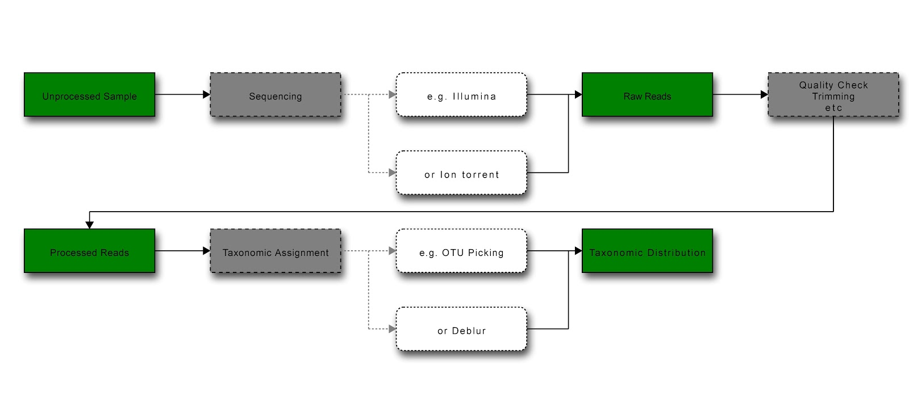

An explanation of contexts in redbiom and Qiita.
================================================

In both redbiom and Qiita study data is grouped into contexts representing different processing pipelines/methods. Processing and bioinformatic techniques can cause inherent biases in datasets, however if data is grouped by the protocol used to obtain the samples and extract data from them then, within any one such group (context), data is expected to be comparable. This is because the data in such a group (context) should share the same biases/limitations. Therefore, when retrieving data found in a redbiom search a context must be specified; so ensuring the retrieved data is comparable. If you are familiar with the methods and processes used in sample processing pipelines you should be able to interpret contexts as a context ultimately represents a processing pipeline. The general syntax of the context is <binning strategy>-<reference database>-<sequencing strategy>-<region sequenced>-<(if trimmed) trimming length>-<id> and this section should help familiarize you with these considerations therefore providing an understanding of contexts in both redbiom and Qiita.

   Diagram of general workflow for obtaining and processing data (green = data state; grey = process; white = example) [Produced at http://interactive.blockdiag.com/]

Obtaining Data
--------------

The first step of any pipeline is obtaining the data for the pipeline. As with any other stage of the pipeline this process could introduce biases or differences in the processed data, and needs to be accounted for. For instance, the region of the genome sequenced will determine whether two studies are directly comparable - use of different marker genes/regions will mean that the sequences (raw data) are not comparable. While the use of different reference databases to taxonomically classify the sequences may allow comparison at the taxonomic level, use of different databases could lead to biases in which sequences are classified.

Sequencing techniques
---------------------

There are several next generation and third generation sequencing techniques on the market, each with their own advantages and limitations. Illumina sequencing is probably the most common high throughput sequencing technique. Below is a short description of some of the major techniques found in redbiom and Qiita contexts.

* Illumina sequencing is a 'massively parallel' (high throughput) sequencing by synthesis technique, but has relatively short read lengths, a problem for assembly of repetitive regions. Note, however, that repetitive regions are less common in more economical genomes such as those of many bacteria, and are not a problem when assembly is not required such as when sequencing short marker gene fragments.
* Ion torrent is another ‘sequencing by synthesis’ method, which is less high throughput but cheaper as it does not require modified nucleotides.
* 454 sequencing has been out-competed, and the sequencers are no longer in production. It was a sequencing by synthesis method, which utilised polonies (like Illumina) and used imaging (pyrosequencing). While cheaper, it has difficulties distinguishing the number of bases in a run of identical bases because it detects incorporation of nucleotides passed over the cell a single type at a time (which also slows the process).

Onywera and Meiring [1]_ compared Ion torrent and Illumina and suggest (with caution) that Illumina sequencing may produce reads of higher quality (2.4-fold more quality-filtered reads) with greater efficiency when sequencing 16S variable regions in metagenomic samples.

Region sequenced for species identification
-------------------------------------------

Marker genes versus whole genome
^^^^^^^^^^^^^^^^^^^^^^^^^^^^^^^^

Factors such as cost, time, and complexity all affect the choice of which genomic regions in a sample will actually be sequenced. Whole genome sequencing (WGS) provides the most information, it can also potentially overwhelm an analysis, especially taking into consideration the high frequency of horizontal spread (of genes) among many prokaryotes, as well as varying genome size, gene duplication and deletion. Furthermore, WGS involves greatly increased costs, time and use of resources (sequencing and assembling the entire genomes). Therefore, microbiome studies generally use a marker gene, which allows for rapid and cost efficient identification of the species within a sample, and so analysis of features such as community structure.

16S rDNA (encoding the 16S rRNA of the ribosome, and thus universally present in prokaryotes) is currently the most commonly used marker gene. The gene's highly conserved function leads to a relatively low observed mutation rate in certain regions, allowing it to be used as a guide to phylogeny and taxonomic identity. More conserved regions of the gene allow reliable amplification (conserved sequences are needed for designing primers capable of annealing sequences from a wide variety of taxa) while hypervariable regions allow greater resolution. Note, however, that there is no consensus quantitative definition of genus or species based on 16S rRNA gene sequence

Another marker region is the internal transcribed spacer DNA (ITS) between the large and small subunit rRNA-encoding DNA. As with rDNA, it is readily amplified due to both being present in multiple copies, and having conserved flanking regions (the rDNA).

Within the 16S rDNA sequence, various variable regions can be amplified. V4 is a commonly used variable region of the 16S rDNA sequence, which, in total, contains nine hypervariable regions of varying conservation. Use of a variable region allows the detection of finer scale differences between taxa. Lower levels of variability are useful in determining higher-ranking taxa. Bukin et al [2]_ suggest that the V2-V3 region has the highest resolution for lower-rank taxa (species, genera) and so exploratory and diversity studies may wish to use this region. Conversely, Yang et al [3]_ come to a different conclusion, preferring V4-V6 for phylogenetic analysis. However, traditionally, V3 and V4 have been the most commonly used fragments.

Processing Data
---------------

Processing data can again lead to both differences or biases in data which could affect comparison. Raw sequences undergo quality control, and are often trimmed. Note that trimming is controversial but is required to allow use of data across studies because the same length sequences are required for comparison between studies. Whether trimming occurs, and trimming length, depends on the study; however deblur and DADA require trimmed input sequences because they require input data to be of the same length (as both algorithms consider single nucleotide differences, and differences in length are therefore distinguished). Illumina sequencing technology can theoretically cover as much as 300 nucleotides, though in reality 200 is more common (leading to between 400 and 600 nt for a paired end read), trimming of the ends of this data removes adapter sequences. Common trimming lengths in the Qiita database are 90, 100, 150 and 200 nucleotides. Once quality control is completed, the raw data can then be processed in various manners.

Assigning sequences to taxa
^^^^^^^^^^^^^^^^^^^^^^^^^^^

Both the strategy of taxa assignment, and the reference database, if used, can lead to potential biases in data.

**Binning strategies**

Reads are representative of taxa in the sample and must be assigned appropriately to allow further analysis. There are two main strategies for assigning reads to a particular taxa, either reads are clustered into operational taxonomic units (OTUs) when above some threshold similarity; or specialised processing algorithms are used to yield putatively error free sequences which can then be aligned to a reference database.

Picked OTUs, the former, involves clustering sequence data into clades based on similarity to a reference database in closed-reference picking, or each other in de novo clustering. Reads that do not cluster are discarded in closed-reference picking. Open picking has a second round of clustering in which reads that do not cluster with reference sequences are clustered against one another (de-novo clustering). The threshold similarity for clustering will determine what taxonomic level clusters represent [4]_ .

Two common algorithms representative of the second strategy are Deblur and DADA2, which can be used to resolve sequence data to the sub-operational taxonomic unit (sOTU) level (where sequences may differ by only a nucleotide). At such high (single-nucleotide) resolution a specialised programme is necessary to retrieve putative error-free sequences. As both packages infer exact amplicon sequence variants (ASVs) they give higher resolution composition data output than OTU methods [5]_ [6]_ . Furthermore, ASVs are comparable across studies because they represent exact sequences rather than per-study OTU IDs. For this reason there is also no absolute requirement for using a reference database, eliminating a possible source of bias. For these, and further reasons, Callahan et al [7]_ suggest that ASVs (and the associated methods to obtain them) should replace OTUs.

An independent study comparing DADA2, Deblur and an OTU picking pipeline found that all resulted in similar general community structure, but varied considerably in run times and the number of ASVs/OTUs called per sample (and so the resulting alpha-diversity metrics) [8]_ . OTU clustering tended to exaggerate the number of unique organisms. However, it should be noted that variation between  treatments rather than per sample is a more informative metric to consider.

**Reference taxonomy**

If the picked OTUs are closed or open reference then the database they were scored against must also be specified (as with all other processing steps, it represents a possible source of bias). The same considerations hold for any microbial data that has had taxa assigned by alignment to a reference database. For example, if deblur generated ASVs have been mapped to a reference database to allow characterisation of known species in the sample, the database used should be specified.

The most common reference database for 16S rDNA is Greengenes. However, this database has not been actively maintained since 2013. Other databases include:

* Silva, which contains not only 16S but also 18S and 23S/28S data, and is actively maintained. Note it contains data for bacteria (16S, 23S), archaea and eukarya (18S, 28S).
* Unite, a database for ITS (it does not contain any other regions).
* GTDB, the newest database for Bacterial and Archeal sequences, this database also includes representative sequences not yet assigned a species name, and contains whole (and partial) genomes.

Conclusion
----------

This article should have given you a brief overview of some of the major processes and considerations in processing pipelines for microbiome data and so the ability to interpret redbiom and Qiita contexts. The general syntax of the context is <binning strategy>-<reference database>-<sequencing strategy>-<region sequenced><trimming length (if trimmed>-<id>. Each of these processes or considerations can lead to differences or biases in the data, and thus is included in contexts.

Bibliography
------------

.. [1] Onywera H, Meiring TL. 2020 Comparative analyses of Ion Torrent V4 and Illumina V3-V4 16S rRNA gene metabarcoding methods for characterization of cervical microbiota: taxonomic and functional profiling. Sci. Afr. 7, e00278. (doi:10.1016/j.sciaf.2020.e00278)

.. [2] Bukin YS, Galachyants YP, Morozov IV, Bukin SV, Zakharenko AS, Zemskaya TI. 2019 The effect of 16S rRNA region choice on bacterial community metabarcoding results. Sci. Data 6, 190007. (doi:10.1038/sdata.2019.7)

.. [3] Yang B, Wang Y, Qian P-Y. 2016 Sensitivity and correlation of hypervariable regions in 16S rRNA genes in phylogenetic analysis. BMC Bioinformatics 17. (doi:10.1186/s12859-016-0992-y)

.. [4] OTU picking strategies in QIIME  Homepage. See http://qiime.org/tutorials/otu_picking.html

.. [5] Amir A et al. 2017 Deblur Rapidly Resolves Single-Nucleotide Community Sequence Patterns. mSystems 2. (doi:10.1128/mSystems.00191-16)

.. [6] Callahan BJ, McMurdie PJ, Rosen MJ, Han AW, Johnson AJA, Holmes SP. 2016 DADA2: High-resolution sample inference from Illumina amplicon data. Nat. Methods 13, 581583. (doi:10.1038/nmeth.3869)

.. [7] Callahan BJ, McMurdie PJ, Holmes SP. 2017 Exact sequence variants should replace operational taxonomic units in marker-gene data analysis. ISME J. 11, 26392643. (doi:10.1038/ismej.2017.119)

.. [8] Nearing JT, Douglas GM, Comeau AM, Langille MGI. 2018 Denoising the Denoisers: an independent evaluation of microbiome sequence error-correction approaches. PeerJ 6, e5364. (doi:10.7717/peerj.5364)
