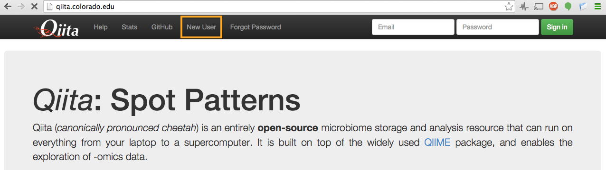
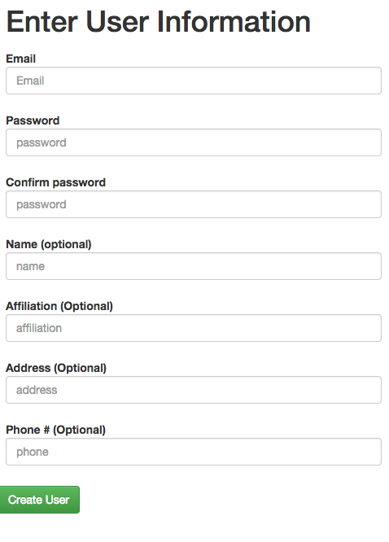
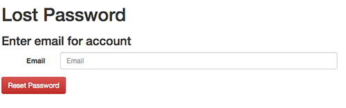
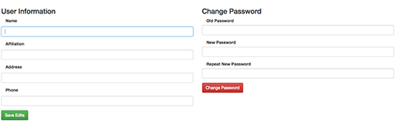

.. _account-creation:

.. index:: account-creation

Creating an account
===================

Open your browser and go to the home page of your Qiita installation;
for the public Qiita instance, this is
`http://qiita.microbio.me <http://www.google.com/url?q=http%3A%2F%2Fqiita.microbio.me&sa=D&sntz=1&usg=AFQjCNGHaa7TIR2613lE5xantGAdpHj3rw>`__.
Click on “New User”.

The “New User” link brings you to a page on which you can create a new
account. Optional fields are indicated explicitly, while all other
fields are required. Once the form is submitted, an email will be sent
to you containing instructions on how to verify your email address. Note
that your account will NOT be created until your email address is
verified. If you do not receive the verification email, check your spam
folder.

If you are in a single user installation you will need to be in a
network (like your house’s or a coffee shop’s) that does not block port
25. Most universities and corporations block this port for security
reasons.

Logging into your account and resetting a forgotten password
------------------------------------------------------------

Once you have created your account, you can log into the system by
entering your email and password.

If you forget your password, you will need to reset it.  Click on
“Forgot Password”.

This will take you to a page on which to enter your email address; once
you click the “Reset Password” button, the system will send you further
instructions on how to reset your lost password.

Updating your settings and changing your password
-------------------------------------------------

If you need to reset your password or change any general information in
your account, click on your email at the top right corner of the menu
bar to access the page on which you can perform these tasks.

